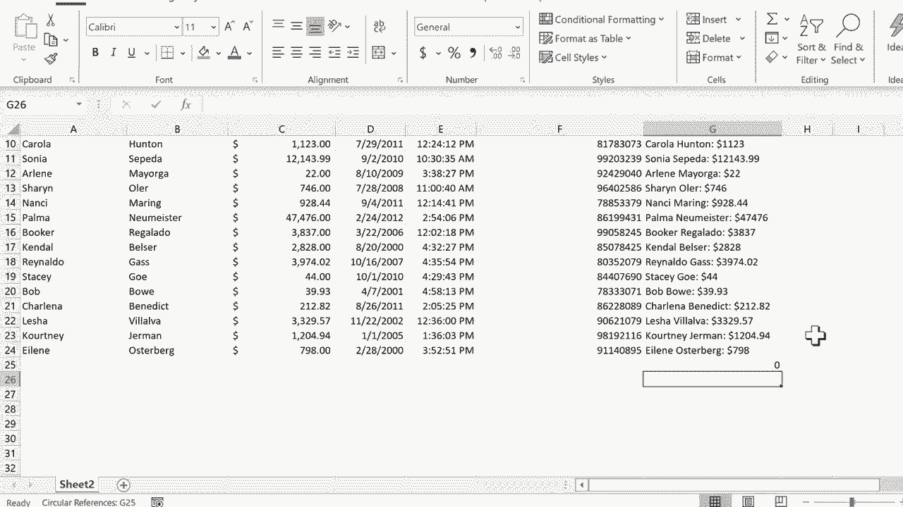

# Excel高效技巧课程 - P14：组合来自多个单元格的数据 📊

在本节课中，我们将学习如何在Excel中将多个单元格中的数据组合到一个单元格中。这个技巧对于创建客户档案、生成报告摘要或整理信息非常有用。

## 概述

我们将通过一个客户关系跟踪表的例子，演示如何使用“&”符号（和号）将姓名、金额等信息连接起来，并利用自动填充功能快速应用到整个数据列。

## 详细步骤

上一节我们介绍了数据整理的基础，本节中我们来看看如何将分散的数据组合起来。

假设我们有一个客户数据表，其中A列是名字，B列是姓氏，C列是总购买金额。我们希望在G列创建一个“客户档案”，将这三项信息合并显示。

首先，在G2单元格输入标题“客户档案”，并使用“格式刷”工具使其与表格其他标题格式一致。

以下是创建组合数据公式的具体步骤：

1.  **输入基础公式**：在G3单元格输入等号（`=`），然后点击A3单元格（名字），接着输入“&”符号，再点击B3单元格（姓氏）。此时公式为：`=A3&B3`。按回车后，单元格将显示“GinaPullen”，但名字和姓氏之间没有空格。

2.  **添加分隔符**：为了在名字和姓氏间添加空格，我们需要修改公式。公式应为：`=A3&" "&B3`。这里的`" "`代表一个空格文本。按回车后，显示为“Gina Pullen”。

3.  **添加更多数据**：我们继续添加总购买金额。在公式后继续添加`&" $"&C3`。完整的公式变为：`=A3&" "&B3&" $"&C3`。按回车后，单元格将显示“Gina Pullen $40”。

## 快速填充其他行

现在，我们已经为第一个客户创建了组合公式。不需要为每个客户手动重复此操作。

我们可以使用“自动填充手柄”来快速复制公式。选中包含公式的G3单元格，将鼠标移至单元格右下角，直到光标变成一个黑色的十字（即自动填充手柄）。

按住鼠标左键并向下拖动，覆盖所有客户数据所在的行。松开鼠标后，Excel会自动将公式应用到每一行，并智能地调整单元格引用（例如，G4的公式会变为`=A4&" "&B4&" $"&C4`）。

## 重要注意事项

有一点需要特别注意：通过“&”符号组合生成的结果（如“Gina Pullen $40”）在Excel中会被视为**文本**，而不是数字。

这意味着，虽然其中包含数字，但无法直接对这些结果进行数学运算（如求和、求平均值）。如果你需要对原始数字进行计算，应直接引用原始的数值单元格（如C列）。

## 总结

本节课中我们一起学习了Excel中组合多个单元格数据的核心技巧。我们掌握了使用 **`=&`** 符号连接单元格内容的方法，学会了在连接时插入空格等分隔符，并利用自动填充功能高效地完成整列操作。

这个技巧能帮助你快速整合信息，生成更清晰、易读的数据摘要。记住，组合后的结果是文本格式，适用于展示，但不适用于后续计算。多加练习，你会发现它在许多数据整理场景中都非常实用。