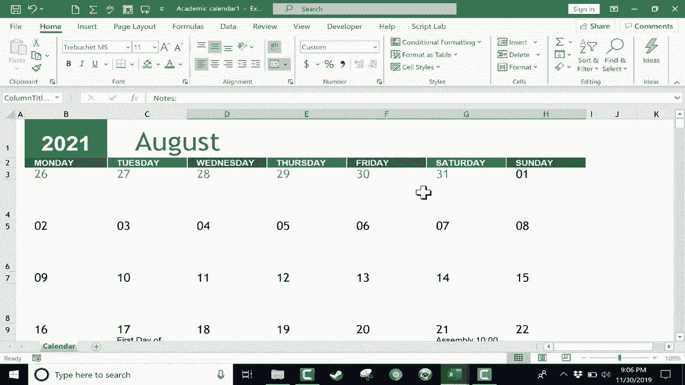

# Excel高效技巧系列课程 - P15：创建日历 📅

在本节课中，我们将学习如何在Excel中快速创建并自定义一个实用的日历。我们将使用Excel内置的模板功能，并介绍如何通过条件格式让日历中的事件更加醒目。

## 概述

创建日历是管理日程和规划事件的有效方式。我们将从使用模板开始，然后学习如何修改年份、月份以及添加和格式化事件。

## 使用模板创建日历

首先，我们使用Excel的模板功能来创建一个基础日历。

1.  点击左上角的“文件”选项卡。
2.  点击“新建”按钮。
3.  在模板库中浏览，找到“学术日历”模板并双击它。
4.  在弹出的预览窗口中点击“创建”。

现在，我们就获得了一个预设好的日历模板。模板默认显示当前年份，并包含一些示例日期。

## 自定义日历年份与月份

上一节我们介绍了如何创建基础日历，本节中我们来看看如何调整年份和起始月份。

*   **更改年份**：在日历顶部的年份单元格中直接输入目标年份（例如 `2021`），按下回车键后，所有日期和星期都会自动更新以匹配新年份。
*   **更改起始月份**：点击月份下拉菜单，将起始月从“八月”更改为“一月”或其他月份，日历的显示顺序会自动调整。

## 添加与管理事件

日历创建好后，接下来我们需要在其中添加具体的事件。

以下是添加事件的步骤：
1.  在对应日期的下方大单元格中，直接输入事件描述，例如“开学第一天”。
2.  对于重复性事件（如每周五的测验），可以先在一个单元格中输入，然后使用 `Ctrl+C` 复制，再 `Ctrl+V` 粘贴到其他日期单元格中。
3.  你还可以为事件添加具体时间。

## 美化与打印日历

为了让日历更美观或便于打印，可以进行一些格式调整。

1.  选中整个月份区域。
2.  在“页面布局”选项卡中，可以尝试更改主题颜色。
3.  若要打印，点击“文件”->“打印”（或按 `Ctrl+P`），预览打印效果后即可输出。

## 使用条件格式高亮事件

为了使特定类型的事件（如“测验”、“作业”）在日历中一目了然，我们可以使用条件格式功能。

上一节我们完成了日历的基本设置，本节中我们来看看如何用条件格式实现自动高亮。

1.  按 `Ctrl+A` 全选整个工作表。
2.  在“开始”选项卡中，点击“条件格式”。
3.  选择“突出显示单元格规则”->“文本包含”。
4.  在弹出的对话框中输入关键词，如“测验”，并设置高亮样式（如黄色填充）。
5.  点击“确定”后，所有包含“测验”的单元格都会被自动标记。

你可以为不同关键词（如“作业”）重复此过程，设置不同的颜色。之后，只要在单元格中输入这些关键词，格式就会自动应用。

如果需要修改规则，可以进入“条件格式”->“管理规则”进行调整。

## 总结

本节课中我们一起学习了在Excel中创建日历的完整流程。我们首先利用模板快速搭建日历框架，然后学会了自定义年份、月份以及添加事件。最后，通过使用条件格式功能，我们实现了对特定事件的自动高亮，让日历变得更加直观和实用。这个方法能极大地节省手动调整和格式化的时间。