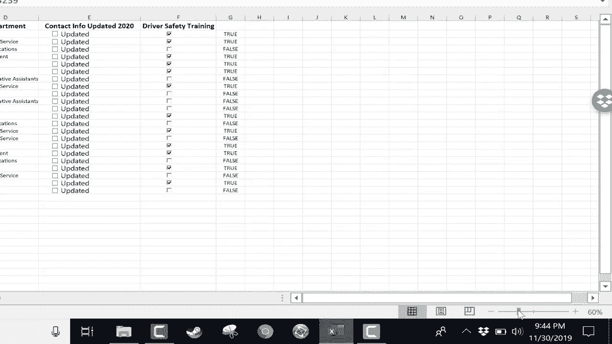

# Excel高效技巧系列教程 - P16：16）🔍 放大与缩小视图

在本节课中，我们将学习如何在Excel中快速调整工作表的缩放级别。掌握缩放技巧能帮助你更清晰地查看数据细节，或一览全局，是提升数据处理效率的基础操作。

## 视图选项卡缩放功能

上一节我们介绍了视图的基本操作，本节中我们来看看如何通过功能区进行缩放。最传统的方法是使用“视图”选项卡中的“缩放”组。

以下是“视图”选项卡中提供的缩放选项：

*   **缩放到100%**：点击此按钮可将视图快速恢复到默认的100%大小。
*   **缩放到选定区域**：首先选中一个单元格区域，例如 `A1:D10`，然后点击此按钮。Excel会自动调整缩放比例，使选定区域恰好填满当前窗口。
*   **缩放按钮**：点击此按钮会打开“缩放”对话框，允许你选择预设的缩放比例（如200%、50%、25%），或输入自定义的百分比，例如 `55%`。

使用这些功能后，你可以点击“100%”按钮或选择“缩放到100%”选项来恢复默认视图。然而，通过菜单层层点击的操作方式略显繁琐。

## 状态栏缩放滑块

幸运的是，Excel提供了一个更快捷的缩放工具。在软件窗口右下角的状态栏中，你可以找到一个缩放滑块。

这个滑块允许你通过拖拽快速调整缩放比例。例如，向右拖动滑块可放大至 `218%`，向左拖动则可缩小至 `50%` 或 `60%`。这是一种非常直观且高效的调整方式。

## 键盘与鼠标滚轮快捷键

除了滑块，还有一种更受许多用户青睐的快捷缩放方法。这需要结合键盘和鼠标操作。

按住键盘上的 **`Ctrl`** 键，同时向前滚动鼠标滚轮即可放大视图，向后滚动滚轮则可缩小视图。这是一种无需寻找按钮、手不离键盘的流畅操作。

**操作提示**：为了获得更平滑的缩放体验，建议在开始缩放前，先单击 `A1` 单元格。这样，视图会以工作表左上角为锚点进行缩放，视觉上更为连贯。

## 课程总结

本节课中我们一起学习了在Excel中调整视图缩放比例的三种核心方法：

1.  使用 **“视图”选项卡** 中的缩放组进行精确控制。
2.  利用 **状态栏的缩放滑块** 进行快速拖拽调整。
3.  掌握 **`Ctrl` + 鼠标滚轮** 的快捷键实现流畅缩放。

你可以根据实际场景选择最适合的方法，从而更高效地查看和分析工作表数据。