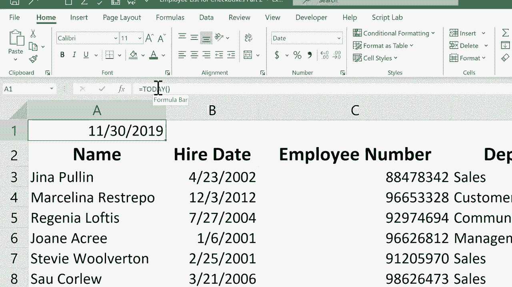

# Excel高效技巧系列课程 - P17：快速输入当前日期和时间 📅⏰

在本节课中，我们将学习如何在Excel中快速、准确地输入静态的当前日期和时间。这对于记录固定时间点（如员工入职日期、交易发生时间）非常有用。

在之前的课程中，我们介绍了使用 `=TODAY()` 函数来动态显示每次打开表格时的当前日期。然而，有时我们需要输入一个不会自动改变的固定日期或时间。本节中，我们来看看如何实现这一点。

## 静态日期与时间的输入方法

以下是几种快速输入静态日期和时间的方法。

### 方法一：手动输入简化日期
点击目标单元格，输入“月/日”（例如 `11/30`），然后按下回车键。Excel会自动补全当前年份。

### 方法二：快捷键输入当前日期
这是最快捷的方法。
1.  点击目标单元格。
2.  按下键盘快捷键：**Ctrl + ;（分号）**。
3.  按下回车键确认。

此操作会立即将今天的日期以静态值的形式填入单元格。

### 方法三：快捷键输入当前时间
如果需要记录精确到分钟的时间，请按以下步骤操作。
1.  点击目标单元格。
2.  按下键盘快捷键：**Ctrl + Shift + ;（分号）**。
3.  按下回车键确认。

此操作会立即将当前时间以静态值的形式填入单元格。

## 重要注意事项

使用上述快捷键输入的日期和时间是**静态值**。这意味着，即使你在一周或一个月后重新打开工作簿，单元格中显示的仍然是当初输入的日期和时间，**不会自动更新**。

这与使用 `=TODAY()` 或 `=NOW()` 这类**函数公式**有本质区别。函数公式的结果会随着每次表格的重新计算或打开而更新。

> 如果你想了解更多关于 `=TODAY()` 函数的内容，可以回顾本系列的相关教程。

---

本节课中，我们一起学习了三种快速输入静态日期和时间的方法，并理解了静态值与动态函数公式的关键区别。掌握这些快捷键能显著提升你在Excel中记录固定时间信息的效率。