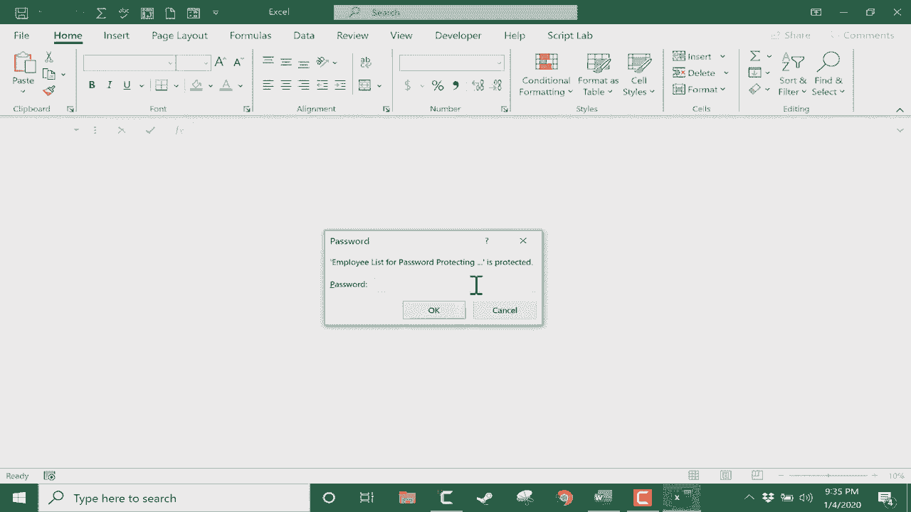

# Excel教程 P18：🔐 Excel文件密码设置


在本节课中，我们将学习如何为Excel文件设置密码保护，以保障数据的安全性和机密性。我们将探讨两种主要的保护方式：保护工作表/工作簿以防止修改，以及加密整个文件以防止未经授权的查看。

---

## 概述

我们将通过一个包含虚构员工信息的表格作为示例，演示如何应用不同的密码保护功能。这些信息包括姓名、入职日期、员工编号和完成状态。我们的目标是确保这些敏感数据不被随意查看或篡改。

---

## 保护工作表以防止修改

上一节我们介绍了课程目标，本节中我们来看看如何防止他人修改你的工作表数据。

首先，打开你的Excel文件，定位到顶部菜单栏的“审阅”选项卡。在“保护”功能组中，你可以找到“保护工作表”的选项。

以下是点击“保护工作表”后可以进行的操作：

*   你可以设置一个密码，用于解除工作表的保护状态。
*   你可以勾选允许用户在受保护工作表中进行的操作，例如选择单元格或设置格式。

例如，如果不设置密码直接点击“确定”，工作表将进入受保护状态。此时，尝试在单元格中输入内容会收到错误提示，这能防止数据被意外或故意更改。

然而，这种方法存在一个明显的局限性：任何用户都可以通过“审阅”选项卡中的“取消保护工作表”按钮来解除保护。因此，设置一个密码至关重要。

**代码示例：设置保护密码**
```excel
' 这是一个概念性描述，实际操作通过图形界面完成
工作表.保护(密码:="YourPassword")
```

设置密码后，工作表将完全被锁定。用户可以看到数据，但无法进行任何更改。只有输入正确的密码，才能通过“取消保护工作表”来恢复编辑权限。

**重要提示**：请务必牢记你设置的密码。如果丢失或忘记密码，将无法恢复对工作表的编辑权限。

---

## 加密整个工作簿以禁止查看

虽然保护工作表能防止修改，但数据仍然可见。接下来，我们学习如何彻底保护工作簿，防止未经授权的用户查看其中的任何内容。

要实现更高级别的保护，我们需要使用文件加密功能。请点击“文件”菜单，然后选择“信息”选项。

在“信息”页面，你会看到“保护工作簿”的按钮。点击它，并从下拉菜单中选择“用密码进行加密”。

以下是加密工作簿的步骤：

*   在弹出的对话框中，输入你设定的密码。
*   系统会显示警告，提醒你如果忘记密码将无法恢复文件，请务必妥善保管。
*   确认密码后，点击“确定”。

完成上述操作后，整个工作簿就被加密了。在关闭文件前，请记得保存更改以确保密码生效。

此后，任何尝试打开此文件的人都会被要求输入密码。只有密码正确，才能访问工作簿内的所有数据。

**公式/概念**：文件加密 ≈ 为整个工作簿文件加上了一把锁，密码是唯一的钥匙。

---

## 总结

本节课中，我们一起学习了两种为Excel文件设置密码保护的方法：



1.  **保护工作表/工作簿**：通过“审阅”选项卡设置，主要用于防止数据被修改，但数据本身仍然可见。核心在于设置解除保护的密码。
2.  **加密工作簿**：通过“文件”->“信息”->“保护工作簿”设置，为整个文件加密。这是更彻底的保护方式，可以防止未经授权的用户查看文件内容。

你可以根据数据安全的实际需求，选择单独或组合使用这些功能，以确保你的Excel文件得到恰当的保护。