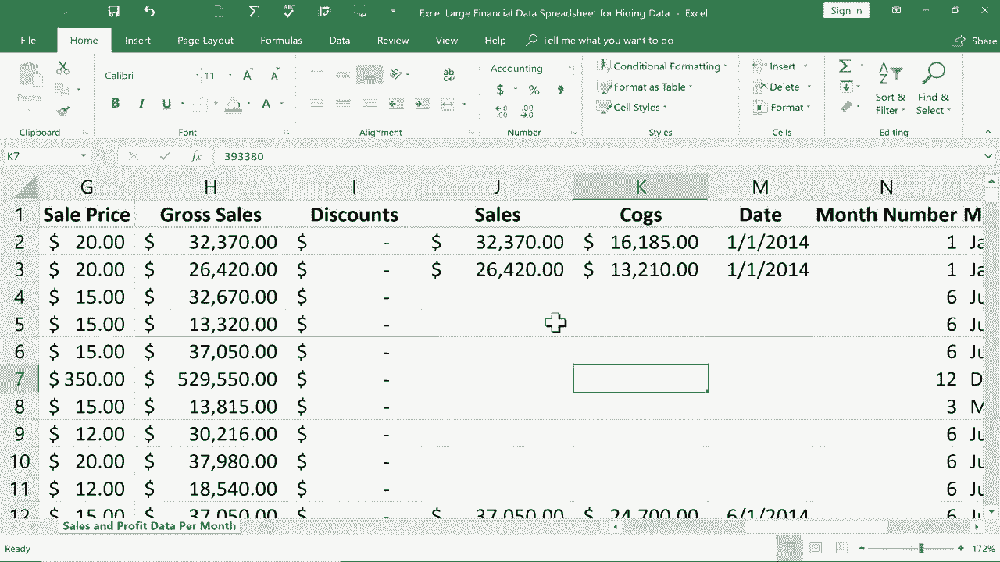

# Excel高效技巧课程 - P19：19）隐藏数据 🔒

在本节课中，我们将学习如何在Excel中隐藏数据，包括行、列、工作表乃至单个单元格。我们还将探讨隐藏数据的原因，以及如何通过保护工作簿来增强数据安全性。

## 概述：为何需要隐藏数据？

假设你有一个包含财务数据和客户信息的电子表格。当你需要与合作伙伴共享部分数据时，可能不希望对方看到所有敏感信息，例如具体利润或客户的个人资料。隐藏数据是一种简单有效的解决方案。

## 如何隐藏行与列

上一节我们介绍了隐藏数据的应用场景，本节中我们来看看如何具体操作。隐藏行和列是最基础的操作。

以下是隐藏行的步骤：
1.  选中需要隐藏的行。例如，点击并拖动左侧的行号（如行号8至17）以选中多行。
2.  在任意选中的行号上右键单击。
3.  从右键菜单中选择“隐藏”。

隐藏列的操作与之类似：
1.  选中需要隐藏的列（例如点击列标字母）。
2.  右键单击选中的列标。
3.  选择“隐藏”。

> **提示**：在较新版本的Excel中，隐藏的行或列之间会显示一条稍粗的分隔线，提示此处有内容被隐藏。

## 如何显示隐藏的行与列

要重新显示被隐藏的行或列，方法也很简单。

以下是取消隐藏行的方法：
1.  选中隐藏行上方和下方的两行（例如，第7行和第18行）。
2.  右键单击选中的行号区域。
3.  选择“取消隐藏”。

取消隐藏列的操作步骤相同，只需选中隐藏列左右两侧的列，然后右键选择“取消隐藏”即可。

## 如何隐藏与显示工作表

除了行和列，你还可以隐藏整个工作表，这对于保护独立的客户列表或分析数据非常有用。

以下是隐藏工作表的步骤：
1.  在底部的工作表标签上右键单击需要隐藏的工作表名称（如“客户列表”）。
2.  从菜单中选择“隐藏”。

要重新显示被隐藏的工作表，操作略有不同：
1.  在任意一个可见的工作表标签上右键单击。
2.  选择“取消隐藏”。
3.  在弹出的对话框中，选择你想要显示的工作表名称，然后点击“确定”。

## 保护工作簿以防止他人取消隐藏

有人可能会问，收到文件的人难道不能自己取消隐藏数据吗？答案是肯定的。为了增强安全性，你可以保护工作簿结构。

操作路径如下：
1.  切换到“审阅”选项卡。
2.  点击“保护工作簿”。
3.  在弹出的窗口中设置密码并确认。
4.  点击“确定”。

> **注意**：保护工作簿后，他人将无法通过右键菜单“取消隐藏”来显示被隐藏的工作表。**但是，被隐藏的行和列仍然可以通过选中相邻区域并右键选择“取消隐藏”来显示**。这是该功能的一个局限性。

## 隐藏特定单元格的技巧

在某些情况下，你可能不想隐藏整行或整列，而只想隐藏某个特定单元格（如一个利润数字）。有一个变通的方法。

操作步骤如下：
1.  选中你想要“隐藏”的单元格。
2.  在“开始”选项卡的“字体”组中，将字体颜色设置为与单元格背景色相同（通常为白色）。

> **重要提醒**：这种方法只是让单元格内容在视觉上不可见。如果他人点击该单元格，其内容仍会在编辑栏中显示出来。因此，这并非真正的安全隐藏，更多用于打印或展示时让界面更简洁。

## 总结

本节课中我们一起学习了Excel中多种隐藏数据的方法：
*   **隐藏行/列**：选中后右键选择“隐藏”，是最快速的方法。
*   **隐藏工作表**：右键工作表标签选择“隐藏”，适合隐藏整张表。
*   **保护工作簿**：通过“审阅”->“保护工作簿”设置密码，可以防止他人取消隐藏工作表。
*   **视觉隐藏单元格**：将字体颜色设为白色，但需注意这并非安全措施。

合理运用这些技巧，你可以在共享Excel文件时，有效控制信息的可见范围，保护敏感数据。