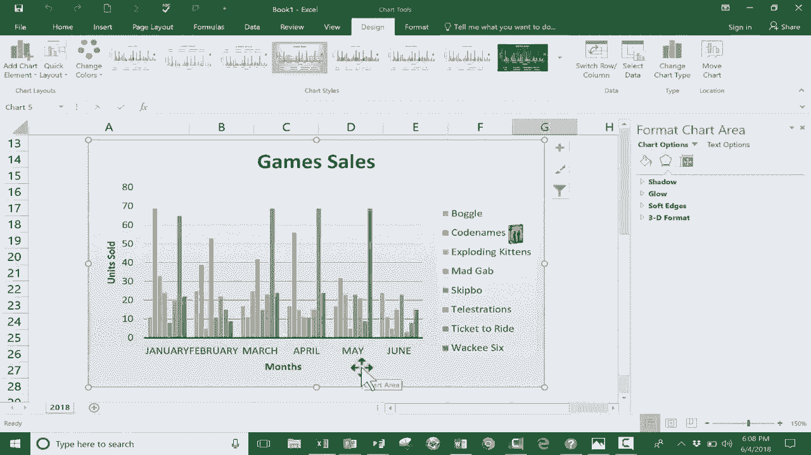

# Excel高效技巧课程 P2：快速创建图表 📊

在本节课中，我们将学习如何在Excel中快速创建和自定义图表，以便直观地展示数据。我们将从一个简单的销售数据表开始，逐步完成图表的插入、调整和美化。

---

## 概述

本教程将指导你使用Excel的快捷键和功能，快速将表格数据转换为清晰的图表。我们将涵盖数据选择、图表生成、样式调整以及图表元素的修改。

---

## 第一步：准备数据并选择范围

首先，你需要一个包含数据的表格。在我们的例子中，这是一个桌游的月度销售数据表。

上一节我们介绍了数据准备，本节中我们来看看如何选择正确的数据范围以创建图表。

创建图表前，需要先选择要包含在图表中的数据。点击并拖动鼠标，高亮显示目标数据区域。此操作允许你排除不需要的数据。例如，在销售数据中，你可能希望展示各产品的月度销量，而不包含“总销量”这一行。

**操作代码示例：**
1.  用鼠标点击数据区域的起始单元格（如A1）。
2.  按住鼠标左键，拖动至数据区域的结束单元格（如G7）。

---

## 第二步：快速插入图表

选择数据后，可以使用快捷键快速生成图表。

以下是插入图表的快捷方法：

*   按住键盘上的 `Alt` 键。
*   然后按下 `F1` 键。

Excel会自动根据所选数据生成一个默认的柱形图，并将其放置在当前工作表的数据区域上方。

---

## 第三步：移动和调整图表视图

生成的图表位置可能不理想，你可以轻松移动它。

上一节我们插入了图表，本节中我们来看看如何调整它的位置和视图比例以便查看。

将鼠标指针移动到图表的边缘（注意避开图表内部的元素），当指针变为十字箭头时，点击并拖动即可移动图表。为了获得更好的工作空间，你可以调整Excel的显示比例（例如，缩放至100%或150%），以便将图表放置在数据下方或其他合适位置。

---

## 第四步：理解与切换图表数据视图

默认生成的图表以一种方式展示数据，但你可以切换行与列的呈现方式。

初始图表可能按游戏显示各月销量。点击图表，功能区会出现“图表设计”选项卡。在“数据”组中，点击“切换行/列”按钮，图表视图会立即改变。切换后，图表将改为按月显示各游戏的销量对比，这提供了不同的数据分析视角。

**核心概念：**
*   **切换前**：图表系列 = 各游戏，分类轴 = 月份。
*   **切换后**：图表系列 = 各月份，分类轴 = 游戏。

---

## 第五步：应用图表样式和快速布局

Excel提供了多种预设样式和布局来快速美化图表。

以下是美化图表的步骤：

1.  **图表样式**：选中图表，在“图表设计”选项卡的“图表样式”组中，将鼠标悬停在不同的样式上可以预览效果，点击即可应用。点击右侧的“更多”按钮可以查看全部样式。
2.  **快速布局**：在“图表设计”选项卡的“图表布局”组中，点击“快速布局”，可以从多种预设布局中选择。这些布局会调整标题、图例、数据标签等元素的位置。

---

## 第六步：编辑图表标题和坐标轴标签

为了使图表信息更明确，需要修改默认的标题和标签。

上一节我们美化了图表外观，本节中我们来完善图表的信息标注。

*   **修改图表标题**：直接单击图表上的“图表标题”文本框，然后输入新标题（如“游戏销售：1月-6月”）。更快捷的方法是：单击标题框，在公式栏输入 `=`，然后点击工作表中包含标题文字的单元格，按回车确认。
*   **修改坐标轴标题**：单击“坐标轴标题”文本框，直接输入描述性文字（如“月份”和“销售数量”）。

---

## 第七步：进一步自定义与添加视觉元素

通过“设置图表区格式”面板，可以对图表进行深度自定义。

双击图表边缘，右侧会打开“设置图表区格式”窗格。在这里，你可以调整图表的填充颜色、边框样式、阴影效果等。此外，你还可以通过“插入”选项卡为图表添加图片，例如将游戏图片插入到图例旁，这些图片会成为图表的一部分并随之移动。

---

## 第八步：在其他Office程序中复用图表

在Excel中创建的图表可以轻松复制到其他Microsoft Office应用程序中。

完成图表后，右键点击图表并选择“复制”。然后打开 PowerPoint、Word 或 Publisher，在文档中右键选择“粘贴”，图表及其背后的数据链接就会被嵌入到新文档中。

---

## 总结

本节课中我们一起学习了在Excel中创建图表的完整流程：从选择数据、用`Alt+F1`快捷键快速插入，到移动图表、切换数据视图、应用样式布局、编辑文本标签，以及进行高级自定义和跨软件复用。掌握这些技巧能帮助你高效地将数据转化为直观的可视化图表。