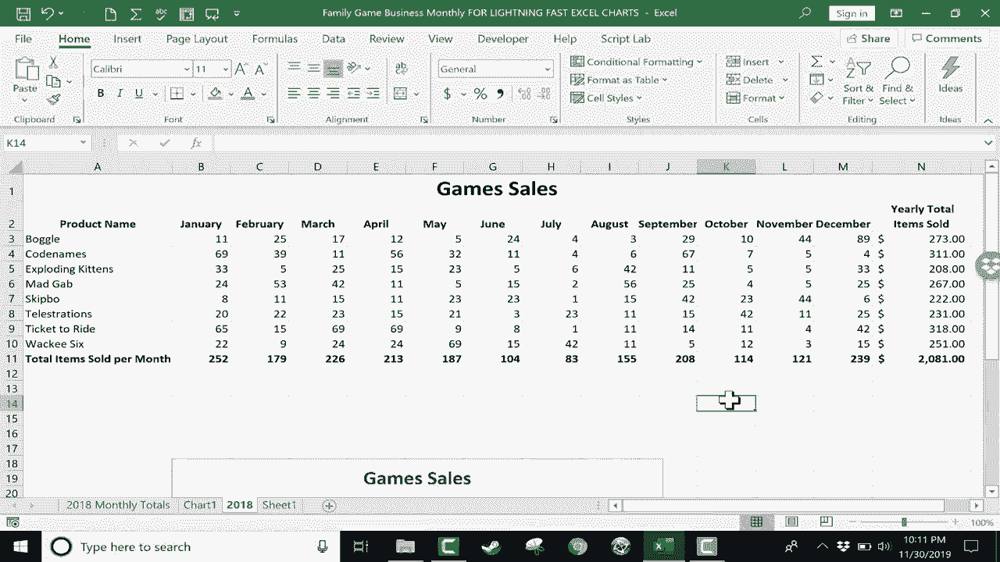

# Excel高效技巧课程 - P20：20）⚡闪电般的Excel图表制作

在本节课中，我们将学习如何通过极其简单的步骤，快速创建Excel图表。这种方法无需复杂的菜单操作，只需几个关键动作和一个快捷键，即可生成直观的数据可视化图表。

## 概述：快速图表的核心

上一节我们介绍了数据处理技巧，本节中我们来看看如何将数据瞬间转化为图表。快速图表的核心在于**选择正确的数据**并使用**特定的键盘快捷键**。

## 第一步：选择图表数据

制作图表前，必须正确高亮显示数据。图表需要的是**核心数据**，而非标题或总计。

以下是选择数据的要点：
*   点击产品名称单元格。
*   拖动鼠标至数据区域的右下角。
*   确保不包含底部或右侧的“总计”行列，否则会扰乱图表。

## 第二步：生成图表

数据选择完毕后，即可生成图表。

按 `Alt + F1` 快捷键，Excel将立即基于所选数据生成一个默认类型的图表（通常是簇状柱形图）。此操作不会弹出图表类型选择窗口。

## 第三步：调整与美化图表

生成的图表可能不符合你的具体需求，可以轻松进行调整。

因为图表已被选中，功能区会出现“图表设计”和“格式”选项卡。

### 更改图表类型

在“图表设计”选项卡中，可以点击“更改图表类型”。
*   **簇状柱形图**：默认类型，便于比较不同项目在各月份的数据。
*   **堆叠柱形图**：便于查看每个月的数据总量及各部分的构成。
*   **三维柱形图**：提供立体视觉效果，但可能影响数据阅读的清晰度。

你可以右键点击任意图表类型，选择“设置为默认图表”，以更改`Alt+F1`快捷键生成的默认图表。

### 快速更改样式与颜色

“图表设计”选项卡还提供“图表样式”和“更改颜色”功能，可以一键应用不同的配色方案和整体样式，快速美化图表。

## 进阶技巧：在新工作表创建图表

如果你希望图表独立于数据，放置在新的工作表上，可以按 `F11` 键。

操作步骤如下：
1.  正确选择核心数据区域。
2.  按下 `F11` 键。
3.  Excel会自动插入一个新工作表（如“Chart1”），并将图表放置其中。

> **注意**：如果未精确选择数据，而只是点击了数据区域内的某个单元格，然后按`Alt+F1`或`F11`，Excel会尝试自动判断数据范围，可能会包含合计项，导致图表错误。因此，**手动精确选择数据区域是最可靠的方法**。

## 总结

本节课中我们一起学习了闪电般制作Excel图表的技巧。

核心流程可总结为：
1.  **精确选择**需要绘制图表的核心数据区域。
2.  按 **`Alt + F1`** 在当前工作表生成图表。
3.  按 **`F11`** 在新工作表生成图表。
4.  利用“图表设计”选项卡**更改图表类型、样式和颜色**进行美化。

掌握这个技巧，你就能在几秒钟内将数据转化为直观的图表，极大提升数据分析与展示的效率。