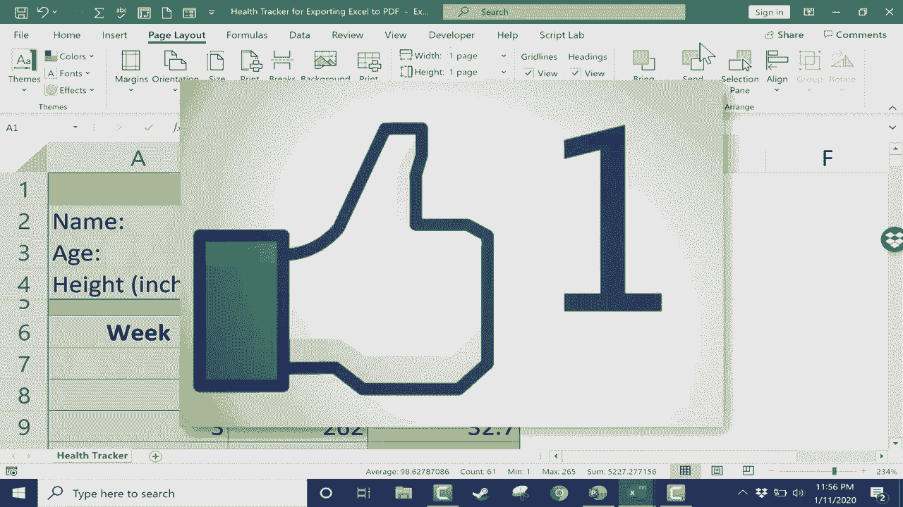

# Excel高效技巧课程 - P21：将Excel文件导出为PDF 📄

在本节课中，我们将学习如何将Excel文件导出为PDF格式。掌握这一技能，可以让你轻松分享数据报告，即使对方没有安装Excel软件也能顺利查看。

---

## 为什么需要导出为PDF？

上一节我们介绍了导出PDF的总体概念，本节中我们来看看一个具体的应用场景。

假设你是一名健身教练，使用Excel为学员Jason Smith制作了一份健康追踪报告。经过17周的合作，Jason取得了不错的减重进展。合作结束后，你希望将这份进展报告发送给他。

然而，Jason可能没有安装Excel，或者不熟悉Google表格等其他办公软件。直接发送Excel文件他可能无法打开。打印并邮寄纸质版是一种方法，但如果你希望发送数字版本，**将Excel转换为PDF**是最佳解决方案。因为PDF是一种通用格式，几乎在任何设备上都能被查看。

---

## 如何导出整个工作表为PDF？

以下是导出整个Excel工作簿为PDF文件的步骤。

1.  点击左上角的 **“文件”** 选项卡。
2.  在左侧菜单中选择 **“导出”**。
3.  在导出界面中，点击 **“创建PDF/XPS文档”** 选项。
4.  在弹出的对话框中，选择保存位置（例如桌面），保留其他默认设置。
5.  点击 **“发布”** 按钮。

操作完成后，系统会自动打开生成的PDF文件供你预览。这种方法会将当前工作表中的所有数据（包括所有行列）都导出到PDF中。

---

## 如何仅导出部分数据为PDF？

有时我们只需要分享部分数据。上一节导出的PDF包含了全部内容，本节中我们来看看如何只导出选定的区域。

你可以选择只将特定的单元格区域导出为PDF。

1.  在Excel中，用鼠标拖动选中你希望导出的数据区域。
2.  点击 **“文件” > “导出” > “创建PDF/XPS文档”**。
3.  在发布为PDF的对话框中，点击 **“选项…”** 按钮。
4.  在弹出的选项窗口中，选择 **“选定区域”**。
5.  点击 **“确定”**，然后选择保存位置并点击 **“发布”**。

这样生成的PDF文件将只包含你之前选中的单元格内容，报告会更加简洁和聚焦。

---

## 其他导出方法与页面设置技巧

除了通过“导出”功能，还有一种等效的方法。

你还可以通过“另存为”功能来生成PDF文件。

1.  点击 **“文件” > “另存为”**。
2.  在“另存为”对话框中，点击 **“保存类型”** 下拉菜单。
3.  从列表中选择 **“PDF (*.pdf)”** 格式。
4.  选择保存位置并点击 **“保存”**。

**调整页面布局以优化PDF：**
在导出前，合理设置页面布局可以让PDF的排版更美观。特别是当数据较多时，可以尝试以下操作：

1.  切换到 **“页面布局”** 选项卡。
2.  在 **“调整为合适大小”** 功能组中，将“宽度”和“高度”都设置为 **“1页”**。
3.  这个设置会强制Excel自动缩放内容，使其完整地容纳在一页PDF中，避免内容被分割到多页。

之后再进行导出操作，你可能会发现数据的排版更加紧凑和清晰。

---

## 课程总结

本节课中，我们一起学习了将Excel文件导出为PDF的多种方法。

我们首先了解了导出PDF的必要性，它能确保文件被广泛兼容。接着，我们逐步掌握了三种核心操作：**导出整个工作表**、**仅导出选定区域**，以及通过**“另存为”**功能进行转换。最后，我们还介绍了在导出前使用 **`页面布局 -> 缩放至一页`** 的技巧，以优化PDF的最终显示效果。

记住这些步骤，你就可以轻松地将任何Excel数据报告转换为便于分享和打印的PDF文档了。