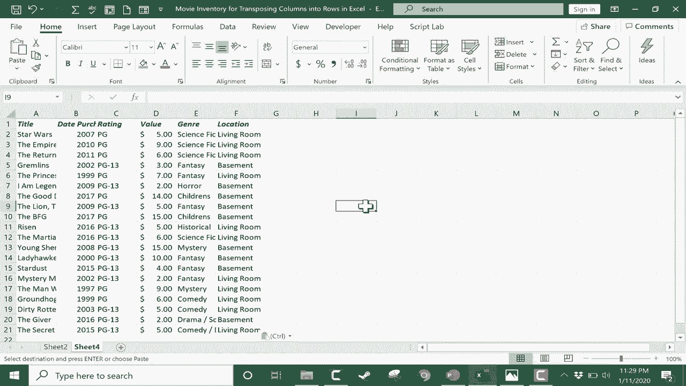

# Excel高效技巧课程 - P22：22）将列转换为行 🔄

在本节课中，我们将学习如何在Excel中快速将数据从列布局转换为行布局。这个技巧在你需要改变数据呈现方式或调整表格结构时非常有用。

## 概述

假设你正在处理一个电影收藏的电子表格，其中列标题是电影名称，行中则是相关信息。但后来你发现，将电影名称作为行标题垂直排列会更符合你的需求。这时，你就需要用到“转置”功能。

## 操作步骤详解

以下是使用“选择性粘贴”功能实现列转行的完整步骤。

**第一步：选择需要转置的数据范围**

首先，定位到你数据区域的左上角单元格。例如，如果你的核心数据区域从B2开始，到E6结束，你需要点击B2单元格。

接着，按住鼠标左键，拖动到数据区域的右下角单元格（例如E6），以选中整个数据范围。

**第二步：复制选中的数据**

选中数据后，按下 `Ctrl + C` 快捷键进行复制。你也可以通过右键菜单选择“复制”来完成此操作。

**第三步：在新的工作表中进行转置粘贴**

为了保持原始数据的整洁，建议在新的工作表中进行转置操作。

1.  点击工作表底部的新建工作表按钮（例如“Sheet2”）。
2.  在新工作表中，点击你希望粘贴数据的起始单元格，例如A1。
3.  在“开始”选项卡中，点击“粘贴”下拉菜单，选择“选择性粘贴”。
4.  在弹出的对话框中，勾选底部的“转置”选项。
5.  点击“确定”。

现在，观察新工作表，你会发现原来的列标题已经变成了行标题，数据的方向被完全转换了。

## 数据整理与调整

转置操作完成后，你可能会发现列宽不合适，导致数据显示不全。

**快速调整列宽的方法如下：**

1.  选中所有需要调整的列（点击列标字母进行拖动选择）。
2.  将鼠标指针移动到任意两列列标的交界线上，直到指针变成双向箭头。
3.  双击鼠标左键，Excel将自动根据每列的内容调整到最合适的宽度。

如果你希望所有列保持统一宽度，可以在选中所有列后，直接拖动任意列的交界线来手动设置宽度。

## 总结

本节课我们一起学习了Excel中“转置”功能的使用方法。我们通过“选择性粘贴”中的“转置”选项，轻松地将数据从列转换为行。关键步骤可以总结为：**选择数据 -> 复制 -> 在新位置选择性粘贴（勾选转置）**。这个技巧能帮助你灵活地调整表格结构，以适应不同的数据分析需求。