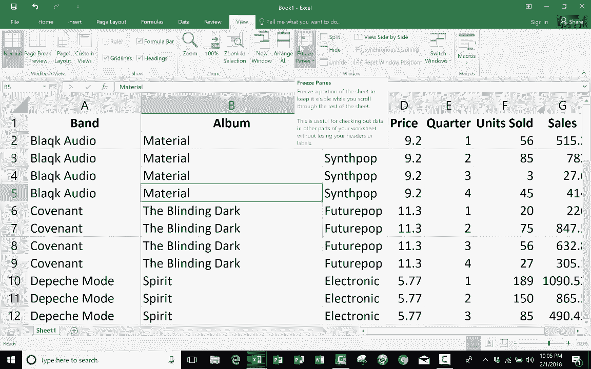

# Excel高效技巧课程 - P23：使用冻结窗格 📊

在本节课中，我们将学习Excel中一个非常实用的功能——**冻结窗格**。这个工具能帮助我们在滚动浏览大型表格时，始终保持特定的行或列可见，从而避免数据混淆，提升工作效率。

## 概述

当处理包含大量数据的电子表格时，向下或向右滚动会导致行标题或列标题移出视线，使我们难以理解单元格数据的含义。冻结窗格功能可以锁定指定的行或列，让它们始终显示在屏幕上。

## 冻结窗格的用途

为了说明其用途，我们以一个简单的电子表格为例。这个表格列出了流行乐队及其专辑信息，包含“专辑”、“乐队”、“流派”、“价格”和“销售”等列标题。

当我们向下滚动浏览数据行时，顶部的列标题会随之移出屏幕。对于一个只有约30条记录的表格，这可能问题不大。但想象一下，如果表格有数百甚至数千行数据，就很容易忘记每一列数字所代表的具体含义。例如，看到一个数字“20”，却无法立刻想起它对应的是“价格”还是“销售”列。

冻结窗格功能正是为了解决这个问题而设计的。它可以让我们将第一行（即标题行）固定在屏幕顶部。这样，无论我们向下滚动到哪一行，标题行都始终可见，确保我们随时都能理解数据的上下文。

## 如何激活冻结窗格

接下来，我们看看如何启用冻结窗格功能。Excel提供了两种主要方法。

### 方法一：经典方法（冻结指定行）

这种方法允许你冻结任意一行以上的所有行。

1.  **选择目标行**：点击你希望冻结区域**下方**的那一行。例如，如果你想冻结第一行（标题行），就需要点击第二行。
2.  **执行冻结命令**：转到顶部菜单栏的 **“视图”** 选项卡。
3.  在“窗口”功能组中，找到并点击 **“冻结窗格”** 按钮。
4.  在下拉菜单中选择 **“冻结窗格”**。

操作完成后，可能看起来没有明显变化。但当你开始向下滚动时，就会发现第一行被锁定在屏幕顶部了。

**取消冻结**：要取消冻结，只需再次点击 **“视图” > “冻结窗格” > “取消冻结窗格”**。

这种方法的灵活性在于，你可以冻结任意多行。例如，如果你想冻结前17行，只需点击第18行，然后执行上述“冻结窗格”命令即可。

### 方法二：快捷方法（冻结首行或首列）

这是更新、更快捷的方法，无需预先选择单元格。

1.  同样地，转到 **“视图”** 选项卡。
2.  点击 **“冻结窗格”** 按钮。
3.  在下拉菜单中，你可以直接选择：
    *   **冻结首行**：仅冻结工作表的第1行。
    *   **冻结首列**：仅冻结工作表的第A列。

选择“冻结首行”的效果与使用经典方法冻结第一行完全相同，但操作更简单，无需考虑当前选中的是哪个单元格。

**冻结首列**的功能同样实用。当你向右滚动一个很宽的表格时，最左侧的列（通常是标识列）会保持可见，帮助你始终定位数据。

## 总结

本节课我们一起学习了Excel中 **“冻结窗格”** 功能的使用方法。我们了解到，通过冻结标题行或标题列，可以在浏览大型数据表时保持方向感，避免混淆数据含义。你掌握了两种激活方式：一种是灵活的经典方法，可以冻结任意行；另一种是便捷的快捷方法，能一键冻结首行或首列。合理运用这个工具，将显著提升你处理Excel表格的效率和准确性。