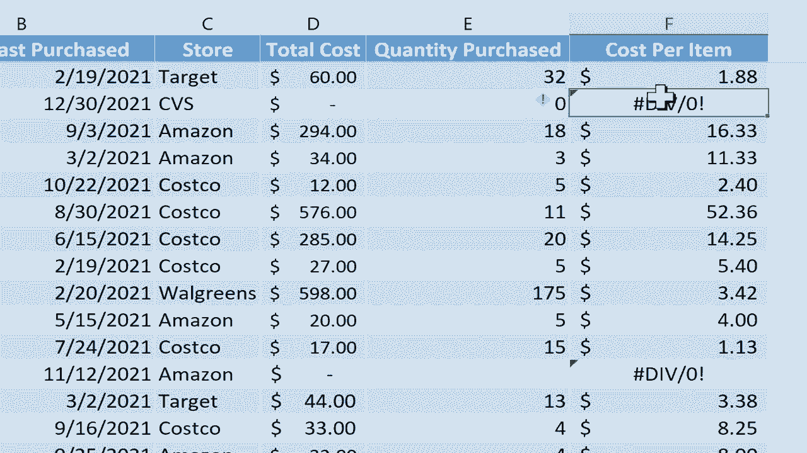

# Excel常见错误修复教程（P25）🔧


## 概述

在本节课中，我们将学习如何识别和修复Excel中三种常见的错误信息：**#NULL!**、**#NUM!** 和 **#####**。我们将逐一分析这些错误产生的原因，并提供简单直接的解决方案，帮助你提升处理Excel表格的效率。

---



## 修复 #NULL! 错误

上一节我们介绍了错误修复的基本概念，本节中我们来看看如何解决 **#NULL!** 错误。这个错误通常出现在公式中，主要原因是在应该使用逗号分隔参数的地方错误地使用了空格。

### 错误原因分析

**#NULL!** 错误的主要原因是公式中使用了空格，而实际上应该使用逗号或其他正确的运算符。Excel会将空格解释为“交集运算符”，它会尝试寻找两个单元格区域的交集。如果这两个区域没有重叠的部分，Excel就会返回 **#NULL!** 错误。

### 解决方案

以下是修复 **#NULL!** 错误的步骤：

1.  **检查公式中的运算符**：仔细检查你的公式，确保在需要分隔多个参数或区域时使用的是逗号（`,`），而不是空格。
2.  **修正公式**：将错误的空间替换为正确的逗号。例如，将 `=SUM(A1:A10 B1:B10)` 修正为 `=SUM(A1:A10, B1:B10)`。

**示例公式对比**：
*   错误公式：`=SUM(A1:A8 A15:A20)` （使用空格）
*   正确公式：`=SUM(A1:A8, A15:A20)` （使用逗号）

---

## 修复 #NUM! 错误

接下来，我们探讨 **#NUM!** 错误。这个错误表示公式尝试进行了一个无效的数学运算。

### 错误原因分析

**#NUM!** 错误通常在两种情况下出现：
1.  公式要求进行一个数学上不可能的计算，例如计算负数的平方根。
2.  公式计算出的数字过大或过小，超出了Excel可以表示的范围（大约为 ±1E±308）。

### 解决方案

以下是处理 **#NUM!** 错误的几种方法：

1.  **检查输入数据**：确保公式引用的数据是有效的。例如，`SQRT` 函数的参数不应为负数。
2.  **使用 IFERROR 函数**：你可以使用 `IFERROR` 函数来捕获错误并返回一个自定义值（如空白或提示文字），使表格更整洁。

**示例代码**：
```excel
=IFERROR(SQRT(C7), "")
```
这个公式的意思是：计算C7单元格的平方根。如果计算成功，则显示结果；如果出现 **#NUM!** 等错误，则显示空白。

---

## 修复 ##### 错误

最后，我们来看最简单的 **#####** 错误。这个错误与公式逻辑无关，纯粹是显示问题。

### 错误原因分析

**#####** 错误表示单元格的宽度不足以完整显示其内容（无论是数字、文本还是公式结果）。当列宽太窄时，Excel就会用 `#####` 填充单元格。

### 解决方案

解决 **#####** 错误的方法非常简单，即调整列宽。

以下是调整列宽的步骤：

1.  **手动调整**：将鼠标移动到列标题（如D列和E列）之间的分隔线上，当光标变成双向箭头时，按住鼠标左键并向右拖动以增加列宽。
2.  **自动调整**：更快捷的方法是直接双击列标题之间的分隔线。Excel会自动将列宽调整为刚好能完整显示该列中最长内容所需的宽度。

---

## 总结

本节课中我们一起学习了三种Excel常见错误的修复方法：
*   **#NULL! 错误**：通常由公式中误用空格引起，应检查并替换为逗号等正确运算符。
*   **#NUM! 错误**：通常由无效数学运算（如对负数开平方）或数字超出范围引起，应检查数据或使用 `IFERROR` 函数处理。
*   **##### 错误**：由列宽不足引起，通过调整列宽即可解决。


掌握这些技巧能帮助你快速排查问题，保持工作表的整洁与准确。请继续关注本系列的下一个部分，我们将讲解 **#REF!** 和 **#VALUE!** 错误的修复策略。