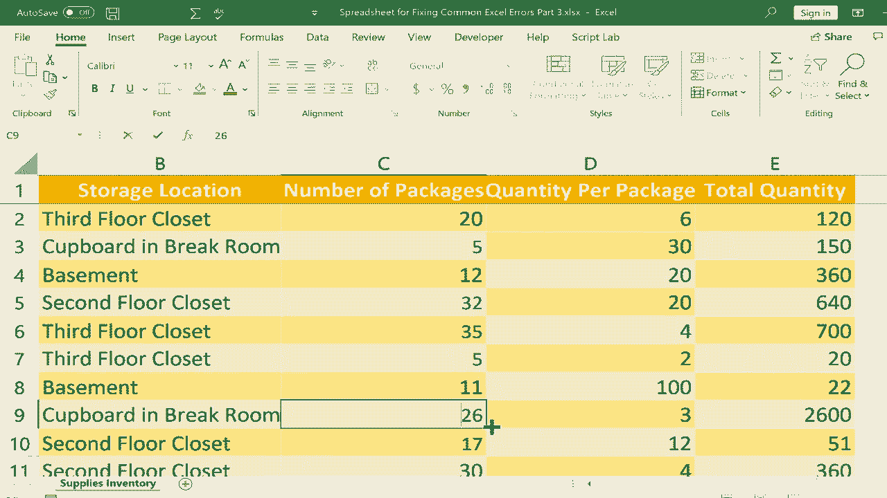

# Excel高效技巧课程 - P26：修复常见错误：REF 和 VALUE 🔧

在本节课中，我们将学习如何识别和修复 Excel 中两种常见的错误类型：**#REF!** 错误和 **#VALUE!** 错误。理解这些错误的成因是避免数据混乱和确保公式准确性的关键。

## 概述 📋

本节课是“修复常见 Excel 错误”系列三部分中的第三部分。我们将专注于 **#REF!**（引用错误）和 **#VALUE!**（值错误），通过具体的库存清单示例，演示它们是如何产生的以及最有效的解决方法。

## 理解与修复 #REF! 错误

上一节我们介绍了其他类型的错误，本节中我们来看看当公式引用的单元格被删除或移动时发生的 **#REF!** 错误。

在我们的示例中，一个公式 `=B3*C3` 用于计算电池总数（包数 × 每包数量）。这个公式引用了 B3 和 C3 单元格。

**#REF! 错误通常在以下情况发生：**
*   删除被公式引用的整个列或行。
*   删除被公式引用的特定单元格（导致其他单元格移动）。

例如，如果删除 C 列（“每包数量”），公式 `=B3*C3` 中的 `C3` 引用将失效，从而显示 **#REF!** 错误。

**修复 #REF! 错误的步骤如下：**
1.  **撤销操作**：最快捷的方法是使用 `Ctrl + Z` 撤销导致错误的删除操作。
2.  **手动修正公式**：如果必须删除数据，则需要手动更新公式。
    *   双击包含错误的单元格，或单击后在上方编辑栏中修改公式。
    *   将无效的引用（如 `#REF!`）更正为当前有效的新单元格引用。

## 理解与修复 #VALUE! 错误

在了解了引用错误后，我们接下来看看因数据类型不匹配而导致的 **#VALUE!** 错误。这种错误常发生在公式试图对不兼容的数据类型执行运算时。

**以下是导致 #VALUE! 错误的常见原因：**

*   **文本与数字进行数学运算**：例如，公式 `=”储物间” * 6` 试图将文本“储物间”乘以数字6，这是无意义的。
    *   **公式示例**：`=A1 * B1`，其中 A1 是文本（如“ABC”），B1 是数字。
*   **数字中含有不可见的字符**：如在数字“11”前或后误输入了空格，Excel 会将其视为文本。
*   **字母与数字混淆**：在快速输入时，可能将数字“0”误输入为字母“O”。
*   **在数字前直接输入特定符号**：虽然美元符号（$）通常可以，但像井号（#）等其他符号与数字结合输入在同一单元格时，可能导致该单元格被识别为文本。

**修复 #VALUE! 错误的步骤如下：**
你需要仔细检查公式中引用的单元格内容。
1.  确保进行数学运算的单元格都是纯数字格式。
2.  清除数字中多余的空格或错误字符。
3.  更正因拼写错误导致的字母/数字混淆（如将“O”改为“0”）。
4.  避免在数字单元格中直接输入非标准符号，应使用单元格格式设置来添加货币等符号。

## 总结 🎯

本节课中我们一起学习了 Excel 中两种棘手的错误：
*   **#REF! 错误** 源于公式引用的单元格被删除。解决方法是撤销操作或手动更新公式引用。
*   **#VALUE! 错误** 源于公式中使用了不匹配的数据类型（如文本与数字相乘）。解决方法是检查并确保参与计算的数据是清洁、正确的数值。

掌握识别和修复这些错误的能力，将帮助你维护表格的完整性，并让公式始终返回准确的结果。