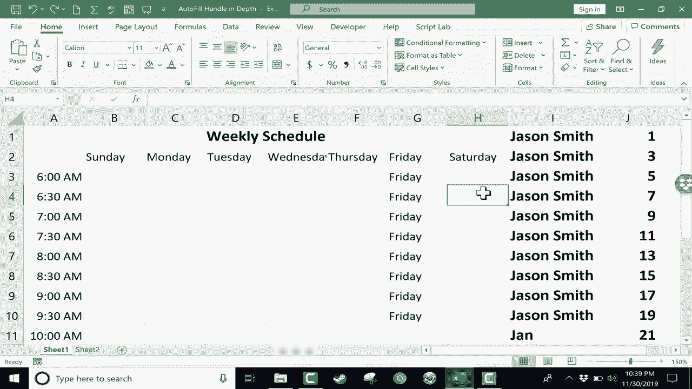

# Excel高效技巧课程 - P27：深入了解自动填充句柄 🔲

在本节课中，我们将深入学习Excel中一个非常实用但常被忽视的工具——**自动填充句柄**。我们将了解它的基本功能、如何用它来复制内容和扩展序列，以及在不同场景下的使用技巧。

自动填充句柄是单元格右下角的一个小方块。它看起来简单，但功能强大，主要用于快速复制单元格内容或根据现有数据智能填充序列。

## 自动填充句柄的基本用法

上一节我们介绍了自动填充句柄的概念，本节中我们来看看它的基本操作：复制内容。

以下是使用自动填充句柄复制文本和数字的步骤：
1.  在目标单元格（例如 `I1`）中输入内容（如一个名字）。
2.  点击选中该单元格。
3.  将鼠标指针移至单元格右下角，直到它变成黑色十字（即自动填充句柄）。
4.  按住鼠标左键并向下拖动。
5.  松开鼠标，原单元格的内容就会被复制到拖过的所有单元格中。

此方法对文本和普通数字均有效。例如，在 `J1` 中输入 `number1` 并向下拖动填充句柄，会得到一连串的 `number1`。

## 使用自动填充句柄扩展序列模式

除了简单的复制，自动填充句柄更强大的功能在于识别和扩展序列模式。

要使用此功能，你需要先为Excel建立一个模式。例如，在连续的单元格中分别输入 `1`、`2`、`3`。然后，同时选中这三个单元格，再拖动最下方单元格的填充句柄。Excel会识别出这是一个递增序列，并自动填充为 `4`、`5`、`6`……

这种模式可以更复杂。例如，输入 `1`、`3`、`5`（奇数序列），然后使用填充句柄，Excel会继续填充 `7`、`9`、`11` 等。你可以尝试各种数字模式，观察Excel的智能填充能力。

## 处理日期和时间序列

自动填充句柄对日期、时间、星期、月份等与时间相关的数据特别有效。

以下是处理时间相关序列的示例：
*   **星期**：在单元格中输入“星期日”，然后拖动其填充句柄，会自动填充“星期一”、“星期二”……
*   **时间**：输入“6:00 AM”，拖动填充句柄，会自动填充“7:00 AM”、“8:00 AM”…… 当到达“12:00 PM”时，它会自动切换。
*   **自定义时间间隔**：要创建30分钟的间隔，可以先输入“6:00 AM”和“6:30 AM”建立模式，然后同时选中这两个单元格，再拖动填充句柄，即可得到“7:00 AM”、“7:30 AM”……
*   **月份**：输入“一月”或“Jan”，拖动填充句柄，会自动填充后续月份。

**关键技巧**：如果你只想**复制**时间/日期内容，而不是扩展序列，请在拖动填充句柄时，按住键盘上的 `Ctrl` 键。例如，按住 `Ctrl` 键再拖动“星期日”，将得到一连串的“星期日”。

## 高效填充长列表数据

当需要填充的行数很多时（例如成百上千行），手动拖动填充句柄会非常低效。

此时，你可以使用“双击填充”功能：
1.  选中包含初始数据或模式的单元格。
2.  将鼠标移至该单元格右下角的填充句柄上。
3.  直接**双击**填充句柄。

Excel会自动向下填充数据，直到遇到相邻列中的空白单元格为止。例如，如果A列有数据直到第100行，在B1输入“一月”后双击填充句柄，B列会自动填充月份直到第100行。

**注意**：如果目标单元格下方相邻列没有数据，双击填充句柄将不会产生任何效果。

---

本节课中我们一起学习了Excel自动填充句柄的核心用法。我们掌握了如何用它来**复制内容**、**扩展数字与时间序列**，以及通过按住 `Ctrl` 键强制复制、通过**双击**快速填充长列表等高效技巧。熟练运用这个工具，将极大提升你在Excel中的数据录入和整理效率。