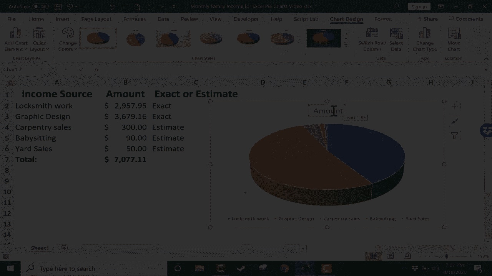
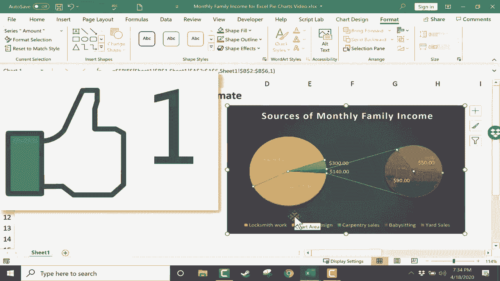

# Excel高效技巧：第29课 - 创建饼图 📊

在本节课中，我们将学习如何在Excel中创建和使用饼图。饼图是一种用于展示各部分与整体之间关系的有效工具。我们将从了解其适用场景开始，逐步学习创建、美化和调整饼图的完整流程。

## 饼图的适用场景

上一节我们介绍了课程目标，本节中我们来看看饼图最适合在什么情况下使用。

饼图的目的是展示个别部分与整体之间的关系。例如，在一个家庭月收入来源的电子表格中，每一项收入（如锁匠工资、平面设计收入、副业收入）都是总收入的一部分。这种情况下，使用饼图可以清晰地传达各部分所占的比例。

然而，并非所有数据都适合用饼图展示。例如，一个包含复杂、重复统计产品的电子表格，由于其结构复杂，使用饼图可能无法有效传达信息，甚至会造成误解。

## 创建饼图

了解了适用场景后，我们开始学习创建饼图的具体步骤。

第一步是选择用于创建图表的数据。需要选中包含类别和数值的单元格区域，但**不应包括总计行**，因为总计会扭曲饼图的比例，使其失去意义。同时，应包含列标题，以便Excel识别数据含义。

选中数据后，可以转到“插入”选项卡。在图表区域中，找到并点击“饼图”按钮。Excel会提供多种饼图选项，包括2D饼图、3D饼图和圆环图。将鼠标悬停在选项上可以预览图表效果。

选择“3D饼图”并点击，图表就会出现在工作表上。此时可以点击并拖动图表，将其移动到合适的位置。

## 自定义饼图元素

创建基础图表后，我们可以通过“图表设计”和“格式”选项卡对其进行深度定制。

选中饼图后，顶部会出现“图表设计”和“格式”两个额外标签。点击“图表设计”标签，可以看到“添加图表元素”的选项。

以下是可调整的主要元素：

*   **图表标题**：可以删除标题、将其移动到饼图上方，或更改标题文本。例如，将默认的“金额”改为更具描述性的“家庭月收入来源”。
*   **数据标签**：用于在饼图切片上显示具体数值或百分比。有多种位置选项，如“居中”、“数据标签外”或“最佳匹配”。对于拥挤的标签，“最佳匹配”通常是一个好选择。
*   **图例**：用于说明各颜色切片代表的类别。可以选择不显示图例，或将其放置在右侧、顶部、左侧或底部。

在“图表设计”选项卡中，还可以使用“快速布局”快速调整整体布局，或使用“更改颜色”为图表选择不同的配色方案。此外，“图表样式”提供了多种预设样式，可以一键改变图表的外观。

如果需要更改数据源或图表类型，可以使用“选择数据”和“更改图表类型”功能。一个有趣的选项是“饼图中的饼图”或“条形图中的饼图”，它特别适用于展示一个主要饼图中某些过小切片的具体构成。

## 高级格式设置

除了基本设计，我们还可以利用“格式”选项卡进行更精细的美化。

在“格式”选项卡中，可以插入形状（如箭头、文本框）来增强图表说明。更重要的是，可以使用“形状样式”来快速改变图表区域、绘图区的外观。

以下是可进行的格式操作：

*   为图表形状选择特定的填充颜色。
*   为图表边框（形状轮廓）选择颜色并调整粗细。
*   对文本元素应用艺术字样式。

Excel图表最强大的功能之一是**动态更新**。当源数据表中的数值发生变化时，饼图会自动调整以反映最新的比例关系。

## 实用技巧与注意事项

最后，我们来了解一些能让饼图更出色的实用技巧，并再次强调其正确用法。

两个常被忽视但非常有用的技巧是：
1.  **“爆炸”切片**：双击饼图的任何一个切片，然后点击并拖动，即可将该切片从主体中分离出来，以突出强调。
2.  **单独格式化**：右键点击任意切片，可以单独更改其填充颜色、边框等。如果对修改不满意，可以右键选择“重置以匹配样式”来恢复。

在结束前，必须重申：饼图并不适用于所有数据。例如，仅选择一列数值数据来创建饼图，得到的结果将是毫无意义且无效的。因此，在创建图表前，务必思考其目的以及你想要展示的数据关系。

本节课中我们一起学习了Excel饼图的完整创建与美化流程。从识别适用场景、选择数据、插入图表，到自定义标题、标签、图例和样式，再到使用高级技巧突出显示重点，并理解了图表的动态联动特性。记住，正确选择图表类型是有效数据可视化的第一步。