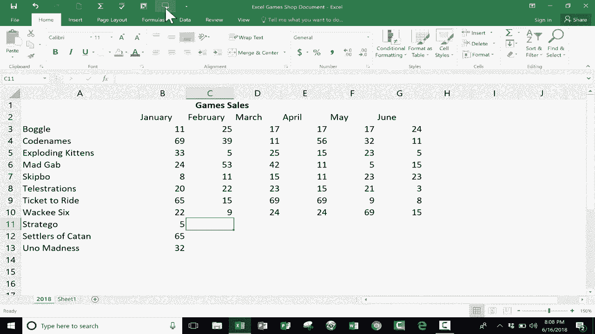

# Excel高效技巧课程 - P3：使用“按回车朗读单元格”输入工具 🎤

在本节课中，我们将学习一个非常实用但鲜为人知的Excel功能——“按回车朗读单元格”。这个功能能显著提升数据输入的效率和准确性，尤其适合需要处理大量数据输入的用户。

## 为什么需要这个功能？ 🤔

当你需要将大量数据从纸质文件、另一个屏幕或应用程序录入Excel表格时，通常需要反复核对。你的视线会在数据源和Excel表格之间不断切换，以确保输入正确。这个过程不仅耗时，还容易让人感到烦躁和出错。

“按回车朗读单元格”功能可以在你每次按下回车键确认输入时，自动朗读你刚刚输入的内容。这样，你只需用耳朵听，就能核对数据，无需频繁转移视线，从而提升输入速度和准确性。

## 如何启用“按回车朗读单元格”功能 ⚙️

上一节我们介绍了这个功能的用途，本节中我们来看看如何找到并启用它。这个功能默认不在Excel的主功能区，需要手动添加到“快速访问工具栏”。

以下是添加步骤：

1.  点击Excel窗口左上角的“自定义快速访问工具栏”下拉箭头（一个小倒三角）。
2.  在下拉菜单中，选择“其他命令”。
3.  在弹出的“Excel选项”对话框中，将“从下列位置选择命令”的下拉菜单从“常用命令”更改为“所有命令”或“不在功能区中的命令”。
4.  在下方长长的命令列表中，找到并选中“按回车朗读单元格”。
5.  点击“添加”按钮，将其移到右侧的列表中。
6.  你可以使用右侧的“上移”或“下移”箭头按钮调整它在工具栏上的位置。
7.  点击“确定”按钮保存设置。

完成以上步骤后，“按回车朗读单元格”的按钮（通常是一个喇叭图标 📢）就会出现在你的快速访问工具栏上。

## 如何使用该功能进行数据输入 📝

现在功能已经就位，让我们通过一个例子来学习如何使用它。假设我们正在为一家桌游店更新库存游戏列表。

首先，**必须点击一次快速访问工具栏上的“按回车朗读单元格”按钮来激活它**。这是一个**切换按钮**，点击一次开启，再点击一次关闭。

激活后，我们就可以开始输入了：

*   在单元格A2输入 `Strtigo`，按下回车。Excel会尝试朗读这个单词。
*   接着在A3输入 `Katon的开拓者`，按下回车，再次听到朗读确认。
*   最后在A4输入 `Uno疯狂`，按下回车完成输入。

这个功能对输入数字尤其有帮助，因为数字的读音更标准，更容易听清核对。例如，你可以在B列对应输入销售额 `65` 和 `32`，每次回车都能听到“六十五”、“三十二”的读音，实现快速听觉校验。

当你不再需要此功能时，只需再次点击快速访问工具栏上的“按回车朗读单元格”按钮，即可将其关闭。

## 总结 📚

本节课中，我们一起学习了如何利用Excel的“按回车朗读单元格”功能来优化数据输入流程。

我们首先了解了它在减少视线切换、提高输入效率方面的价值。然后，我们一步步学习了如何从“所有命令”中找到并将其添加到“快速访问工具栏”。最后，我们通过实例演示了如何开启、使用和关闭这个**切换功能**。

掌握这个技巧，能让你在繁重的数据录入工作中更加得心应手，通过“听”来辅助“看”，实现更高效、更准确的操作。