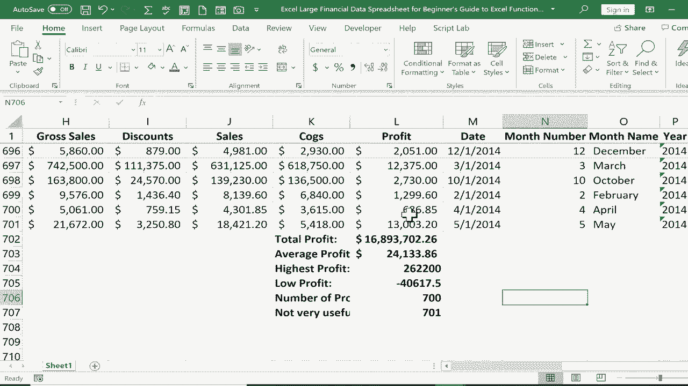

# Excel函数与公式入门指南 📊 - P30


## 概述

在本节课中，我们将学习Excel中最常用、最基础的六个函数：`SUM`、`AVERAGE`、`MAX`、`MIN`、`COUNT`和`COUNTA`。我们将通过一个财务数据表格的实例，了解每个函数的作用、语法和实际应用方法，帮助你快速掌握数据分析的核心工具。

---

## 1. 快速导航与数据准备

在开始学习函数之前，掌握高效浏览大型表格的技巧很重要。例如，按住 `Ctrl` 键并点击 `↓` 方向键，可以快速跳转到当前数据列的底部。

上一节我们介绍了快速导航技巧，本节中我们来看看如何为计算利润数据做准备。我们假设手头有一个包含不同市场、国家和产品利润的财务表格，目标是分析“利润”这一列的数据。

---

## 2. 使用SUM函数计算总利润

`SUM` 函数用于计算一系列单元格中所有数字的总和。

以下是 `SUM` 函数的基本用法：

1.  **选择目标单元格**：点击你希望显示总和的单元格。
2.  **输入公式**：以等号 `=` 开头，输入函数名 `SUM`。
3.  **指定范围**：在 `SUM` 后输入左括号 `(`，然后指定要相加的单元格范围（例如 `L2:L701`），最后输入右括号 `)`。
4.  **完成计算**：按下 `Enter` 键，Excel会自动计算并显示总和。

**公式示例**：
```excel
=SUM(L2:L701)
```

此外，Excel提供了更快捷的“自动求和”功能：选中数据下方的单元格，在“开始”选项卡的“编辑”组中点击 **Σ** 符号，然后按 `Enter` 即可。

---

## 3. 使用AVERAGE函数计算平均利润

在了解了如何求和之后，我们常常还需要计算平均值。`AVERAGE` 函数可以计算指定范围内所有数字的算术平均值。

操作步骤与 `SUM` 函数类似：
1.  在目标单元格输入 `=AVERAGE(`。
2.  选择或输入范围（如 `L2:L701`）。
3.  输入右括号 `)` 并按 `Enter`。

**公式示例**：
```excel
=AVERAGE(L2:L701)
```

**提示**：在公式栏（位于Excel窗口顶部）中输入和编辑公式，比直接在单元格内操作更不易出错。

---

## 4. 使用MAX和MIN函数寻找极值

除了总体和平均情况，数据中的最大值和最小值也至关重要。`MAX` 函数返回范围内的最大数字，而 `MIN` 函数返回最小数字。

以下是具体应用方法：

*   **寻找最高利润**：使用 `=MAX(L2:L701)`。
*   **寻找最低利润**：使用 `=MIN(L2:L701)`。结果可能是负数，这表示该条目处于亏损状态。

---

## 5. 使用COUNT与COUNTA函数统计条目

统计条目数量是另一项常见需求。这里有两个相似但功能不同的函数：`COUNT` 和 `COUNTA`。

上一节我们学习了如何寻找数据极值，本节我们来学习如何统计数据数量。以下是这两个函数的区别与用法：

*   **`COUNT` 函数**：只统计范围内包含**数字**的单元格数量。它会忽略空白单元格以及包含文本或字母的单元格。
    *   **公式示例**：`=COUNT(L2:L701)`。如果L1单元格是标题“Profit”，则它不会被计入。

*   **`COUNTA` 函数**：统计范围内所有**非空**单元格的数量。只要单元格内有任何内容（包括数字、文本、字母，甚至只是一个空格），都会被计入。
    *   **公式示例**：`=COUNTA(L2:L701)`。这个结果会包含标题“Profit”单元格。

简单来说，当你只想统计数字条目的数量时，使用 `COUNT`；当你想知道整个列表（包含标题等文本）有多少个项目时，使用 `COUNTA`。

---

## 总结

本节课我们一起学习了Excel的六个核心函数：
1.  **`SUM`**：对数字求和。
2.  **`AVERAGE`**：计算数字的平均值。
3.  **`MAX` / `MIN`**：找出范围内的最大值或最小值。
4.  **`COUNT`**：统计包含数字的单元格数量。
5.  **`COUNTA`**：统计所有非空单元格的数量。



掌握这些基础函数，你就能快速从数据中提取总利润、平均利润、利润极值以及有效数据条数等关键信息，为更深入的数据分析打下坚实基础。