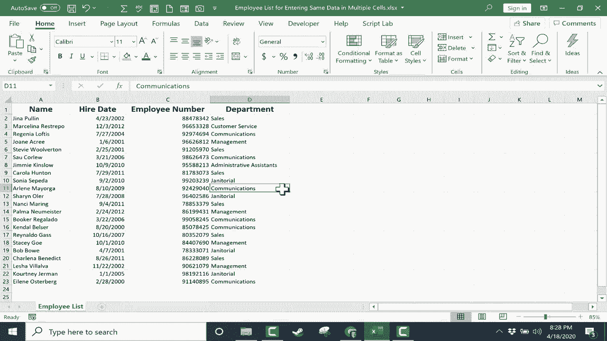

# Excel高效技巧课程 - P31：在多个单元格中批量输入相同数据 📝

在本节课中，我们将学习如何在Excel中快速向多个非连续的单元格输入相同的数据。这是一种能极大提升数据录入效率的技巧，尤其适用于处理不连续但需要相同内容的单元格。

## 概述

在之前的课程中，我们介绍了如何使用**自动填充柄**来复制数据。其基本操作是：在一个单元格输入数据（如“管理”），然后拖动该单元格右下角的填充柄，将数据复制到相邻的单元格。

**代码示例：**
`在A1单元格输入“管理” -> 拖动A1单元格右下角的填充柄至A5`

然而，自动填充柄主要适用于连续的单元格区域。当我们需要在不连续的多个单元格中输入相同内容时，就需要使用本节介绍的新方法。

## 核心操作步骤

以下是使用“Ctrl+Enter”组合键在多个选定单元格中输入相同数据的详细步骤。

1.  **选择目标单元格**
    首先，按住键盘上的 `Ctrl` 键，然后用鼠标逐个点击所有需要输入相同数据的单元格。这些单元格可以是分散在表格各处的。

2.  **输入数据**
    在保持所有单元格被选中的状态下，直接输入你需要的内容，例如“销售”。此时，输入的内容会显示在最后被激活的那个单元格中。

3.  **批量确认输入**
    这是最关键的一步：在输入内容后，不要只按 `Enter` 键，而是按住 `Ctrl` 键，然后再按 `Enter` 键。

**核心公式/操作：**
`选择多个单元格 -> 输入内容 -> 按 Ctrl + Enter`

完成以上操作后，你会发现刚才输入的内容已经一次性填充到了所有之前选定的单元格中。

## 操作要点与常见错误

上一节我们介绍了核心步骤，本节中我们来看看操作中的关键点和需要避免的错误。

*   **必须使用 Ctrl+Enter**：如果只按 `Enter` 键，数据只会输入到最后活动的单个单元格中，其他被选中的单元格不会被填充。
*   **适用于任何数据类型**：此方法对文本、数字、日期等内容均有效。
*   **高效选择**：结合 `Ctrl` 键进行多点选择，是此技巧高效的前提。

## 总结

本节课中我们一起学习了Excel中一个非常实用的效率技巧：如何利用 `Ctrl` 键选择多个不连续的单元格，并通过 `Ctrl + Enter` 组合键批量输入相同的数据。

这个方法完美解决了自动填充柄无法处理非连续区域的局限，让你在整理类似员工部门、产品分类等数据时，速度得到显著提升。记住核心口诀：**先Ctrl选，再Ctrl+Enter填**。