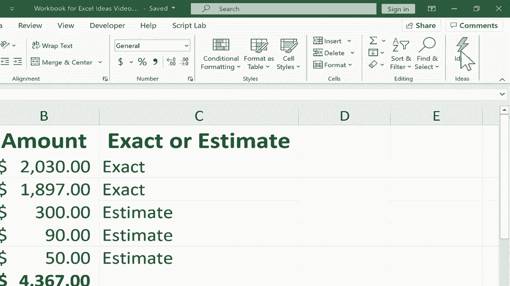
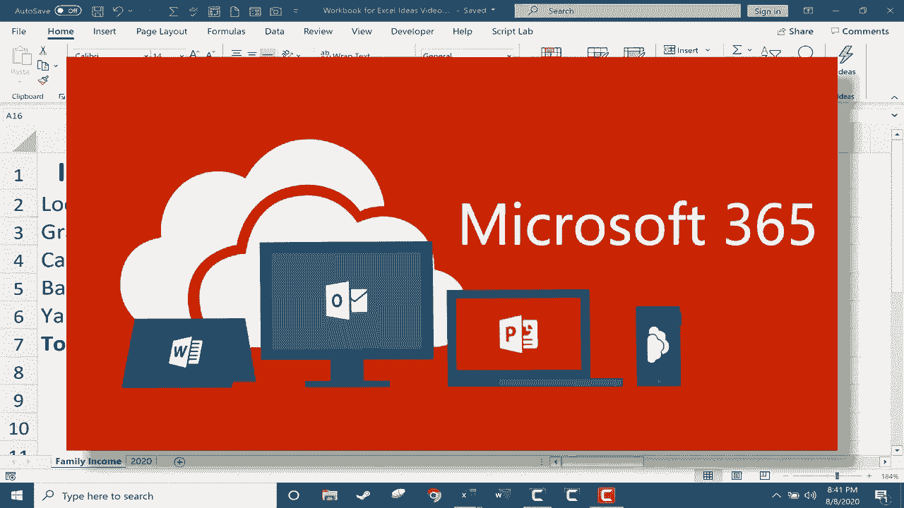
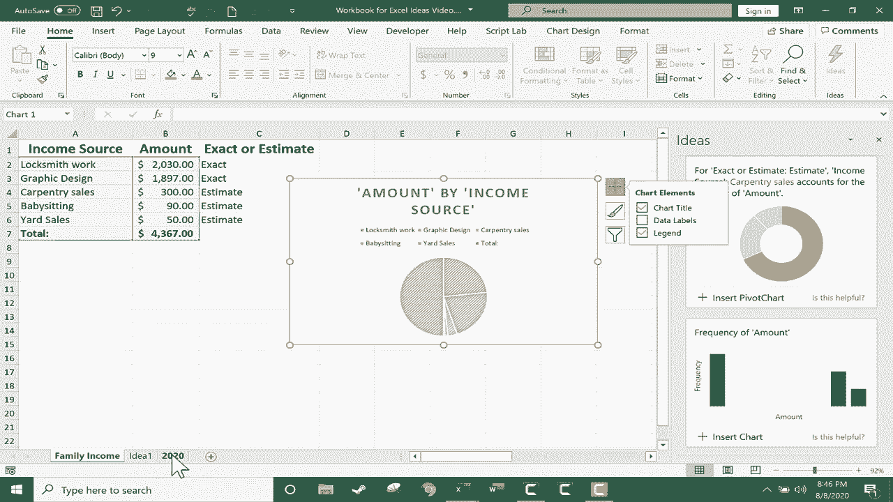

# Excel高效技巧系列课程 - P33：创意按钮 🎨

在本节课中，我们将学习如何使用Excel的“创意”按钮（也称为“想法”按钮），借助人工智能快速生成美观的图表和数据透视表，从而直观地分析和展示数据。

## 概述

“创意”按钮是Office 365版本Excel（包括Windows、Mac和在线版）中的一项智能功能。它能够自动分析你的数据，并提供一系列可视化的建议，帮助你快速创建图表和数据透视表，而无需手动选择数据或设计图表类型。

## 创意按钮的位置与启动

要使用“创意”功能，你无需预先选择数据。只需打开一个包含数据的工作表，然后按照以下步骤操作：

1.  在Excel顶部功能区中，切换到 **“开始”** 选项卡。
2.  在选项卡的右侧区域，找到并点击 **“创意”** 按钮。

点击后，系统可能需要一些时间进行分析，随后会在右侧面板中显示一系列可视化建议。

## 使用创意按钮分析简单数据

上一节我们介绍了如何启动“创意”功能，本节中我们来看看它在一个简单家庭收入表格中的应用效果。

启动“创意”后，面板会显示针对当前数据的建议。例如，对于一个家庭收入表格，它可能会建议：
*   一个展示**收入来源占比的饼图**。
*   一个关于**收入来源的数据透视表**。

初始显示的建议数量可能有限，你可以点击 **“显示所有结果”** 来查看更多选项。

以下是应用建议的步骤：
1.  浏览建议列表，找到你喜欢的可视化效果。
2.  点击建议下方的 **“插入图表”** 或 **“插入数据透视表”** 按钮。
    *   插入的**图表**会直接放置在当前工作表数据的旁边。
    *   插入的**数据透视表**则会创建一个新的工作表来存放。你可以通过拖动工作表标签来调整其位置。

## 自定义生成的视觉效果

所有通过“创意”按钮插入的图表或数据透视表都是完全可编辑的。插入后，你可以像处理任何普通Excel对象一样对其进行自定义。

例如，对于一个插入的图表：
*   点击选中图表，顶部会出现 **“图表设计”** 和 **“格式”** 选项卡。
*   你可以使用这些工具来**更改图表样式**、**添加图表元素**（如标题、数据标签）或进行**数据筛选**。

这意味着“创意”功能提供的是基于AI生成的、可快速应用的**基础模板**，你可以在此基础上调整，使其完全符合你的展示需求。

## 在复杂数据中的应用

现在，让我们关闭创意面板，尝试在一个包含大量财务数据的复杂工作表上再次使用“创意”功能。

即使面对复杂数据，使用方法依然相同：在 **“开始”** 选项卡点击 **“创意”** 按钮。系统会分析数据并生成新的建议列表。

由于数据更复杂，生成的结果也会更加丰富和深入。例如，你可能会看到：
*   识别数据**异常值**的图表。
*   展示两个数据系列之间**相关性**的图表。
*   突出显示数据中特定**模式**的数据透视图。

这展示了“创意”功能利用人工智能识别数据趋势和关键洞察的强大能力。它可以帮助你从海量数据中快速发现值得关注的信息，并以美观的视觉形式呈现出来。

## 总结

本节课中，我们一起学习了Excel“创意”按钮的使用方法。我们了解到，这个功能可以：
1.  **自动分析**工作表数据，无需手动选择。
2.  **智能推荐**多种图表和数据透视表。
3.  **一键插入**推荐的可视化效果。
4.  **完全支持自定义**，插入后可按需修改。

“创意”按钮是提升数据分析效率和可视化效果的强大工具，尤其适合希望快速获得数据洞察的初学者和专业人士。