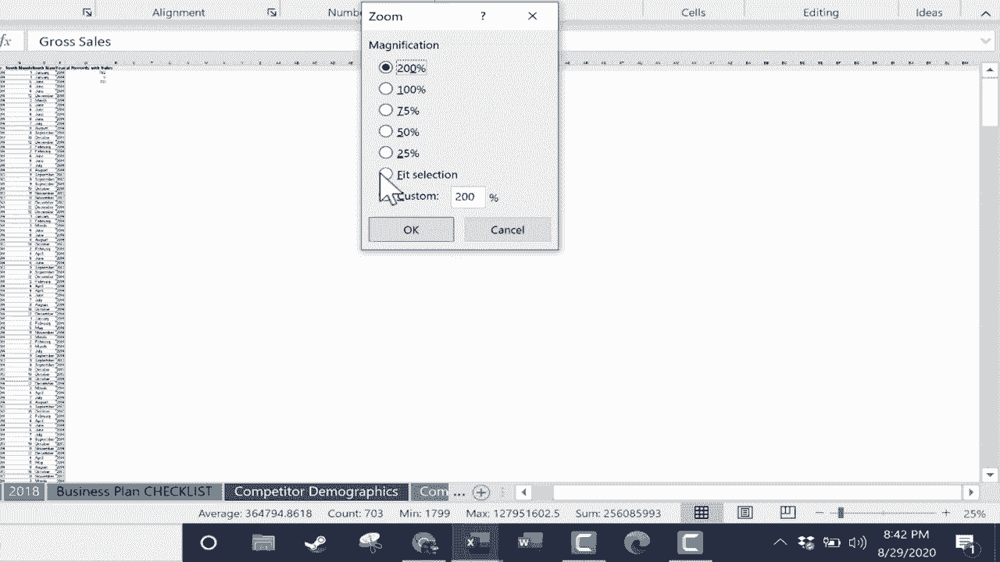
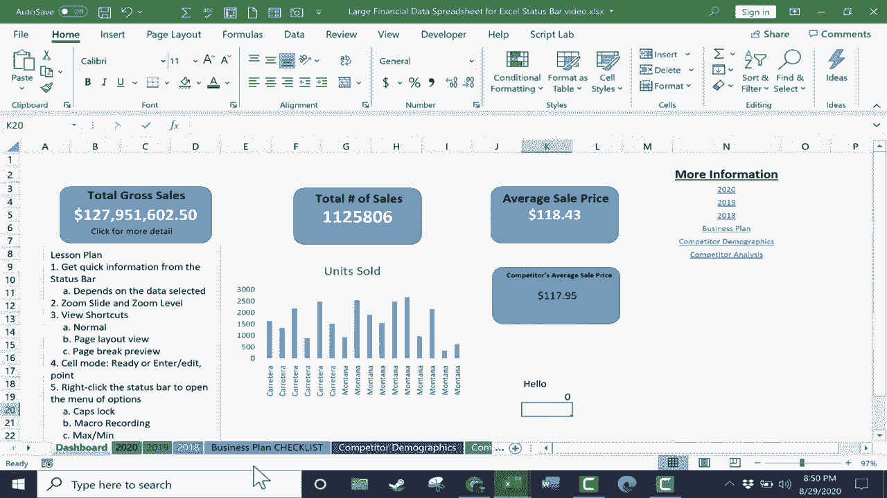

# Excel高效技巧课程 - P34：34）状态栏详解 📊


在本节课中，我们将学习Excel状态栏的功能与用法。状态栏位于Excel窗口底部，虽然看似简单，却能提供大量关于所选数据的即时信息，并包含多种实用工具。掌握状态栏的使用，能显著提升数据处理效率。

上一节我们介绍了Excel的其他界面元素，本节中我们来看看这个常被忽视但功能强大的状态栏。

## 状态栏的核心功能：快速数据统计

状态栏最常见的用途是快速显示所选数据的统计信息。

例如，打开一个包含财务数据的表格，选中“销售额”所在的H列。此时，状态栏会自动计算并显示该列数据的**平均值**、**计数**、**最小值**、**最大值**和**求和**。

**公式示例：**
*   平均值 = `AVERAGE(H:H)`
*   求和 = `SUM(H:H)`

这个功能非常便捷。在许多情况下，你无需再手动使用“自动求和”功能，只需选择数据区域，状态栏就会立即给出关键统计结果。

选择范围可以是整列、整行或任意单元格区域。例如，你可以同时选中多列数据，状态栏会计算所有选中区域的总和。

**注意：** 如果选中的区域包含文本（例如B列的“国家”），状态栏将不会计算平均值、最大值和最小值，但依然会显示**计数**。

## 自定义状态栏显示信息

状态栏显示的信息是可以自定义的。你可能发现你的状态栏没有显示“最大值”和“最小值”。

以下是自定义步骤：
1.  在状态栏任意位置**右键单击**。
2.  在弹出的菜单中，勾选或取消勾选你希望显示或隐藏的项目，例如“最大值”、“最小值”、“数字计数”等。




你可以根据个人习惯和当前任务需求，灵活配置状态栏显示的内容。

## 视图与缩放控制

除了数据统计，状态栏右侧还集成了视图切换和缩放控制工具。

**缩放控制：**
*   使用**缩放滑块**可以快速放大或缩小工作表视图。
*   点击**缩放级别**（如“100%”）可以打开缩放对话框，直接选择特定比例（如25%、200%）或“缩放到选定区域”。

**视图切换：**
状态栏右侧提供了三种视图模式按钮：
1.  **普通视图**：默认的编辑视图。
2.  **页面布局视图**：显示页面边界、页眉页脚，便于调整打印格式。
3.  **分页预览视图**：用蓝色线条显示分页符，可以直接拖动分页符来调整每页打印内容。

在需要调整打印布局时，切换到“页面布局”或“分页预览”视图会非常有用。

## 其他实用状态指示器

通过右键菜单自定义，你还可以在状态栏上添加更多有用的指示器：

*   **单元格模式**：显示当前单元格状态，如“就绪”、“输入”、“编辑”或“点”模式（在输入公式并用鼠标选取范围时出现）。
*   **大写锁定/数字锁定指示器**：当Caps Lock或Num Lock键开启时，状态栏会显示相应图标，防止误操作。
*   **宏录制**：显示一个宏录制图标。点击它可以快速开始或停止录制宏，这是一个高效的快捷方式。

**代码示例（VBA宏录制简例）：**
```vba
Sub MyMacro()
    ' 这是一个简单的宏示例
    Range("A1").Value = "Hello, Status Bar!"
End Sub
```

本节课中我们一起学习了Excel状态栏的多项实用功能。我们了解到它可以快速提供数据统计信息，并且这些信息是可自定义的。我们还掌握了如何使用状态栏进行视图切换、缩放控制，以及如何启用单元格模式、大写锁定等有用的状态指示器。



善用状态栏这个“信息中枢”，能让你的Excel操作更加得心应手。希望你在今后的使用中能更多地关注并利用这个高效工具。