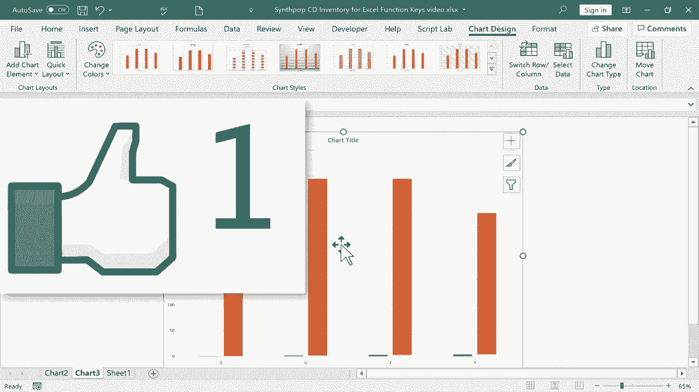

# Excel高效技巧课程 - P35：35）Excel功能键详解 🎹

在本节课中，我们将系统学习Excel中从F1到F12所有功能键的具体作用与使用场景。掌握这些快捷键能显著提升你的操作效率，让你更专注于数据本身。

---

## F1：帮助键

当你在使用Excel过程中遇到疑问或需要官方指导时，可以按下**F1**键。该操作会在Excel窗口右侧打开帮助面板。

以下是帮助面板的主要功能：

*   浏览Excel推荐的学习主题。
*   获取关于公式和函数的详细说明。
*   使用搜索框查找特定问题的解决方案，例如输入“宏”来获取创建和运行宏的相关信息。

使用完毕后，点击帮助面板右上角的“X”即可关闭。

---

## F2：编辑键

**F2**键的作用是进入当前选定单元格的编辑状态。其效果等同于用鼠标双击该单元格。

你可能会问，既然双击鼠标也能实现，为何需要这个快捷键？关键在于保持操作连贯性。频繁在键盘和鼠标之间切换会降低效率。使用**F2**键可以让你的双手始终停留在键盘上，快速进行公式修改或内容输入。

---

## F3：粘贴名称键

按下**F3**键会打开“粘贴名称”对话框，其中会列出当前工作簿中所有已定义的**命名范围**。

以下是此功能的应用方式：

*   点击“粘贴列表”，可以将所有命名范围的列表粘贴到指定位置。
*   在对话框中选择一个特定的命名范围（如“类型”），然后点击“确定”，即可将该范围的内容快速引用或粘贴到公式中。

这为管理和使用命名范围提供了极大便利。

---

## F4：切换引用键

在编辑单元格公式时，将光标定位到某个单元格引用（如`H2`）上，然后按下**F4**键。

这个操作会为引用添加或切换**美元符号 (`$`)**，从而在相对引用、绝对引用和混合引用之间循环切换。例如：
*   `H2` -> `$H$2` (绝对引用)
*   `$H$2` -> `H$2` (混合引用)
*   `H$2` -> `$H2` (混合引用)
*   `$H2` -> `H2` (相对引用)

这是快速锁定行或列，创建固定引用的高效方法。

---

## F5：定位键

按下**F5**键会打开“定位”对话框。这个功能可以让你快速跳转到工作表中的特定位置。

其核心用途包括：

*   从列表中选择一个已定义的命名范围（如“乐队”），即可快速选中该区域。
*   在“引用位置”输入框中直接输入目标单元格地址（如`Z500`），然后按回车，即可直接跳转到该单元格。
*   点击“定位条件”按钮，可以根据特定条件（如公式、常量、空值等）快速选中符合条件的所有单元格。

---

## F6与F8：导航与扩展键

**F6**键用于在Excel窗口的不同区域间循环切换焦点，例如工作表区域、状态栏、功能区等。这有助于完全使用键盘进行导航。

**F8**键用于开启或关闭“扩展式选定”模式。按下**F8**后，状态栏会显示“扩展式选定”，此时使用方向键可以以当前活动单元格为起点，逐步扩大选区范围。

这相当于用键盘实现了鼠标点击拖拽选取区域的操作，非常适合快速选择大块连续数据。

---

## F7与F9：检查与计算键

**F7**键用于启动拼写检查器，对当前工作表或选定区域进行英文拼写检查。

**F9**键与公式计算相关。当你在“公式”选项卡中将工作簿的计算选项设置为“手动”时，更改公式所引用的数据后，计算结果不会自动更新。此时，按下**F9**键会强制对所有公式进行一次手动重算。

例如，在手动计算模式下，更改销售数量后，按下**F9**，总收入公式才会更新结果。

---

## F10、F11与F12：功能键

**F10**键用于激活功能区的键提示。按下后，功能区各选项卡和命令上会显示字母或数字提示，此时按对应按键即可快速执行命令，无需使用鼠标。

**F11**键可以快速创建图表。选中数据区域后按下**F11**，Excel会自动生成一个默认图表，并将其放置在一个全新的图表工作表中。

**F12**键是“另存为”功能的快捷键。按下后会直接打开“另存为”对话框，方便你快速将当前工作簿保存为新文件或更改保存位置。

---

本节课中，我们一起详细学习了Excel中F1到F12这12个功能键的每一项核心功能。从获取帮助、快速编辑，到定位数据、切换引用、创建图表和保存文件，这些按键是提升Excel操作流畅度和效率的得力工具。建议在日常使用中多加练习，逐渐养成使用快捷键的习惯，让你的数据处理工作更加得心应手。