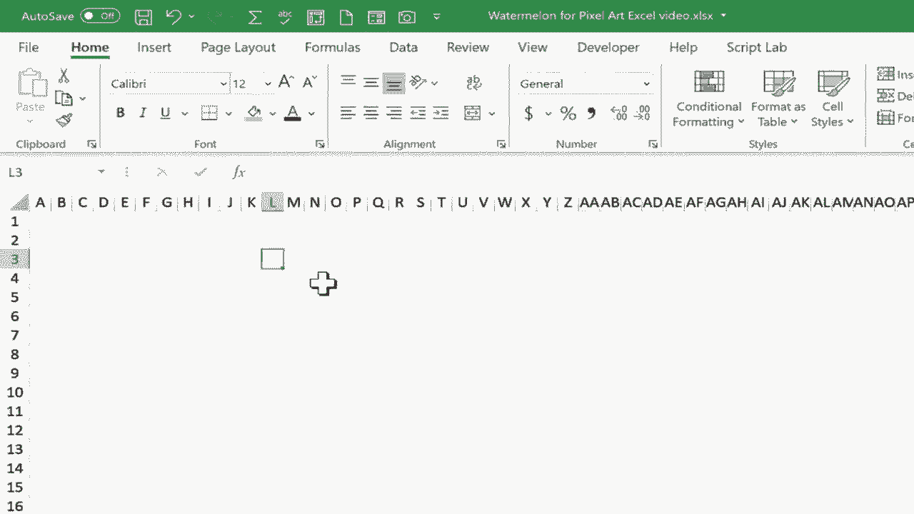
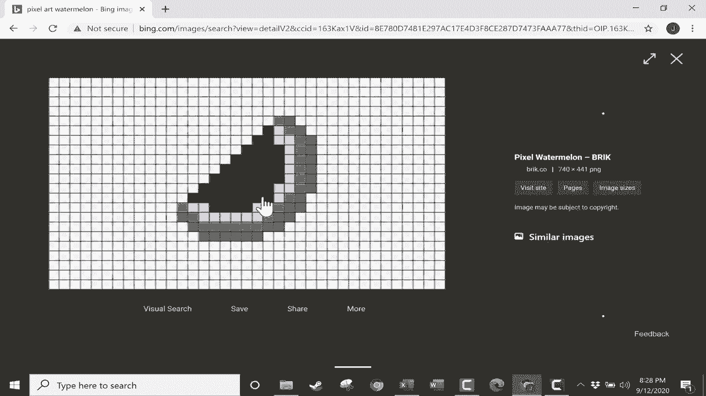
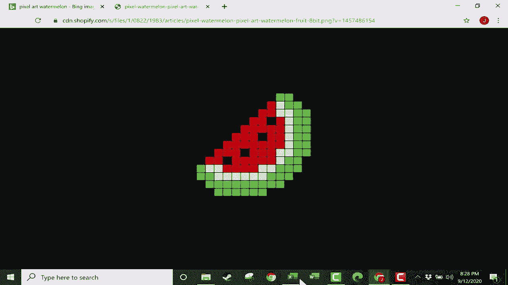
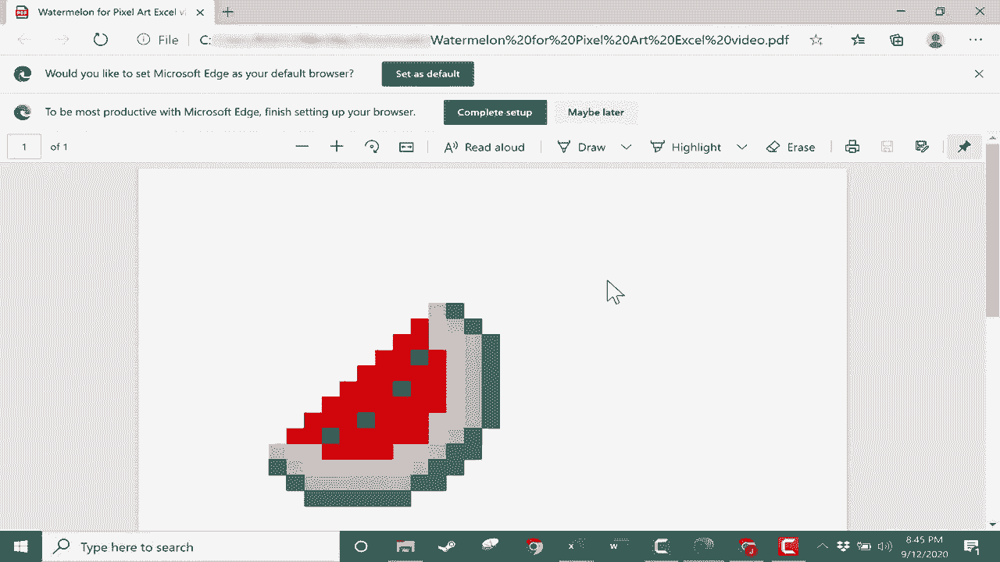

# Excel高效技巧课程 - P36：36）如何创建Excel像素艺术 🎨

在本节课中，我们将学习如何在Microsoft Excel中创建像素艺术。这是一个有趣且实用的技巧，尤其适合Excel初学者，它能帮助你熟悉单元格格式和颜色填充工具。

## 概述：什么是像素艺术？

像素艺术是一种数字艺术形式，通过排列单个彩色方块（像素）来构成图像。它因《Minecraft》等游戏而广为人知，也常被用作头像。由于Excel的网格结构与像素艺术的背景网格非常相似，因此它成为了创作像素艺术的理想工具。

上一节我们介绍了像素艺术的基本概念，本节中我们来看看如何在Excel中具体操作。

## 第一步：准备Excel网格

首先，我们需要调整Excel工作表中单元格的尺寸，使其变成均匀的正方形网格，作为我们的“画布”。

1.  点击工作表左上角（行号与列标交汇处），以选中整个工作表。
2.  将鼠标指针放在任意两列（例如B列和C列）的列标之间，当指针变为双向箭头时，点击并拖动以调整列宽。调整时，注意观察显示的像素值。
3.  将列宽设置为**50像素**。
4.  使用相同方法，将鼠标放在任意两行的行号之间，点击并拖动以调整行高，同样设置为**50像素**。

完成以上步骤后，你就得到了一个由正方形单元格组成的完美像素艺术网格。

## 第二步：寻找创作灵感与参考图

如果你没有创作灵感，可以借助网络寻找参考图像。

1.  打开浏览器，访问搜索引擎（如Bing或Google）。
2.  搜索你希望绘制的像素艺术主题（例如“像素艺术 西瓜”）。
3.  在搜索结果中切换到“图片”模式，浏览并选择一张你喜欢的、结构清晰的图片作为参考。

## 第三步：将参考图导入Excel

找到参考图后，可以将其复制到Excel工作表中，方便临摹。

1.  在浏览器中右键点击选中的参考图片，选择“复制图片”。
2.  切换回Excel窗口，在画布旁边的空白区域点击右键，选择“粘贴”。
3.  将粘贴进来的图片拖动到画布旁边合适的位置。

如果图片尺寸与你的单元格网格不匹配，可以尝试拖动图片角落的控制点来缩放图片，使其大致与网格对齐。

## 第四步：使用颜色填充工具绘制

现在，我们可以开始参照图片，在网格上“绘制”像素艺术了。为了提高可视性，建议使用右下角的缩放滑块适当放大视图。

以下是绘制过程中会用到的核心工具和技巧：

**核心工具：填充颜色（油漆桶）**
在“开始”选项卡的“字体”组中，可以找到**填充颜色**按钮（图标通常是一个油漆桶）。点击它旁边的下拉箭头，可以选择颜色。

**高效绘制技巧：**

为了提升绘制效率，你可以使用以下两种方法：

1.  **双击“格式刷”进行连续填充**
    *   首先，将一个单元格填充为目标颜色（如红色）。
    *   选中这个已上色的单元格。
    *   在“开始”选项卡的“剪贴板”组中，**双击**“格式刷”按钮。
    *   此时，你可以连续点击或拖动选择其他需要填充相同颜色的单元格，它们都会立即被上色。
    *   完成后，按 `ESC` 键或再次单击“格式刷”按钮即可退出该模式。

2.  **使用 `Ctrl` 键进行多选后统一填充**
    *   按住键盘上的 **`Ctrl`** 键。
    *   用鼠标逐个点击或拖动选择所有需要填充同一种颜色的、位置不连续的单元格。
    *   选中所有目标单元格后，松开 `Ctrl` 键。
    *   点击“填充颜色”按钮，选择一种颜色，所有被选中的单元格将同时被填充。

你可以根据图形不同颜色区域的特点，灵活搭配使用这两种方法。例如，对于大面积连续色块，使用“双击格式刷”更快捷；对于分散的相同颜色像素，使用“`Ctrl`+多选”更高效。

## 第五步：完成与导出作品

当参照图片完成所有颜色的填充后，你的像素艺术作品就诞生了。

1.  删除或移开旁边的参考图片。
2.  你可以通过缩放来整体欣赏你的作品。
3.  如需保存或分享，可以点击“文件”>“导出”>“创建PDF/XPS文档”，将作品保存为PDF格式，方便打印或传输。

## 总结

本节课中我们一起学习了在Excel中创建像素艺术的完整流程。我们首先通过调整单元格尺寸创建了方形画布，然后学习了如何寻找参考图并利用高效的填充技巧（**双击格式刷**和**`Ctrl`+多选**）进行绘制。这个过程不仅能创作出有趣的作品，还能让你熟练掌握Excel的单元格格式操作，是寓教于乐的绝佳练习。

掌握了基础方法后，你就可以发挥创意，在Excel中绘制出人物、动物、风景等各种复杂的像素艺术作品了。