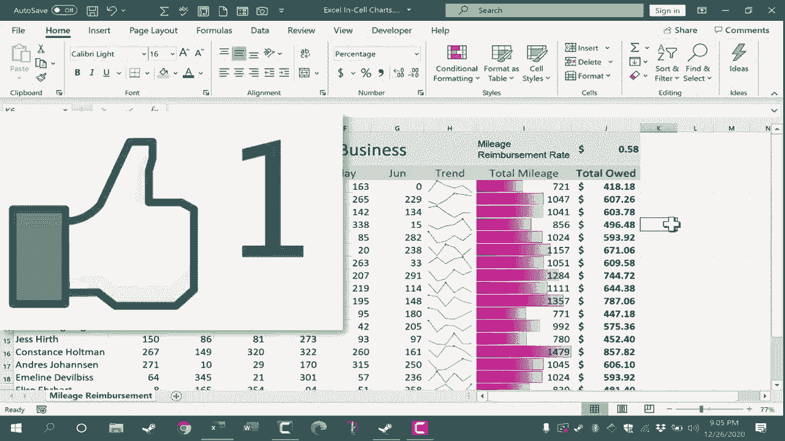

# Excel高效技巧课程 - P37：单元格内图表 📊

在本节课中，我们将学习如何在Microsoft Excel中创建单元格内图表。这种图表非常实用，占用的空间比典型的浮动图表少得多。我们将介绍两种主要方法：使用条件格式创建数据条，以及使用“微型图”功能创建趋势线图。

## 使用条件格式创建数据条图表

上一节我们概述了单元格内图表的优势，本节中我们来看看第一种创建方法：使用条件格式。

首先，选择你希望在图表中显示数据的列。在本例中，我们选择列I。接着，转到“开始”选项卡，在“样式”组中点击“条件格式”。在弹出的菜单中，找到“数据条”选项。

以下是具体操作步骤：
1.  将鼠标悬停在“渐变填充”或“实心填充”选项上，可以预览效果。
2.  点击你喜欢的填充样式（例如“渐变填充”）即可应用。

现在，你就在单元格内创建了一个条形图。这是单元格内图表的一个基础示例。

除了默认选项，你还可以进行更多自定义设置。点击“条件格式” -> “数据条” -> “其他规则”，可以打开规则设置对话框。

在规则设置对话框中，你可以进行以下调整：
*   选择不同的条形颜色。
*   更改条形方向，例如从“从左到右”改为“从右到左”。

通过条件格式，你可以灵活地创建各种样式的单元格内数据条图表。

## 使用微型图创建趋势图表

虽然数据条能展示数值大小，但有时我们更希望看到数据的变化趋势。接下来，我们将学习功能更强大的“微型图”方法。

微型图是内嵌在单元格中的小型图表，非常适合展示数据趋势。请注意，此功能在较新版本的Excel中可用。

首先，点击你希望插入微型图的单元格（例如H3）。然后，转到“插入”选项卡，在“微型图”组中，选择“折线图”。

此时会弹出一个“创建微型图”对话框。你需要为这个微型图选择数据范围。

以下是选择数据范围的方法：
*   最简单的方式是点击对话框中的范围选择箭头。
*   然后用鼠标点击并拖动，选择你想要跟踪趋势的数据区域（例如B3:G3）。
*   再次点击范围选择箭头返回对话框，点击“确定”。

现在，一个展示数据趋势的折线微型图就嵌入到了单元格中。你可以清晰地看到该数据序列的趋势是上升、下降还是持平。

你无需为每一行数据重复上述步骤。创建第一个微型图后，可以使用填充功能快速应用到其他行。

具体操作如下：
1.  选中已创建微型图的单元格。
2.  将鼠标指针移动到单元格右下角的绿色小方块（填充柄）上。
3.  点击并按住鼠标左键，向下拖动到目标区域。
4.  松开鼠标按钮，微型图就会自动填充到所有选中的单元格中。

## 自定义和美化微型图

当你选中任意一个微型图时，Excel顶部会出现一个专门的“微型图设计”选项卡，其中提供了丰富的自定义选项。

在“设计”选项卡中，你可以进行以下操作：
*   **编辑数据**：重新选择微型图的数据范围或位置。
*   **更改类型**：在折线图、柱形图和盈亏图之间切换。请注意，柱形图和盈亏图对于展示趋势可能不如折线图直观。
*   **显示数据点**：这个功能非常有用，可以突出图表中的关键信息。

“显示”组中的选项能有效吸引读者注意嵌入式图表的重点部分：
*   **标记**：显示折线上的所有数据点。
*   **高点**和**低点**：用不同颜色标记出数据的最高值和最低值。
*   **负点**：标记所有负值数据点。
*   **首点**和**尾点**：标记序列的第一个和最后一个数据点。

此外，你还可以轻松调整微型图的整体外观。“样式”组提供了多种预设的颜色方案。

以下是美化微型图的步骤：
1.  在“样式”库中点击，可以选择黑白、蓝色或其他彩色样式。
2.  点击“微型图颜色”可以自定义折线的颜色。
3.  点击“标记颜色”可以自定义数据点标记的颜色。
4.  如果需要，还可以在“分组”中设置坐标轴选项或清除微型图。

---

本节课中我们一起学习了在Excel中创建单元格内图表的两种高效方法。第一种是利用**条件格式**快速生成数据条，适合比较数值大小；第二种是使用**微型图**功能创建精致的趋势图表，并能进行高度自定义。这两种技巧都能让你在有限的单元格空间内直观地展示数据，极大地提升报表的可读性和专业性。