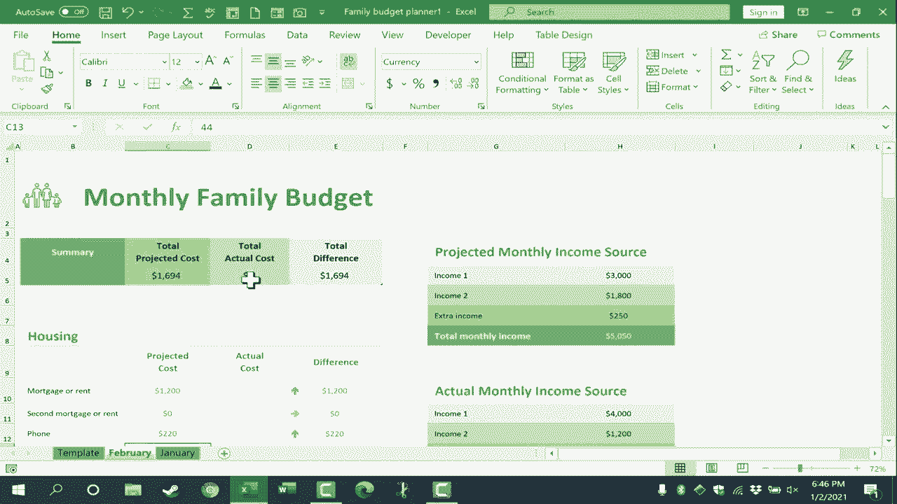

# Excel高效应用教程 - P38：使用 Excel 创建家庭月度预算 📊

在本节课中，我们将学习如何使用 Microsoft Excel 创建并维护一个家庭月度预算。通过预测收入与支出、跟踪实际开销并与计划对比，你可以更好地管理家庭财务，并为未来的储蓄或投资目标制定计划。

---

## 概述

本教程将引导你完成以下步骤：在 Excel 中搜索并使用预算模板、根据你的实际情况调整预算项目、利用工作表副本功能高效管理多个月份的预算，以及如何在实际月份中更新和对比数据。掌握这些技巧，你将能系统性地规划和控制家庭财务。

---

## 第一步：创建新的预算工作簿

首先，打开 Microsoft Excel。点击左上角的“文件”菜单，然后选择“新建”。

这将打开一个新屏幕，你可以选择创建一个空白工作簿，或者浏览最近使用的模板列表。屏幕下方有一个搜索框，用于在线搜索模板。

在搜索框中输入“家庭预算”，然后按回车键。搜索结果会显示多个相关模板，例如“家庭月预算”。虽然本教程以“家庭预算”为例，但其中展示的原则同样适用于其他类型的预算模板，如商业预算或部门预算。

双击你选择的模板（例如“家庭预算”）。随后会弹出一个窗口，显示该模板的详细信息。浏览后，点击“创建”按钮以下载并使用该模板的副本。

为了获得更好的全局视图，你可以使用窗口右下角的缩放滑块来调整显示比例。

---

## 第二步：调整预算模板中的默认数据

模板下载后，通常会包含一些示例数据。你需要将这些数据更改为符合你家庭实际情况的数字。

假设你来自一个双收入家庭。在“收入”部分，将“收入来源一”的默认金额（如$4000）改为实际金额，例如$3000。操作方法是：点击该单元格，输入新数字，然后按回车键。

接着，更新“收入来源二”的金额，例如改为$1800。模板可能还提供了“其他收入”的输入位置，用于记录临时性收入，如兼职或出售闲置物品所得。你可以为此项估算一个金额，例如$250。

**核心概念**：家庭月度预算的核心在于，在每个月初，你和家人共同预测本月各项收入和支出的金额。这是一个前瞻性的财务规划过程。

接下来，处理“支出”部分。逐一查看每个预算类别（如住房、交通、食品等），并输入你为本月预估的费用。

例如，将“抵押贷款/租金”改为$1200。如果你对某些项目的费用不确定，可以暂时清除其内容：选中相关单元格，右键点击并选择“清除内容”。

请注意，模板会自动为每个类别（如“住房”）计算小计。当你修改某个子项（如将“电话费”改为$220）时，总预计成本会自动更新。

---

## 第三步：高效管理多个月份的预算

许多固定支出（如房贷、水电费）每月金额相对稳定，而可变支出（如交通、娱乐）则波动较大。为了能方便地重复使用预算模板，而不必每月清理数据，可以采用以下方法：

首先，找到工作表底部标签，其默认名称可能是“家庭月度预算”。右键点击该标签，选择“重命名”，将其改为“模板”。按回车键确认。

这样做的目的是保留一个干净的模板，用于生成未来各个月份的预算。

当新月份（例如一月）来临时，右键点击“模板”工作表标签，选择“移动或复制”。在弹出的对话框中，勾选“建立副本”选项，然后点击“确定”。

现在会出现一个名为“模板 (2)”的新工作表。右键点击它，再次选择“重命名”，将其命名为“一月”。你可以拖动工作表标签来调整顺序（例如将“一月”放在“模板”右侧）。

现在，你可以在“一月”工作表中填写该月的具体预算数据，而“模板”工作表始终保持空白，以备下个月使用。对于二月，只需重复此过程：复制“模板”并重命名为“二月”即可。

**核心技巧**：通过复制工作表来管理多个月份的预算，可以让你轻松回顾历史数据，例如查看去年同期的支出情况，从而为今年的预算规划提供参考。

---

## 第四步：在月中记录实际数据并进行分析

预算不仅是计划工具，也是跟踪工具。随着月份推进，当实际收入到账或实际支出发生时，你需要返回对应月份的工作表，在“实际收入”和“实际支出”栏目下更新数据。

例如，如果实际获得的奖金与预估不同，或某项实际开销超出预算，只需在相应单元格中输入实际金额并按回车键。

到月底时，输入所有项目的实际费用。模板会自动计算“总预计成本”、“总实际成本”以及两者之间的“差额”。这个“差额”就是本月预算的结余或超支金额。

通过对比“预计”与“实际”数据，你可以清晰地看到哪些类别的开销超出了计划，这有助于你发现问题并在下个月进行调整。

---

## 总结

本节课我们一起学习了如何使用 Excel 创建和管理家庭月度预算。我们掌握了从搜索模板、个性化数据输入，到利用工作表副本功能高效管理多个月份预算的全过程。关键在于每月初进行预测规划，并在月中及月末坚持记录实际数据，通过对比分析来优化未来的财务决策。坚持使用这一方法，能帮助你更清晰地掌控家庭财务状况，稳步实现储蓄或债务偿还等财务目标。