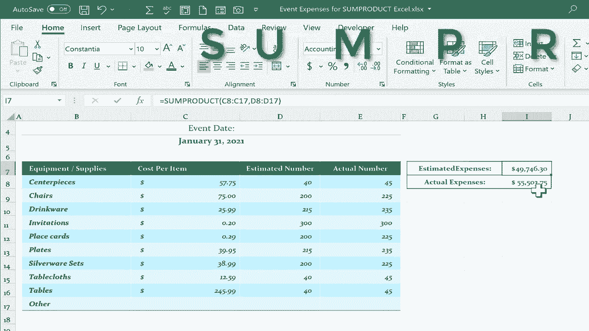

# Excel高效技巧课程 - P39：39）Excel SUMPRODUCT 函数 🧮

在本节课中，我们将要学习Excel中一个非常强大的函数——**SUMPRODUCT**。这个函数能够一次性完成多个数组的乘法运算并求和，从而极大地简化计算步骤，提升工作效率。我们将通过一个活动费用预算的实例，来演示其基础用法。

## 概述

SUMPRODUCT函数的核心功能是计算多个数组中对应元素的乘积之和。其基本语法为：
`=SUMPRODUCT(array1, [array2], [array3], ...)`
其中，`array1`、`array2`等是需要进行对应元素相乘的数组或单元格区域。

## 传统计算方法的局限性

假设我们有一个活动费用预算表，其中列出了各项物品的成本（C列）和预计数量（D列）。要计算总预计费用，传统方法通常需要以下多个步骤：

以下是传统计算方法的步骤：
1.  在“总预计成本”列（例如E列）中，为第一个物品输入公式 `=C8*D8`。
2.  使用填充柄将该公式向下拖动，为所有物品计算单项总成本。
3.  最后，在底部使用 `=SUM(E8:E17)` 对所有单项总成本进行求和，得到总费用。

对于“总实际成本”的计算，也需要重复类似的步骤，将预计数量替换为实际数量（F列）。

这种方法步骤繁琐，且需要创建额外的辅助列。

## 使用SUMPRODUCT函数一步到位

上一节我们介绍了传统方法的繁琐步骤，本节中我们来看看如何使用SUMPRODUCT函数一步完成相同的计算。

SUMPRODUCT函数可以直接将成本数组和数量数组对应相乘，然后自动将所有乘积结果相加。

以下是使用SUMPRODUCT计算总预计费用的步骤：
1.  在目标单元格（例如G18）中输入公式：`=SUMPRODUCT(C8:C17, D8:D17)`
2.  按下回车键，即可直接得到总预计费用。

这个公式的含义是：将C8:C17区域中的每个成本，分别与D8:D17区域中对应的数量相乘，然后将所有乘积结果相加。

## 计算实际总费用

理解了如何计算预计总费用后，计算实际总费用就变得非常简单。我们只需将公式中的数量数组从“预计数量”更换为“实际数量”即可。

在另一个目标单元格中，输入公式：
`=SUMPRODUCT(C8:C17, F8:F17)`
按下回车，即可得到基于实际数量的总费用。

可以看到，我们不再需要创建“单项总成本”的辅助列，一个公式就解决了所有问题。

## 函数原理与优势

SUMPRODUCT函数的工作原理可以概括为“先乘后加”。它按顺序处理数组中的元素：
1.  **对应相乘**：将第一个数组的第一个元素与第二个数组的第一个元素相乘，第一个数组的第二个元素与第二个数组的第二个元素相乘，依此类推。
2.  **求和**：将所有乘法运算的结果相加，得到最终值。

其核心优势在于：
*   **简化步骤**：将多步计算（相乘、填充、求和）合并为一步。
*   **减少辅助列**：无需创建中间计算列，使表格更简洁。
*   **提高效率与准确性**：减少了公式复制和区域选择可能带来的错误。

## 总结

本节课中我们一起学习了Excel中SUMPRODUCT函数的基础应用。我们通过一个预算案例，对比了传统的分步计算法与使用SUMPRODUCT一步计算法，清晰地展示了后者在简化流程、提升效率方面的巨大优势。

记住其核心公式：`=SUMPRODUCT(数组1, 数组2)`。它能够优雅地解决需要对多组数据先进行对应元素乘法再求和的常见问题。这只是SUMPRODUCT功能的开始，它在条件求和、多条件计数等复杂场景中更为强大，我们将在后续课程中继续探索。