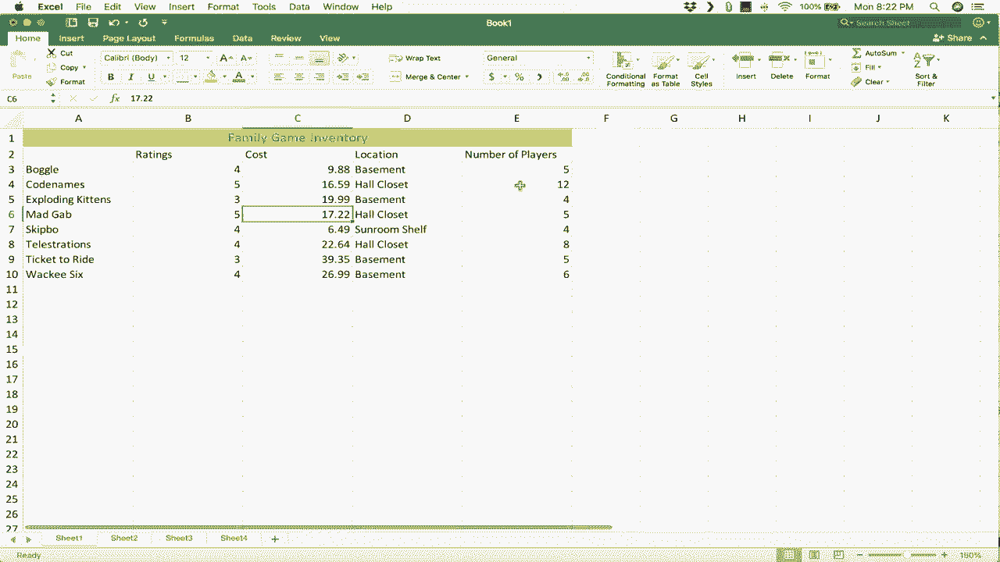

# Excel for Mac 初学者指南 📘 - P4

在本节课中，我们将学习如何在 Mac 上使用 Microsoft Excel。我们将从打开软件、认识界面结构开始，逐步学习如何输入数据、调整格式以及保存工作簿。通过一个创建“家庭游戏库存”的实例，你将掌握 Excel 的基础操作。

## 1. 启动与界面概览 🚀

上一节我们介绍了课程目标，本节中我们来看看如何启动 Excel 并认识其界面。

首先，在 Mac 上找到并打开 Microsoft Excel。你可以在“应用程序”文件夹中搜索，或从 Dock 栏启动。启动后，通常会看到一个包含各种模板的选择窗口。

在窗口左上角，你可以选择“空白工作簿”来创建一个全新的电子表格。模板非常实用，你可以通过搜索（例如“家庭预算”）找到并打开预设模板，然后替换其中的示例数据。

## 2. 工作簿、工作表与单元格 📄

现在你已经打开了 Excel，我们来了解其核心结构。理解这些基本概念是有效使用 Excel 的关键。

一个 Excel 文件称为一个**工作簿**。就像一本书由多页组成一样，一个工作簿包含多个**工作表**。工作表是工作簿中的单个页面，默认名为“Sheet1”、“Sheet2”等。你可以通过点击底部的 `+` 号来添加新工作表。

每个工作表由**列**（以字母 A, B, C... 标识）和**行**（以数字 1, 2, 3... 标识）组成。列与行相交形成的矩形框称为**单元格**。每个单元格都有一个唯一的地址，由列字母和行号组成。

例如，位于 E 列和第 9 行交叉点的单元格，其地址是 **`E9`**。

多个连续的单元格构成一个**范围**。范围的命名规则是：左上角单元格地址 + 冒号 + 右下角单元格地址。

例如，从 E4 到 H11 的单元格范围，其名称是 **`E4:H11`**。

## 3. 功能区与工具栏 🛠️

认识了电子表格的结构后，我们来看看操作它们的工具布局。

Excel 窗口顶部有一系列**标签**（如“开始”、“插入”、“数据”）。点击每个标签会显示对应的**功能区**，其中包含了各种工具和选项。功能区中的工具通常用垂直线分组，以便于查找。

窗口最上方还有**快速访问工具栏**，包含“保存”、“撤销”等常用按钮。你可以自定义这个工具栏。此外，像大多数 Mac 程序一样，顶部的菜单栏也提供了“文件”、“编辑”、“插入”等选项。

**提示**：如果点击已激活的标签，功能区会隐藏；再次点击同一标签，功能区会重新显示。

## 4. 输入与编辑数据 ✍️

了解了界面之后，我们开始学习如何输入数据。请记住一个核心原则：**选择才能影响**。你必须先选中一个单元格，才能在其中输入或修改内容。

我们将创建一个“家庭游戏库存”列表作为示例。

1.  选中单元格 `A1`，输入“家庭游戏库存”，然后按 `回车` 键。光标会自动移动到 `A2`。
2.  在 `A2` 输入第一个游戏名（如“Boggle”），再次按 `回车` 键移动到 `A3`，继续输入其他游戏名称。

输入数据时，可以使用以下键盘快捷键移动选择：
*   `回车`：向下移动
*   `Shift` + `回车`：向上移动
*   `Tab`：向右移动
*   `Shift` + `Tab`：向左移动

如果输入有误，有两种修改方式：
*   **单击单元格后直接输入**：会完全替换原有内容。
*   **双击单元格进入编辑模式**：可以使用方向键在单元格内移动光标，进行局部修改。

## 5. 调整列宽与行高 📏

输入数据后，你可能会发现文字显示不全或布局不美观。以下是调整列宽的几种方法：

*   **手动调整**：将鼠标移至两列标题之间的分隔线上，光标变为双箭头时，点击并拖动即可调整列宽。
*   **自动调整**：双击两列标题之间的分隔线，Excel 会自动将列宽调整为刚好容纳该列中最长的内容。

**提示**：你可以选中多列，然后在任意两列分隔线上双击，所有选中列的宽度会统一调整为最适合其内容的宽度。调整行高的方法与调整列宽类似。

## 6. 格式化数据 🎨

为了让数据表更清晰、专业，我们可以进行一些简单的格式化操作。

**添加标题行并合并居中：**
1.  在数据上方插入新行：右键点击第 1 行的行号，选择“插入”。
2.  将原 `A1` 的标题剪切并粘贴到新的 `A1` 单元格。
3.  选中标题行中从 `A1` 到 `E1` 的单元格范围。
4.  在“开始”标签的功能区中，点击“合并后居中”按钮。这将合并选中的单元格并使标题居中显示。

**设置文本格式：**
选中标题单元格，你可以在“开始”功能区中使用工具来：
*   **加粗** 文本
*   添加*斜体*或<u>下划线</u>
*   更改字体大小和颜色
*   为单元格添加背景色

## 7. 保存工作簿 💾

完成数据输入和格式化后，务必保存你的工作。

点击左上角的“文件”菜单，选择“保存”。如果是首次保存，系统会提示你选择保存位置并命名文件（例如“家庭游戏库存.xlsx”）。之后，你可以通过点击快速访问工具栏的保存图标，或使用快捷键 `Command` + `S` 来快速保存。

以后要打开这个文件，可以启动 Excel 后，在“文件”>“打开最近使用”列表中找到它。

## 总结 📝

本节课中我们一起学习了 Mac 版 Excel 的基础知识。我们了解了工作簿、工作表和单元格的结构，熟悉了功能区和工具栏的布局。通过创建“家庭游戏库存”的实践，我们掌握了输入与编辑数据、调整列宽行高、以及进行基础格式化（如合并居中和文本样式设置）的方法。最后，我们学习了如何保存工作簿以便日后使用。这些是使用 Excel 完成简单数据管理任务的核心技能。