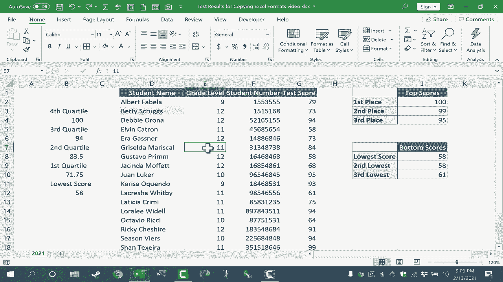

# Excel高效技巧课程 - P40：复制Excel格式的多种方法 🎨

在本节课中，我们将学习如何在Excel中高效地复制单元格或区域的格式。掌握这些技巧可以显著提升表格美化和数据整理的效率。

## 概述

我们将重点介绍三种复制Excel格式的核心方法：使用“粘贴特殊”功能、利用“格式刷”工具，以及通过“自动填充手柄”仅填充格式。每种方法都适用于不同的场景，能帮助您快速统一表格样式。

## 使用“粘贴特殊”功能复制格式

上一节我们概述了课程内容，本节中我们来看看第一种方法：“粘贴特殊”。此功能允许您仅复制源单元格的格式，而不影响目标单元格的内容。

操作步骤如下：
1.  选中并复制（`Ctrl+C`）包含所需格式的源单元格。
2.  选中目标单元格。
3.  按下 `Ctrl+Alt+V` 打开“选择性粘贴”对话框。
4.  在对话框中选择“格式”选项，然后点击“确定”。

执行后，目标单元格将应用源单元格的所有格式设置（如背景色、字体颜色等），但其原有内容保持不变。

## 利用“格式刷”工具

“粘贴特殊”功能适合单次操作，但若需将格式应用到多个不连续的区域，“格式刷”是更高效的选择。

“格式刷”位于“开始”选项卡的“剪贴板”组中，图标是一把刷子。

**以下是使用“格式刷”的两种模式：**

*   **单次应用**：单击选中源单元格，再单击一次“格式刷”图标。此时鼠标指针旁会显示一个刷子图标，单击目标单元格即可应用格式，随后格式刷模式自动关闭。
*   **连续多次应用**：双击“格式刷”图标可以锁定格式刷模式。在此模式下，您可以连续点击或拖动选择多个单元格或区域来应用格式。完成后，按 `Esc` 键或再次单击“格式刷”图标即可退出。

**格式刷的强大之处在于可以复制整个区域的复杂格式。** 操作方法是：先选中已设置好格式的整个源区域，然后单击“格式刷”，再拖动选择目标区域。释放鼠标后，目标区域将获得与源区域完全一致的格式布局。

## 通过“自动填充手柄”仅填充格式

除了复制到其他位置，有时我们还需要将格式沿行或列方向扩展。“自动填充手柄”为此提供了便捷方式。

“自动填充手柄”是选中单元格或区域右下角的小绿色方块。

**以下是使用自动填充手柄复制格式的步骤：**
1.  在已设置格式的源单元格上，将鼠标悬停在自动填充手柄上。
2.  **按住鼠标右键**并拖动覆盖目标单元格。
3.  松开右键，在弹出的菜单中选择“仅填充格式”。

这样，拖动经过的单元格将只复制源单元格的格式，而不会改变其自身的内容。

## 总结

本节课中我们一起学习了在Excel中复制格式的三种核心方法：
1.  **“粘贴特殊”功能**：适合精确的单次格式复制。
2.  **“格式刷”工具**：适合快速、尤其是多次向不同区域应用相同格式，并能完美复制整个区域的复杂格式组合。
3.  **“自动填充手柄”的“仅填充格式”选项**：适合将格式沿相邻单元格快速扩展。

熟练掌握这些技巧，能帮助您摆脱重复的手动格式化操作，让工作表快速变得整洁美观。