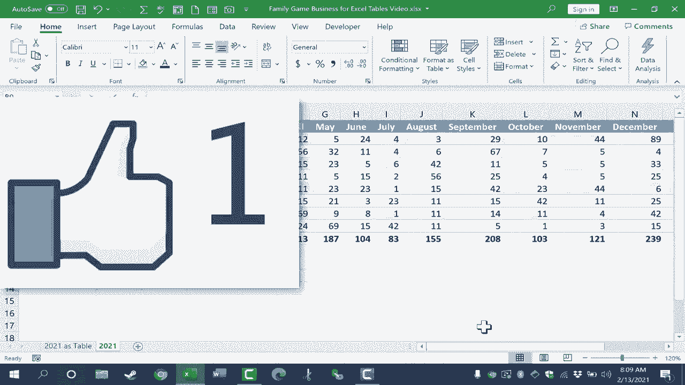

# Excel高效技巧课程 - P42：全面掌握Excel表格 📊

在本节课中，我们将全面学习Excel表格的核心概念、创建方法、设计选项以及实用技巧。你将了解表格的结构、优势，并学会如何将普通数据范围转换为功能强大的表格，以及如何利用表格特性提升数据处理效率。

## 表格结构解析 🔍

上一节我们介绍了课程概述，本节中我们来看看Excel表格的基本构成。一个标准的Excel表格主要由三个部分组成。

以下是表格的三个核心组成部分：

1.  **表头行**：表格的第一行，用于描述每列数据的类型，例如“产品名称”、“价格”。创建表格后，表头行会固定在顶部，方便滚动查看。同时，表头会自动包含排序和筛选按钮。
2.  **表格数据**：表头行下方的数据区域。默认以交替颜色的条纹行显示，便于跟踪数据。表格数据区域可以自动扩展以容纳新输入的数据。
3.  **表格总计行**：位于表格底部的可选行，用于快速对列中的数字数据进行求和、求平均值等汇总计算。

## 创建Excel表格 🛠️

了解了表格的结构后，我们来看看如何将一个普通的数据范围转换为Excel表格。

操作步骤如下：

1.  确保你的数据是一个连续的范围，中间没有空行或空列。
2.  点击该数据范围内的任意单元格。
3.  在菜单栏选择 **`插入`** -> **`表格`**。
4.  在弹出的“创建表”对话框中，确认数据范围是否正确，并务必勾选 **`表包含标题`** 选项。
5.  点击 **`确定`**。

**快捷方式**：你也可以直接选中数据后，按下键盘快捷键 **`Ctrl + T`** 来快速打开创建表格的对话框。

创建表格后，功能区会出现 **`表格设计`** 选项卡，用于进一步设置表格。

## 表格设计与功能设置 🎨

现在我们已经创建了一个表格，接下来通过“表格设计”选项卡来定制它，并启用更多实用功能。

以下是关键的设置选项：

*   **命名表格**：在“属性”组中，可以为表格起一个不含空格的名字（如 `SalesData`）。这在后续使用公式引用表格时非常方便。
*   **启用总计行**：在“表格样式选项”组中，勾选 **`汇总行`**，表格底部会出现总计行。点击总计行中的单元格，可以从下拉菜单中选择求和、平均值等计算方式。
*   **调整样式**：在“表格样式选项”组中，可以切换“镶边行”、“镶边列”、“第一列”、“最后一列”的格式。在“表格样式”组中，可以更改表格的整体配色方案。
*   **其他工具**：在“工具”组中，可以 **`插入切片器`** 进行交互式筛选，或 **`通过数据透视表汇总`** 快速创建数据透视表。

## 表格的公式优势 ➕

使用表格的一大优势是简化公式操作，让公式更智能、更易维护。

例如，在表格右侧新增一列“第四季度销售”，并在第一个单元格输入公式计算10-12月的总和：
`=SUM([@[十月]:[十二月]])`
或直接用鼠标选取范围：
`=SUM(`
然后按下回车，该公式会自动填充到整列。

## 将表格转换回范围 ↩️

尽管表格功能强大，但有时你可能需要将其恢复为普通范围。

操作方法是：点击表格内任意位置，进入 **`表格设计`** 选项卡，在“工具”组中点击 **`转换为区域`**。确认后，表格将变为普通数据区域，排序筛选按钮消失，且无法自动扩展。

---

**本节课总结**：我们一起深入学习了Excel表格的三大结构（表头行、表格数据、总计行），掌握了从创建、设计到应用公式的全流程。表格不仅能提升数据可视化和管理效率，其智能扩展和公式填充特性更能显著节省操作时间。