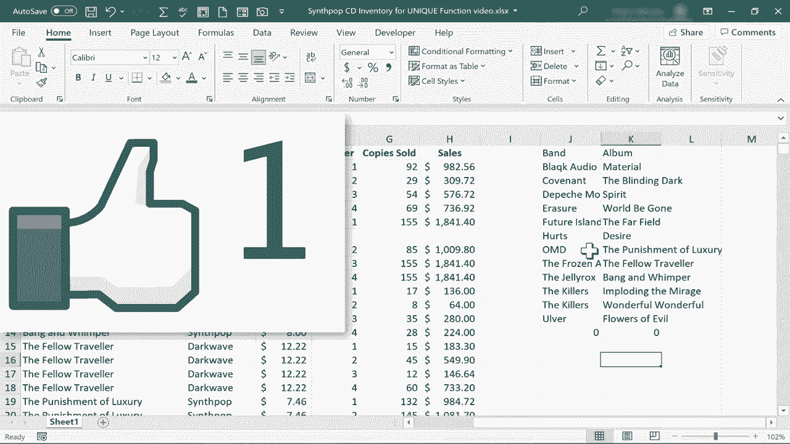

# Excel高效技巧课程 - P45：两个动态数组函数：UNIQUE 和 SORT 🎯


在本节课中，我们将学习Excel中两个强大的动态数组函数：`UNIQUE`和`SORT`。我们将了解它们各自的功能，并探索如何将它们结合使用，以实现高效的数据去重与排序。

## 概述 📋

我们以一个包含乐队、专辑及其季度销售数据的表格为例。数据中存在大量重复项，因为信息是按季度记录的。我们的目标是：从这个数据集中，提取出不重复的乐队列表，并进一步生成按字母顺序排列的乐队与专辑组合的唯一列表。

## 使用UNIQUE函数提取唯一值

首先，我们来看看如何从一列数据中提取所有不重复的值。

以下是使用`UNIQUE`函数的基本步骤：
1.  选择目标单元格（例如 `J2`）。
2.  输入公式：`=UNIQUE(B:B)`。这里的 `B:B` 表示对整列B进行操作。
3.  按下回车键。

**代码示例**：
```excel
=UNIQUE(B:B)
```

执行后，`UNIQUE`函数会分析B列中的所有数据，将唯一的乐队名称列出，并将结果“溢出”到`J2`单元格下方的区域中。这个结果是动态的，意味着当源数据（B列）发生变化时，溢出区域的结果会自动更新。

上一节我们介绍了如何使用`UNIQUE`函数从单列中提取唯一值。接下来，我们看看如何从多列数据中提取唯一组合。

## 从多列中提取唯一组合

有时，我们需要考虑多列数据的组合是否唯一。例如，我们想获得“乐队-专辑”的唯一组合列表。

操作步骤如下：
1.  在目标单元格（例如 `J1`）输入公式。
2.  选择包含乐队和专辑的两列数据作为数组。

**代码示例**：
```excel
=UNIQUE(B:C)
```

这个公式会同时考虑B列（乐队）和C列（专辑）的数据。只有当两列数据的组合完全相同时，才会被视为重复项。因此，即使乐队名称相同，只要专辑不同，就会被保留在唯一值列表中。

在学会了提取唯一值之后，我们很自然地会希望这些结果能按照一定的顺序排列，以便于查看和分析。这时，`SORT`函数就派上用场了。

## 使用SORT函数进行排序

`SORT`函数可以单独使用，对任何数据范围进行排序，并将排序后的结果溢出。

单独使用`SORT`函数的示例如下：
```excel
=SORT(B:B)
```
这个公式会将B列的数据按升序排列并输出。

然而，`SORT`函数更强大的地方在于它可以与其他函数嵌套使用。下面，我们将看到如何将`UNIQUE`和`SORT`结合起来。

## 结合UNIQUE与SORT函数

我们可以将`SORT`函数嵌套在`UNIQUE`函数内部，先对数据进行排序，再提取唯一值。但更常见的需求是：先提取唯一组合，再对这个组合进行排序。

以下是实现这一需求的步骤：
1.  清除之前的结果，在目标单元格（如 `J1`）输入新公式。
2.  使用`SORT`函数包裹`UNIQUE`函数的结果。

**代码示例**：
```excel
=SORT(UNIQUE(B:C))
```

这个公式的执行顺序是：
1.  `UNIQUE(B:C)`：首先从B列和C列中提取出“乐队-专辑”的唯一组合。
2.  `SORT(...)`：然后对这个唯一组合列表进行排序（默认按第一列升序排列）。



执行后，我们将得到一个既无重复、又按乐队名称字母顺序排列的清晰列表。

## 总结 🎓


本节课中我们一起学习了：
*   **`UNIQUE`函数**：用于从指定数组或范围中提取唯一值，语法为 `=UNIQUE(array)`。
*   **`SORT`函数**：用于对指定数组或范围进行排序，语法为 `=SORT(array)`。
*   **函数的结合使用**：通过嵌套 `=SORT(UNIQUE(array))`，我们可以一步生成排序后的唯一值列表，这是处理和分析数据的高效技巧。


这两个动态数组函数能够极大地简化数据清洗和整理的工作流程。它们的“溢出”特性让结果区域自动适应，并与源数据动态联动，是Excel 365版本中非常实用的功能。