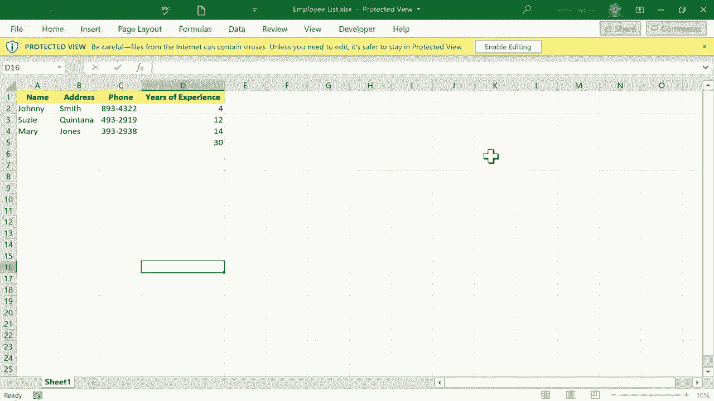
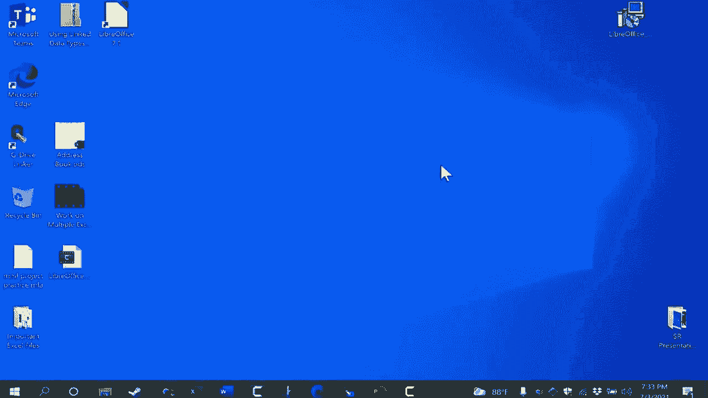
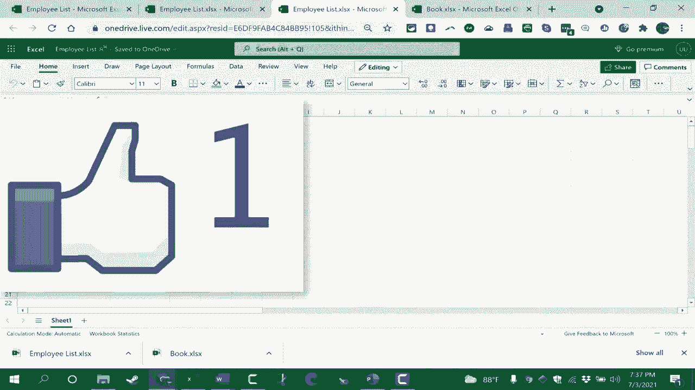

# Excel正确打开方式！提效技巧大合集！(持续更新中) - P47：47）Excel Web应用 📊

在本节课中，我们将学习如何免费使用微软的在线版Excel——Excel Web应用。你将了解如何访问它、创建和编辑电子表格、使用核心功能、与他人协作，以及如何将文件保存到本地。

## 概述：什么是Excel Web应用？

Excel Web应用是微软Excel的在线版本。它允许用户完全免费地查看、创建和编辑Excel电子表格。你可以以多种格式保存文件，并轻松地与他人共享协作。

## 访问与登录

要访问Excel Web应用，只需打开浏览器，访问 `office.com` 网站。

该网站界面会提示你注册或登录。如果你想免费使用，请点击“登录”或“注册免费版Office”。

登录时，你可以使用任何微软账户，例如Outlook邮箱或Xbox账户。如果你已有微软账户，直接登录即可。

登录成功后，你将进入微软Office的在线工作界面。

## 界面与基础操作

登录后，界面左侧会显示常用的Office应用列表，如Word、Excel、PowerPoint等。你可以快速在这些应用间切换。

界面左上角有一个“新建”按钮（加号图标）。点击它可以创建新文档。选择“工作簿”即可创建一个新的Excel电子表格。

这个在线版Excel的界面布局与桌面版相似，拥有选项卡和功能区。不过，它的功能区只包含最常用、最核心的功能，并非桌面版的全部功能。

例如，在“插入”选项卡中，你可以插入图表，但可能找不到“SmartArt”图形。

在单元格中输入数据的基本操作与桌面版一致：
*   单击选中一个单元格。
*   双击可进入单元格编辑模式。
*   输入数据后，按 `Enter` 键确认并下移，按 `Tab` 键确认并右移。
*   结合 `Shift` 键，`Shift` + `Enter` 可上移，`Shift` + `Tab` 可左移。
*   当然，你也可以直接用鼠标点击目标单元格。

## 核心功能演示

在线版Excel遵循“先选择，后操作”的原则。你可以通过点击和拖动来选择单元格区域，然后对它们进行格式化。

例如，选中数据后，你可以使用功能区中的按钮进行**加粗**、**居中**、更改字体颜色或填充颜色等操作。

“格式刷”功能同样可用。首先选中已有格式的单元格，点击“格式刷”按钮，再点击目标单元格或区域，即可快速复制格式。

公式功能是在线版Excel的核心。你可以像在桌面版中一样使用公式。

例如，计算总和：
1.  在目标单元格输入 `=SUM(`。
2.  用鼠标选择要求和的单元格区域，如 `D2:D4`。
3.  输入右括号 `)` 并按 `Enter` 键。公式为：`=SUM(D2:D4)`

此外，对于常用的求和，你可以先选中目标单元格下方的空白单元格，然后在“开始”选项卡中点击“自动求和”（Σ）按钮，再按 `Enter` 键。

## 共享与协作

在线版Excel的优势在于便捷的共享与协作。点击右上角的“共享”按钮，可以设置分享权限。

默认情况下，“任何拥有链接的人”可编辑文档。你可以更改权限为“可查看”，这样他人只能阅读不能修改。

一些高级功能（如设置链接过期时间、密码保护）需要Microsoft 365订阅。

设置好权限后，你可以输入邮箱地址直接发送邀请，或者“复制链接”，通过任何方式（如邮件、即时通讯工具）分享该链接。获得链接的用户即可根据权限编辑或查看文档。

## 保存与本地访问

在线创建的文档默认保存在云端。如果你想在本地电脑保存一份副本，可以点击“文件”->“另存为”->“下载副本”。

文件会以 `.xlsx` 格式（标准Excel格式）下载到你的电脑。下载前，建议先在网页顶部为文件命名。

另一种访问在线Excel的方式是通过Windows系统的“Office”应用。在开始菜单搜索“Office”并打开该应用，它会整合显示你在线和本地的Office文档，方便你快速打开或创建新的在线工作簿。

## 总结

本节课我们一起学习了微软Excel Web应用的使用方法。我们了解了如何免费访问和登录、熟悉了其工作界面、掌握了输入数据、格式化和使用公式等基础操作。我们还重点学习了如何与他人共享文档进行协作，以及如何将在线文档保存到本地电脑。Excel Web应用是一个功能强大且完全免费的在线表格工具，非常适合日常办公、学习及轻量级协作。