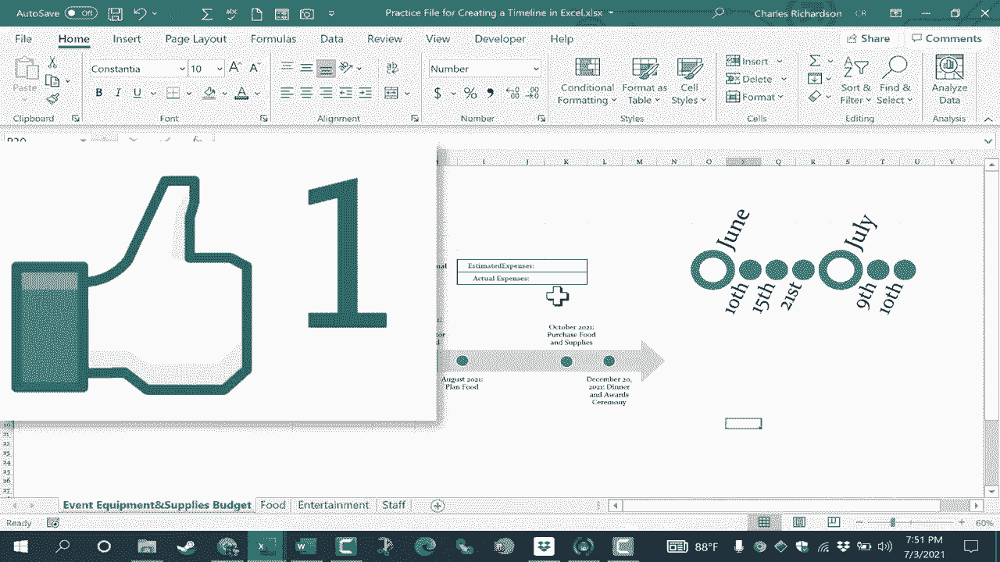

# Excel高效技巧课程 - P48：创建时间线 📅

在本节课中，我们将学习如何在Microsoft Excel中创建时间线。时间线是一种有效的视觉工具，可以帮助我们规划和跟踪项目进度，无论是回顾过去还是展望未来。

## 概述

我们将从一个活动规划的工作簿示例开始，学习如何插入、自定义和调整时间线，使其清晰展示关键事件和日期。

---

## 1. 插入时间线

上一节我们介绍了时间线的用途，本节中我们来看看如何将其插入到Excel工作表中。

首先，定位到功能区的 **“插入”** 选项卡。在“插图”组中，点击 **“智能图形”** 图标。如果你的屏幕较大，此图标可能直接显示在功能区上。

点击后会弹出一个窗口，供你选择图形类型。为了创建时间线，请在左侧类别中选择 **“流程”**，然后在右侧找到合适的时间线模板。常见的选择有“基本时间线”和“圆形重音时间线”。

选择“基本时间线”并点击“确定”，时间线图形便会插入到当前工作表中。

---

## 2. 放置与调整时间线

图形插入后，需要将其移动到合适的位置。

点击时间线图形的**外边框线**进行拖动。请注意，如果点击的是内部的箭头或文本，可能会误移动单个元素，而非整个图形。

为了获得更好的视图以便放置，你可以使用工作表右下角的**缩放滑块**来调整显示比例。

---

## 3. 编辑时间线内容

时间线左侧会伴随一个文本窗格，用于快速编辑内容。文本窗格中的每个项目符号对应时间线上的一个节点。

以下是编辑步骤：
1.  点击文本窗格中的第一个项目符号，输入日期和事件描述，例如：`2021年6月 - 事件协调员分配任务`。
2.  输入的内容会自动调整格式以适应图形空间。
3.  点击下一个项目符号，继续添加后续事件。

**如何添加更多事件节点？**
*   将光标置于文本窗格中某行的末尾，按 **`Enter`** 键，即可在时间线上新增一个节点。
*   若要创建子事件，可以选中某个项目后按 **`Tab`** 键，使其成为上一事件的子项。

**如何调整事件点的位置？**
如果事件之间的时间间隔不均等，你可以直接**点击并拖动**时间线上的圆形节点，使其在横轴上靠近或远离，以更真实地反映时间跨度。

---

## 4. 格式化时间线

你可以更改时间线的外观，使其与你的文档主题更匹配。

右键点击时间线图形，选择 **“样式”** 选项，可以快速应用不同的预设配色和效果。

你也可以通过右键菜单中的 **“填充”** 和 **“轮廓”** 选项，手动更改颜色。此外，选中图形后，拖动其四角或边缘的控制点，可以**整体调整时间线的大小**。

---

## 5. 尝试其他时间线样式

除了“基本时间线”，你还可以尝试“圆形重音时间线”等其他智能图形。

其操作逻辑类似，但视觉样式不同，例如使用大小不同的圆圈来区分主事件和子事件。同样通过左侧的文本窗格进行编辑，按 **`Enter`** 键添加新事件，并手动调整日期文本。

---

## 总结

本节课中，我们一起学习了在Excel中创建时间线的完整流程：
1.  通过 **“插入” > “智能图形”** 添加时间线。
2.  拖动边框放置图形，使用文本窗格编辑事件内容。
3.  使用 **`Enter`** 键添加节点，使用 **`Tab`** 键创建子项，并可直接拖动节点调整位置。
4.  通过右键菜单更改样式、颜色和大小。
5.  探索不同的时间线模板以适应不同需求。

掌握创建时间线的技巧，能帮助你更直观地进行项目规划和进度管理。