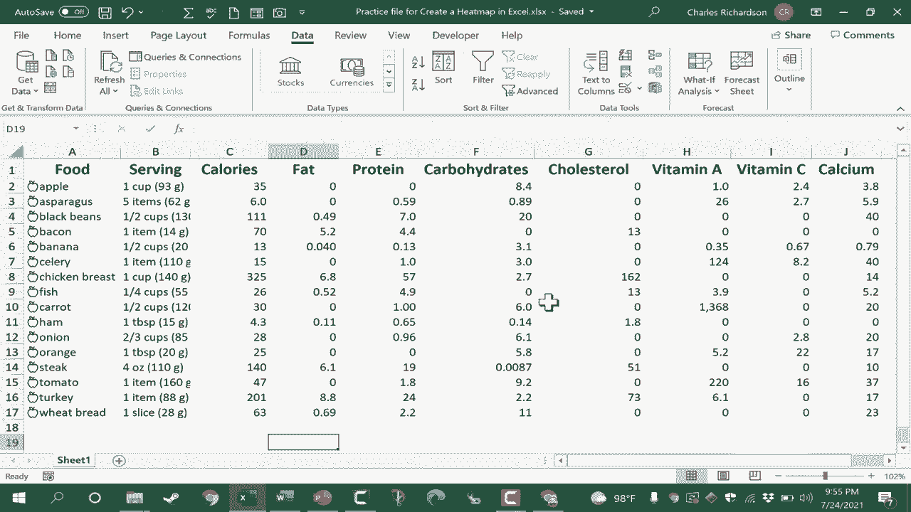
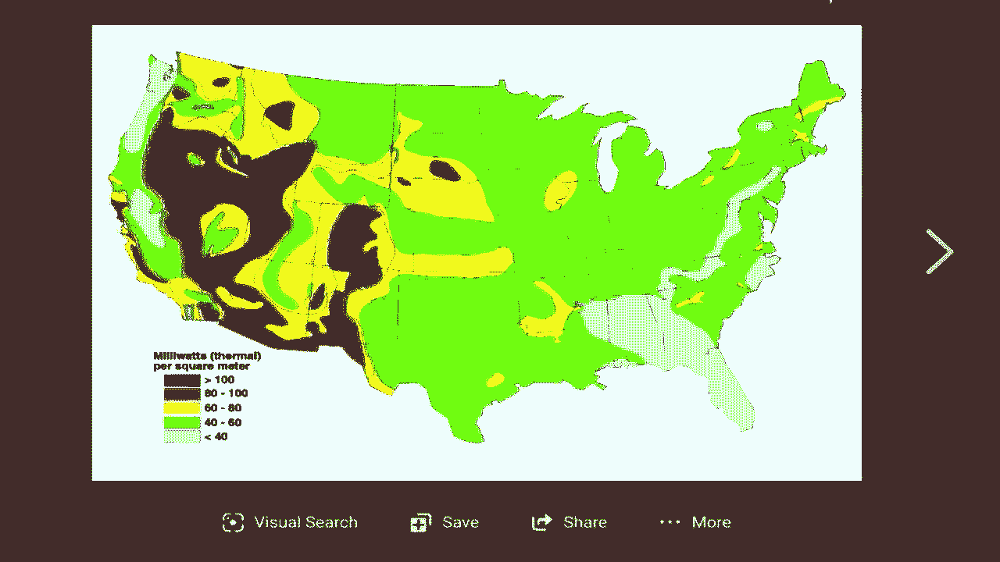
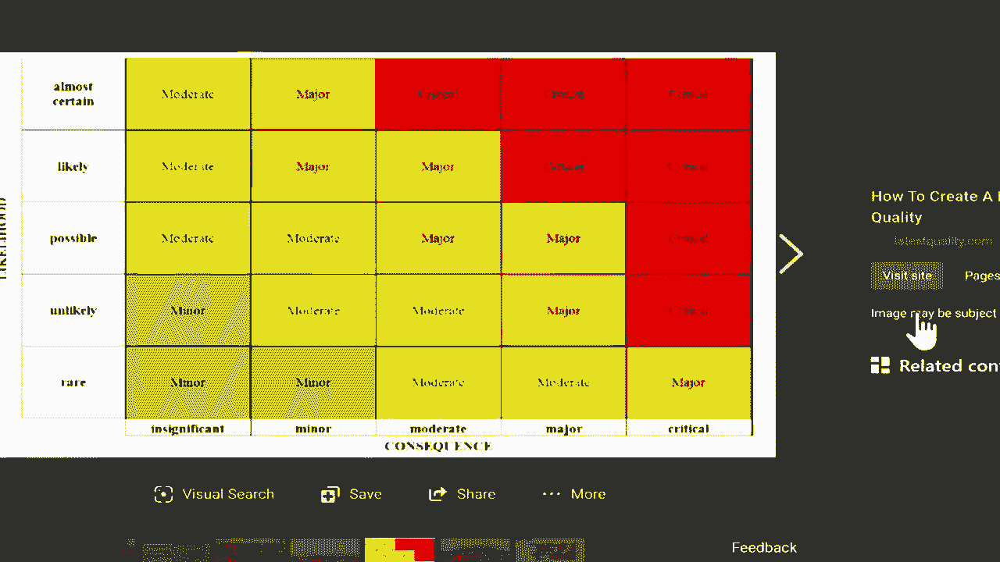
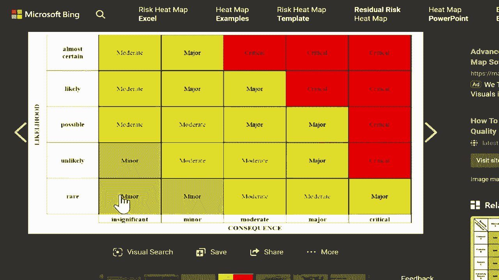
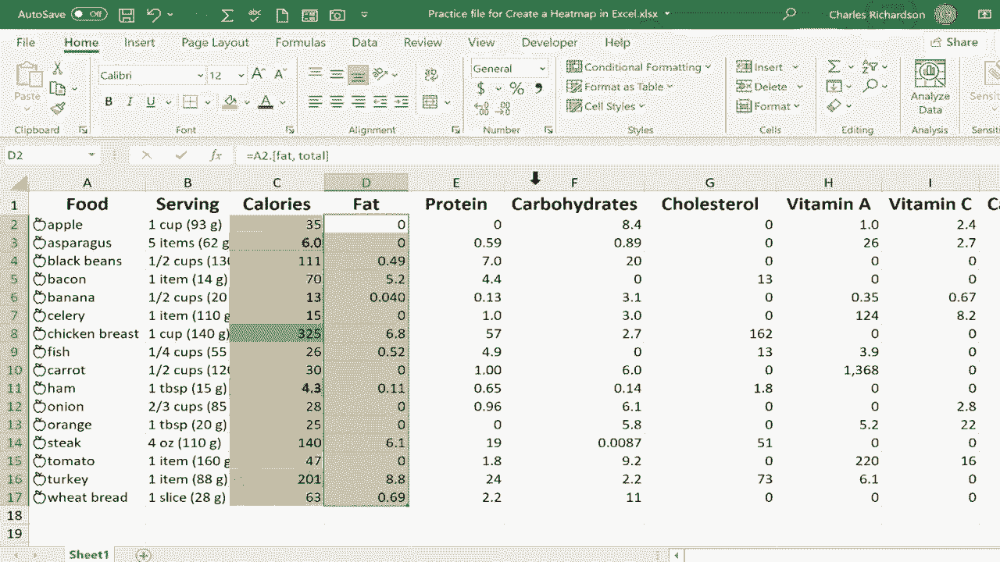
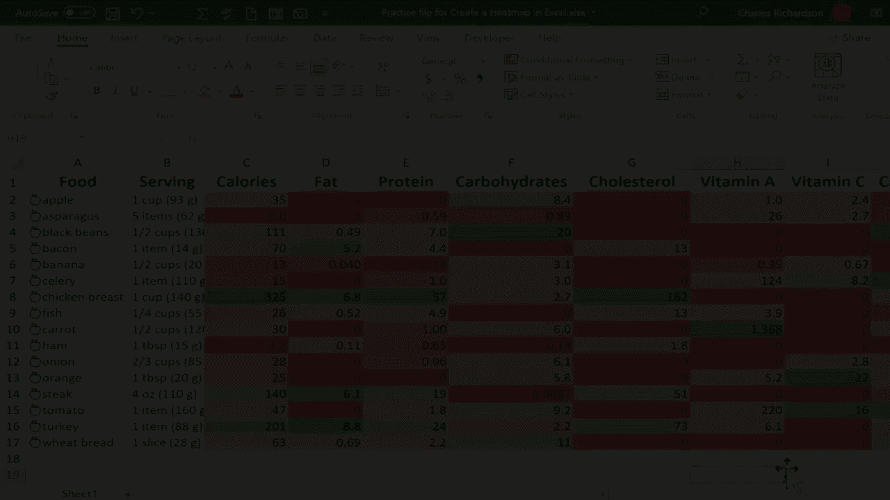
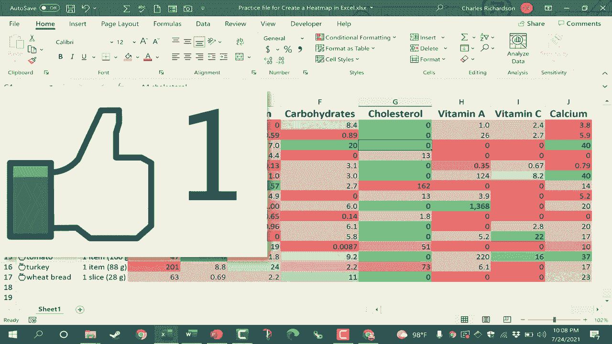
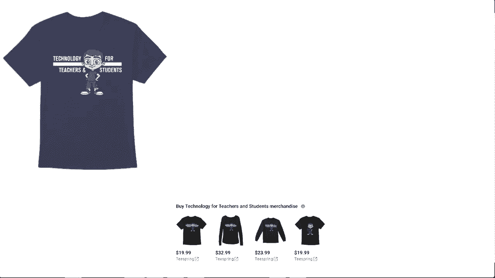

# Excel高效技巧大全：第49课 - 创建热图 🔥

在本节课中，我们将学习如何在Excel中利用“条件格式”功能，将枯燥的数据表格快速转换为直观、美观的热力图。热图能帮助你和观众一眼识别数据中的关键信息、趋势和异常值。

上一节我们介绍了数据整理的基本方法，本节中我们来看看如何通过可视化让数据“说话”。

## 概述：什么是热图？

热图是一种使用颜色渐变来代表数据值的可视化工具。它通常用于表示密度、频率或强度。在Excel中，我们可以通过“条件格式”中的“色阶”功能来创建热图，用不同的颜色直观地展示数据的大小关系。

## 第一步：选择正确的数据范围

创建热图的第一步是选择数据。需要注意的是，不能一次性选中所有不同类型的数据列来创建统一的热图，因为Excel会跨所有选中的单元格计算最小值和最大值，这可能导致错误的颜色映射。

例如，如果你同时选中了“卡路里”和“维生素A”两列，Excel会将所有数值混合比较，从而无法准确反映每列内部的数据关系。

**操作要点**：应**分别选择每一列**你希望进行比较的数据。

## 第二步：应用“色阶”条件格式

选定数据列后，即可应用热图效果。

以下是操作步骤：
1.  选中目标数据列（例如“卡路里”列）。
2.  点击【开始】选项卡。
3.  在【样式】组中，点击【条件格式】。
4.  将鼠标悬停在【色阶】上。
5.  从弹出的色阶选项中选择一个预设方案（例如“绿-黄-红”色阶）。

此时，所选数据列会根据数值大小，自动填充上从绿到红渐变的颜色。数值最小的单元格显示为绿色，最大的显示为红色。

## 第三步：根据数据含义调整色阶方向

默认的色阶方向（低值绿、高值红）可能不符合你的分析意图。例如，对于“卡路里”、“脂肪”这类通常希望**越低越好**的数据，高值用红色警示更为合适。

以下是调整方法：
1.  再次选中已应用色阶的数据列。
2.  点击【条件格式】>【色阶】。
3.  选择相反的色阶方案（例如“红-黄-绿”色阶）。

这样，高卡路里的食物就会标记为红色，低卡路里的则标记为绿色，分析意图更加清晰。

## 核心技巧与注意事项

以下是创建有效热图的关键点：

*   **逐列应用**：为保持逻辑清晰，应对需要对比的每一列数据单独应用色阶。例如，营养数据应分别对“卡路里”、“脂肪”、“维生素”等列单独设置。
*   **颜色逻辑一致**：确保颜色含义在整个表格中保持一致。例如，在所有“需限制摄入”的项目（如卡路里、脂肪）中，统一让高值显示为红色；在“有益成分”（如维生素）中，让高值显示为绿色。
*   **目的导向**：没有绝对正确的颜色方案。颜色的设置应完全服务于你想要传达的信息。是突出风险，还是展示表现？这决定了你选择何种色阶。

## 总结

本节课中我们一起学习了在Excel中创建热图的完整流程。我们了解到，热图的核心在于通过“条件格式”中的“色阶”功能，用颜色直观映射数据大小。关键在于**分列选择数据**，并根据数据的业务含义（如“越高越好”或“越低越好”）**选择合适的色阶方向**。掌握这一技巧，能让你快速从复杂数据中提炼出洞察，制作出专业、易懂的数据报告。