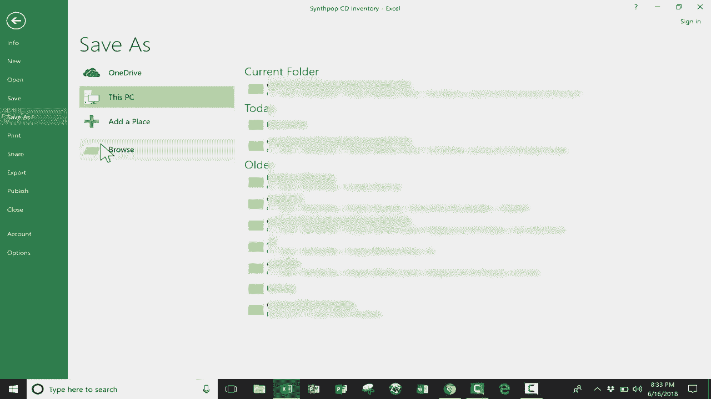

# Excel高效技巧教程 - P5：删除重复项工具 🧹

在本节课中，我们将学习如何使用Excel的“删除重复项”工具，从一个包含重复数据的列表中快速提取出唯一的项目。这个功能对于数据清洗和整理非常有用。

## 概述

假设你有一个电子表格，其中记录了某个合成流行CD商店销售的乐队和专辑信息。由于数据是按不同季度收集的，导致许多乐队名称出现了多次重复。现在，我们的目标是创建一个不包含重复乐队的简洁列表。

## 操作步骤

以下是使用“删除重复项”工具的具体步骤。

1.  **定位工具**：首先，在Excel顶部菜单栏中找到“数据”选项卡。在“数据工具”功能区中，你可以看到“删除重复项”的按钮。

2.  **选择数据范围**：点击“删除重复项”按钮后，会弹出一个对话框。默认情况下，Excel会检查你选中的所有列。如果只想针对某一列（例如“乐队”列）删除重复项，需要在此对话框中进行设置。

3.  **指定列**：在弹出的对话框中，点击“取消全选”。然后，仅勾选你希望依据其删除重复项的列，例如“乐队”列。这确保了Excel只根据乐队名称来判断和删除重复行。

4.  **执行并确认**：点击“确定”按钮。Excel会执行操作，并弹出一个提示框，告诉你发现了多少个重复值以及删除了多少行，最终剩下多少个唯一值。确认后，你的数据表中就只剩下不重复的乐队列表了。

## 保存结果

操作完成后，你可以通过“文件”->“另存为”将这份清理后的唯一乐队列表保存为一个新的Excel文件。这样，你就同时拥有了包含原始季度数据的文件和整理后的简洁列表文件。

## 总结

本节课我们一起学习了Excel中“删除重复项”工具的使用方法。通过这个功能，我们可以轻松地从包含重复记录的数据中，提取出唯一的项目列表，极大地提高了数据整理的效率。记住，在执行删除操作前，最好先另存原始文件或在新文件中操作，以保留原始数据。