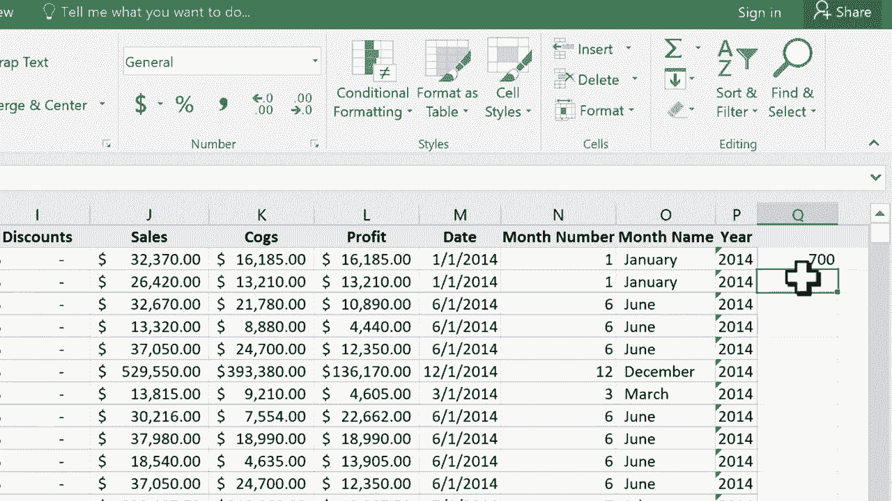

# Excel高效技巧教程 - P6：使用Count与CountA函数 📊

在本节课中，我们将学习Excel中两个非常实用的函数：`COUNT`和``COUNTA``。它们能帮助我们快速统计表格中的数据量。此外，我们还会了解如何使用Excel的状态栏来获取即时统计信息，这有时比编写公式更加快捷。

## 理解数据记录

首先，我们来看一个示例表格。这个表格包含数百行数据，每一行填充了信息的“行”在数据处理中通常被称为一条“记录”。当数据量很大时，通过手动滚动来统计记录总数既低效又容易出错。

上一节我们介绍了数据记录的概念，本节中我们来看看如何用函数自动统计它们。

## 使用COUNT函数统计数字

`COUNT`函数用于计算指定范围内包含**数字**的单元格数量。

以下是使用`COUNT`函数的基本步骤：
1.  选择一个空白单元格用于显示结果。
2.  输入等号`=`开始公式。
3.  输入函数名`COUNT(`。
4.  用鼠标选择需要统计的列或区域，例如包含销售数字的E列。
5.  输入右括号`)`或直接按回车键完成公式。

**公式示例**：`=COUNT(E:E)`

这个公式会返回E列中所有包含数字的单元格数量。如果E列有700个数字，结果就是700。

## 使用COUNTA函数统计所有非空单元格

如果你想统计包含**任何内容**（包括文本、数字等）的单元格数量，就需要使用`COUNTA`函数。

它的用法与`COUNT`类似：
1.  在空白单元格输入等号`=`。
2.  输入函数名`COUNTA(`。
3.  选择需要统计的列，例如A列。
4.  按回车键完成。

**公式示例**：`=COUNTA(A:A)`

这个公式会统计A列所有非空单元格。如果A列第一行是标题，那么它会将标题也计算在内，因此结果可能比`COUNT`函数多一个。

## COUNT与COUNTA的核心区别

让我们总结一下这两个函数的核心差异：
*   **`COUNT(范围)`**：只计算范围内包含**数字**的单元格。
*   **`COUNTA(范围)`**：计算范围内所有**非空**单元格，无论其内容是数字、文本还是公式。

理解这个区别，能帮助你根据数据内容选择合适的统计函数。

## 利用状态栏快速查看统计信息

除了使用函数，Excel还提供了一个更快捷的工具——状态栏。当你用鼠标选中一列或一个数据区域时，屏幕底部的状态栏会自动显示该区域的即时统计信息。

以下是状态栏通常提供的信息：
*   **平均值**：所选区域内数字的平均值。
*   **计数**：所选区域内非空单元格的数量（相当于`COUNTA`的结果）。
*   **求和**：所选区域内所有数字的总和。

你可以自定义状态栏显示的信息。只需在状态栏上右键点击，即可勾选或取消勾选“数值计数”、“最小值”、“最大值”等选项。这样，你无需输入任何公式，就能快速了解数据的基本概况。

## 课程总结

本节课中我们一起学习了：
1.  使用 **`COUNT`函数** 来统计指定区域内的数字单元格数量。
2.  使用 **`COUNTA`函数** 来统计指定区域内所有非空单元格的数量。
3.  掌握了 **状态栏** 的用法，它能快速提供选中数据的计数、求和、平均值等关键信息，极大提升工作效率。

记住，对于纯数字列的快速计数，可以优先使用状态栏；而当需要将统计结果固定在单元格中，或进行更复杂的条件统计时，`COUNT`和`COUNTA`函数则是你的得力工具。