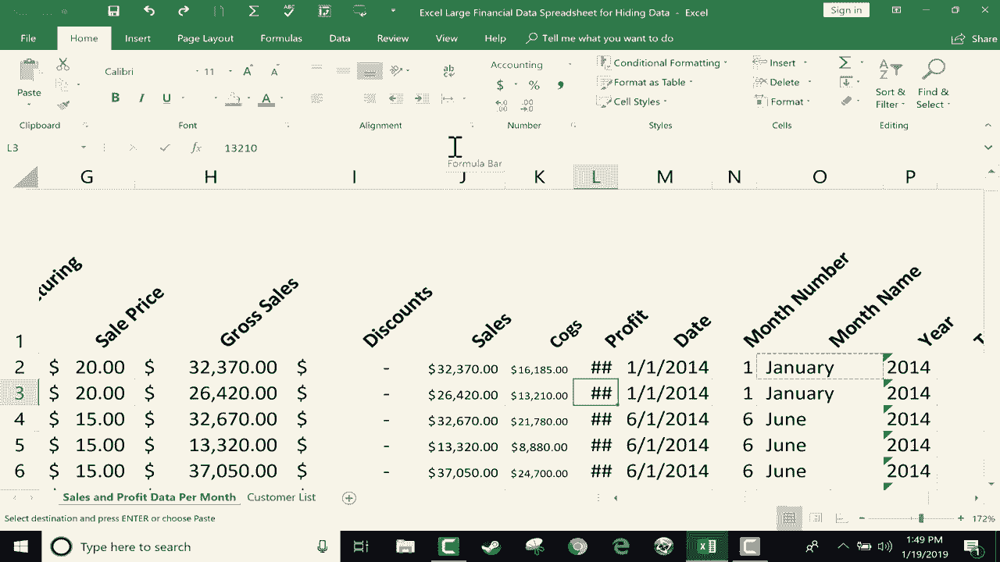

# Excel高效技巧系列课程 - P7：单元格对齐选项详解 📊

在本节课中，我们将学习Excel中三种关键的单元格对齐选项。这些工具能帮助你灵活调整单元格内容的显示方式，确保数据清晰易读，即使内容超出了默认的单元格宽度。

## 概述

当单元格中的内容（尤其是数字或长文本）超出列宽时，Excel会显示一串井号（`#####`），这给阅读数据带来了困难。本节教程将介绍如何利用“缩小字体填充”、“自动换行”和“文本方向”这三个对齐功能来解决此问题。

## 1. 使用“缩小字体填充”适应数字

上一节我们提到了数据超宽的常见问题。本节中，我们首先来看看如何让过长的数字自动缩小以匹配单元格宽度。

“缩小字体填充”功能会动态调整单元格内字体的大小，确保其内容始终完全显示在当前的列宽内。

**操作步骤如下：**

1.  选中目标单元格或整列。
2.  点击“开始”选项卡下“对齐方式”组右下角的对话框启动器按钮（一个小箭头图标）。
3.  在弹出的“设置单元格格式”对话框中，勾选“文本控制”区域的“缩小字体填充”复选框。
4.  点击“确定”。

应用后，单元格内的数字会随列宽变化而自动缩放。但需注意，如果将列缩得过窄，字体可能变得太小而难以辨认。

## 2. 使用“自动换行”处理长文本

处理较长的文本标题时，“缩小字体填充”可能不是最佳选择。此时，“自动换行”功能更为合适。

“自动换行”通过增加行高并将文本换行显示，使内容适应固定的列宽。

**以下是启用“自动换行”的方法：**

*   **快捷按钮**：选中单元格后，直接在“开始”选项卡的“对齐方式”组中点击“自动换行”按钮。
*   **通过对话框**：同样可以通过“设置单元格格式”对话框，在“文本控制”区域勾选“自动换行”。

启用后，文本将在单词间自动换行，单元格行高会增加以容纳所有内容。

## 3. 调整“文本方向”以节省水平空间

除了调整文本大小和换行，我们还可以改变文本的显示方向来优化布局。

调整文本方向（如设置为垂直或倾斜）可以显著减少列宽需求，尤其适用于较长的列标题。

**设置文本方向的步骤：**

1.  选中需要调整的单元格。
2.  在“开始”选项卡的“对齐方式”组中，点击“方向”按钮（一个带有斜向字母的图标）。
3.  从下拉菜单中选择一个预设角度（如垂直文本、逆时针角度等）。
4.  如需自定义角度，可点击“设置单元格对齐方式”，在弹出的对话框中精确设置。

将标题设置为垂直或倾斜后，你可以将列调整得更窄，但请注意这可能会占用更多的垂直空间。

## 总结

本节课中我们一起学习了三种控制Excel单元格内容显示的对齐技巧：
*   **缩小字体填充**：自动缩放字体以适应列宽，适合数字数据。
*   **自动换行**：通过增加行高和文本换行来适应列宽，适合文本标题。
*   **文本方向**：通过改变文字书写方向来节省水平空间，为表格布局提供更多灵活性。

合理组合运用这些选项，可以让你有效地安排表格数据，使其更加美观且易于阅读。