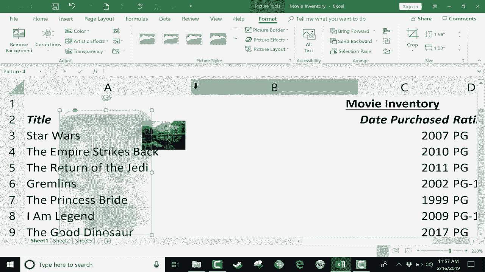

# Excel高效技巧系列课程 - P8：为工作表添加图片与背景 🖼️

在本节课中，我们将学习如何在Excel工作表中添加图片和背景，以增强表格的视觉吸引力和展示效果。我们将探讨两种主要方法：设置工作表背景和插入浮动图片，并分析各自的优缺点。

---

## 设置工作表背景

上一节我们介绍了课程概述，本节中我们来看看如何为整个工作表设置背景图片。

你可以在 **“页面布局”** 选项卡下的 **“页面设置”** 功能组中找到 **“背景”** 选项。点击该按钮，即可从你的电脑中选择一张图片插入。

例如，选择一张图片并点击插入后，你的数据后方将出现该背景。当你滚动工作表时，背景图片会不断重复平铺。

**设置背景的优点与缺点如下：**

以下是使用背景图片的主要利弊分析：

*   **优点**：为电子表格增添色彩和美感。
*   **缺点**：
    1.  背景可能遮挡单元格中的文本，影响数据的可读性。
    2.  背景图片的大小是固定的，不会随工作表的缩放比例而同步变化。这意味着当你放大或缩小时，数据会变大变小，但背景图片基本保持原样。

在“页面布局”中，你还可以删除现有背景或搜索新背景。点击“背景”后，除了从电脑上传，还可以使用 **“搜索图片”** 功能。

此功能默认搜索“知识共享”协议下的图片，这些图片被上传至网络供分享使用。你可以取消勾选该选项以获得更多结果，或使用筛选器按尺寸、类型（如剪贴画、线条图）查找图片。线条图因其对比度高，有时对文本的遮挡较少。

**请注意**：添加到工作表中的背景图片**不会**被打印出来，也不会在打印预览中显示。因此，背景图片的主要用途是在屏幕演示时吸引观众注意力。

---

## 插入浮动图片

了解了背景的局限性后，我们来看看另一种更灵活的方法：插入浮动图片。

在许多情况下，与其设置背景，不如直接使用 **“插入”** 选项卡。在 **“插图”** 功能组中，选择 **“图片”**，即可从电脑上传图片。

与背景图片不同，这种方式插入的图片是“悬浮”在数据上方的独立对象。它的**缩放行为与数据同步**：当你放大或缩小工作表视图时，图片也会同比变大或变小。

你可以自由调整其大小，并将其放置在数据旁边或上方。你还可以通过 **“插入” > “插图” > “在线图片”** 来搜索并插入网络图片。

插入浮动图片的一个显著优势是，点击图片后会出现 **“图片格式”** 选项卡，其中提供了丰富的格式设置选项。

**可用的格式选项包括：**

以下是你可以对浮动图片进行的一些美化操作：

*   为图片添加边框。
*   将图片边缘设置为圆角或椭圆形。
*   应用各种预设的图片样式，如3D效果或斜面效果。
*   调整图片的**透明度**。这个功能尤其有用，通过增加透明度，可以让图片半透明地显示在数据后方，既起到了装饰作用，又最大程度地保证了数据的可读性。

因此，通过插入浮动图片并调整其透明度，可以实现比直接设置背景更好的视觉效果和实用性。

---

## 课程总结

本节课中，我们一起学习了在Excel中添加视觉元素的两种方法。

1.  **设置工作表背景**：操作简单，能快速美化整个页面，但会影响文本阅读且无法打印。
2.  **插入浮动图片**：方式更灵活，图片可随视图同步缩放，并且可以通过格式工具（特别是透明度调整）实现类似背景的效果，同时更好地保障数据的清晰度。

你可以根据具体的展示需求，选择最适合的方法来提升工作表的视觉表现力。