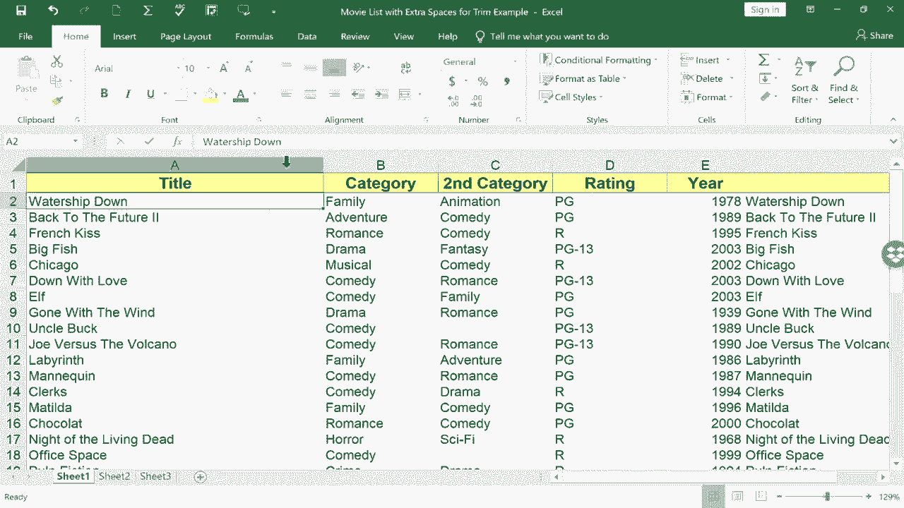

# Excel高效技巧课程 - P9：移动与复制列 📊➡️📋

在本节课中，我们将学习在Excel中移动和复制整列数据的快捷方法。掌握这些技巧可以显著提升你的数据处理效率。

## 概述

许多人习惯使用“剪切”和“粘贴”命令来移动Excel中的列。虽然这种方法有效，但存在更快捷的操作方式。本节将介绍如何通过简单的鼠标拖拽来快速移动或复制整列数据。

## 传统方法：剪切与粘贴

上一节我们介绍了列操作的基本概念，本节中我们来看看具体的操作方法。首先，回顾一下移动列的传统步骤：

以下是使用右键菜单移动列的常规流程：
1.  右键单击需要移动列的列字母（例如A列）。
2.  在弹出的菜单中选择“剪切”。
3.  右键单击目标位置的列字母。
4.  选择“插入剪切的单元格”或“粘贴”。

此方法虽然直观，但步骤较多。

## 高效技巧：拖拽移动列

接下来，我们将学习一种更快的拖拽移动方法。

操作步骤如下：
1.  用鼠标左键单击需要移动列的列字母，选中整列。
2.  将鼠标指针移动到选中列的**左边缘或右边缘**。
3.  当指针从“十字加号”形状变为**四向箭头**形状时，按住鼠标左键。
4.  将整列拖拽到目标位置后松开。

**重要提示**：如果将列拖拽到已有数据的列上，Excel会提示“是否替换目标单元格内容？”。若选择“确定”，原数据将被覆盖；若选择“取消”，则操作中止。

为了避免覆盖数据，可以先在目标位置**右键插入一个空白列**，再将数据列移动至此。

## 进阶技巧：拖拽复制列

除了移动，我们还可以快速复制整列数据。

操作步骤如下：
1.  选中需要复制的整列。
2.  将鼠标指针移动到列的边缘，直至变为四向箭头。
3.  **先按住键盘上的 `Ctrl` 键**，再按住鼠标左键进行拖拽。
4.  此时鼠标指针旁会出现一个“加号”，将列拖到目标位置后松开。

这个操作的效果是：**原列数据保持不变，同时在目标位置生成一个数据副本**。

## 总结

本节课中我们一起学习了Excel中移动和复制列的高效技巧。
*   核心移动操作是：**选中整列 → 拖拽边缘**。
*   核心复制操作是：**按住 `Ctrl` 键 + 选中整列 → 拖拽边缘**。

记住，在移动数据前，留意Excel的覆盖提示，必要时先插入空白列。熟练掌握这些鼠标拖拽技巧，能让你摆脱对右键菜单的依赖，使表格整理工作更加流畅快捷。