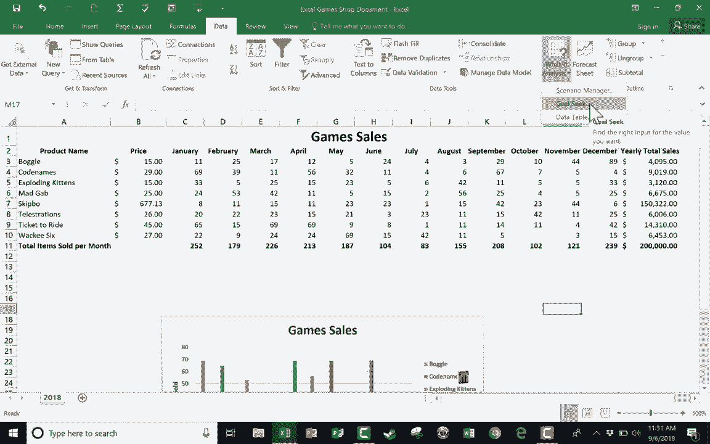

# Excel高级教程（持续更新中） - P1：假设分析之情景管理器与目标搜索 🔍

在本节课中，我们将学习 Microsoft Excel 中的两个“假设分析”功能：**情景管理器**和**目标搜索**。这两个工具能帮助我们模拟不同条件下的数据变化，从而进行预测和规划。我们将通过一个游戏销售电子表格的实例来演示它们的具体用法。

## 概述：什么是假设分析？

假设分析是一种通过改变某些变量来观察结果如何变化的数据分析方法。在Excel中，它主要包含三个工具：情景管理器、目标搜索和数据表。本节课我们将重点学习前两个。

## 情景管理器：创建与比较不同场景

情景管理器允许我们创建并保存多组不同的输入值（即“情景”），并快速查看每种情景对最终结果的影响。这非常适合用于业务预测，例如规划不同销售策略下的收入情况。

我们使用的示例是一个桌游商店的年度销售表。左侧列出了游戏及其月度销量，右侧的“年度总销售额”单元格（例如 `B13`）使用公式 `=SUM(B2:B13)*成本` 计算得出。我们的目标是探索如何改变销量以实现更高的收入。

以下是使用情景管理器的具体步骤：

1.  **定位功能**：在Excel的“数据”选项卡下，找到“预测”组，点击“假设分析”，然后选择“情景管理器”。

2.  **创建“当前”情景**：
    *   点击“添加”按钮。
    *   在“情景名”中输入“当前年份”。
    *   在“可变单元格”中，选择我们计划在不同情景中改变的单元格，例如各游戏12月的销量区域（`B12:M12`）。
    *   点击“确定”后，系统会显示当前这些单元格的值，再次点击“确定”保存。这个情景记录了实际数据，作为比较的基准。

3.  **创建“乐观”情景**：
    *   再次点击“添加”。
    *   命名为“乐观情景”，注释可写“十二月销售的最佳案例情景”。
    *   可变单元格范围相同（`B12:M12`）。
    *   点击“确定”后，为每个游戏12月的销量输入一个较高的假设值（例如，每个游戏售出100份），然后保存。

4.  **创建“悲观”情景**：
    *   添加名为“悲观情景”的新情景。
    *   在可变单元格中输入较低的假设值（例如，每个游戏仅售出3份），然后保存。

创建完成后，你可以在情景管理器列表中选中任一情景，点击“显示”或直接双击，工作表上的数据就会更新为该情景下的数值。你可以轻松地在不同情景间切换，对比“当前年份”（$51,000）、“乐观情景”（$64,000）和“悲观情景”（$46,000）下的总收入差异。

**重要提示**：使用完毕后，建议切换回反映真实数据的“当前”情景，再关闭管理器，以确保工作表数据恢复正常。

## 目标搜索：反向求解以实现特定目标

上一节我们介绍了如何创建多种情景来观察结果。本节我们来看看目标搜索，它的思路正好相反：**先设定一个期望的结果（目标），然后反推需要改变哪个输入值才能实现它。**

例如，假设我们的目标是将年度总收入从$51,000提升至$200,000。我们可以使用目标搜索来找出需要达成这一目标的某个关键变量的值。

以下是使用目标搜索的步骤：

1.  **定位功能**：同样在“数据”>“假设分析”中，选择“目标搜索”。

2.  **设置参数**：
    *   **设置目标单元格**：选择包含总收入的单元格（如 `B13`）。
    *   **目标值**：输入你希望达到的数值，例如 `200000`。
    *   **可变单元格**：选择你允许Excel调整以实现目标的那个单元格。例如，我们选择“票到达”游戏12月的销量单元格（`B12`）。

3.  **执行计算**：点击“确定”，Excel会立即计算并显示：为了达到$200,000的总收入，“票到达”在12月需要售出 **303,048份**。这个例子虽然夸张，但清晰地展示了目标搜索的逻辑。

4.  **尝试其他变量**：我们可以撤销上一步操作，重新进行目标搜索。这次，将“可变单元格”设为某个游戏的价格单元格（如“Skipbo”卡牌的价格）。Excel会计算出，在销量不变的情况下，需要将单价提高到 **$677.13** 才能实现$200,000的收入目标。

## 总结

本节课我们一起学习了Excel中两个强大的假设分析工具：
*   **情景管理器**：用于创建和管理多组输入假设，便于对比不同场景下的输出结果。
*   **目标搜索**：用于根据设定的目标值，反向求解出所需的关键输入值。

这两个功能是进行财务预测、销售规划和数据模拟的实用工具，能帮助我们更好地理解数据关系并制定策略。

