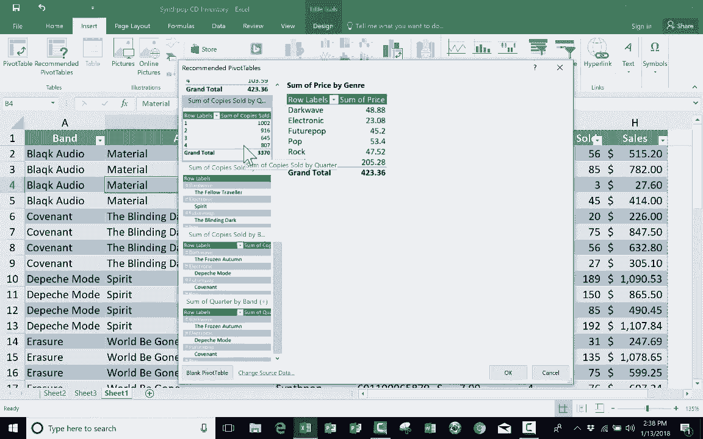

# Excel高级教程（持续更新中） - P10：10）使用“推荐的数据透视表” 📊

在本节课中，我们将学习如何使用Excel的“推荐的数据透视表”功能。这是一种快速、简便的方法，能帮助初学者基于现有数据自动生成有用的数据透视表报告。

## 概述

“推荐的数据透视表”是Excel提供的一项智能功能，它能够分析你的数据，并自动推荐几种可能的数据透视表布局。这为不熟悉数据透视表复杂设置的用户提供了极大的便利。

## 前提条件与准备工作

在开始之前，你需要确认你的Excel版本支持此功能。请检查“插入”选项卡，在“数据透视表”按钮旁边是否能看到“推荐的数据透视表”选项。

为了更深入地理解数据透视表，建议你先学习常规数据透视表的创建与设置方法。本教程将使用一个假设的合成流行音乐商店库存数据作为示例，其结构如下：

*   **项目编号**：商品的唯一标识。
*   **价格**：商品的单价。
*   **季度**：销售发生的季度。
*   **售出总数**：商品售出的总数量。
*   **总销售额**：商品带来的总金额，计算公式为 `总销售额 = 价格 * 售出总数`。

## 如何使用“推荐的数据透视表”

上一节我们介绍了数据准备，本节中我们来看看如何实际操作“推荐的数据透视表”功能。

首先，点击“插入”选项卡下的“推荐的数据透视表”按钮。Excel会弹出一个窗口，展示它根据你的数据推荐的不同透视表方案。

以下是几个推荐方案的例子及其解读：

1.  **按类型汇总的价格**：此方案会计算每种音乐类型（如流行、摇滚）下所有商品的价格总和。但这反映的是库存商品的总标价，而非实际销售额，因此对分析销售表现可能帮助有限。
2.  **按类型的销售数据**：此方案会汇总每种音乐类型的总销售额。这有助于你了解哪种类型的音乐最受欢迎、带来的收入最多。例如，数据可能显示“流行”音乐是销售额最高的类型。
3.  **按乐队销售的副本数量**：此方案会列出每个乐队售出的专辑总数，并可能关联其音乐类型。这对于分析具体乐队的市场表现非常有用。
4.  **按乐队汇总的季度数据**：此方案可能按季度展示每个乐队的某项数据（如销售额或数量）。如果某个乐队只在特定季度有数据（例如布兰登·弗劳尔斯），其汇总结果就会与其他乐队不同。你需要判断这类信息是否符合你的分析需求。

关键点在于，你可以浏览这些推荐方案，并选择最符合你分析目标的一个。

## 应用与调整推荐方案

当你选中一个有用的推荐方案（例如“按乐队销售的副本数量”）并点击“确定”后，Excel会自动创建一个新的工作表，并将生成的数据透视表放入其中。

如果生成的报告不完全符合你的要求，你可以轻松地进行调整。工作表右侧会出现“数据透视表字段”窗格。你可以通过拖拽字段来添加或删除行、列、值或筛选器。例如，你可以将“季度”字段拖入“列”区域，以按季度查看各乐队的销售情况。

## 总结

本节课中我们一起学习了“推荐的数据透视表”功能。它通过分析你的数据自动生成透视表方案，是探索数据和快速获得洞察的强大工具。对于初学者，这是一个绝佳的起点；对于有经验的用户，它也能提供新的分析思路。通常，用户可以根据明确需求手动创建透视表，但在不确定如何开始时，“推荐的数据透视表”能提供极大的帮助。

