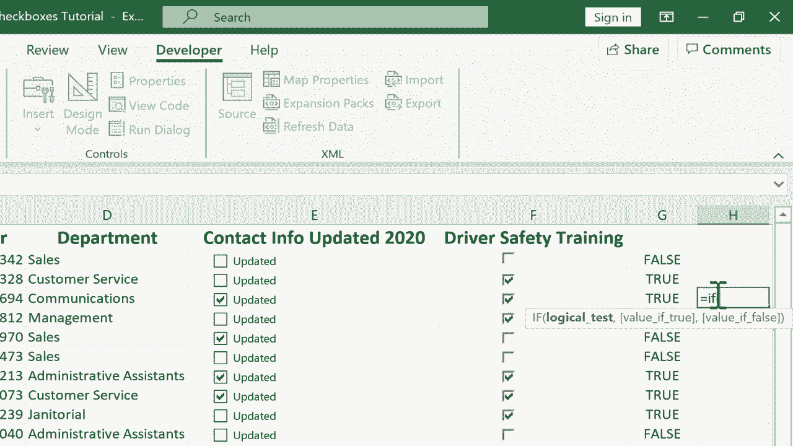

# Excel高级教程（持续更新中） - P12：12）复选框 - Part 1 📝


在本节课中，我们将学习如何在Excel电子表格中添加和使用复选框。我们将探讨两种主要方法，并了解如何将复选框与单元格链接，以实现数据的动态交互和可视化。

在之前的教程中，我们介绍了如何在“开发者”选项卡的“控件”组中使用表单控件。其中一个例子引起了广泛关注，因此我们将在本节中深入探讨另一个表单控件——复选框的应用。

## 准备工作：启用“开发者”选项卡

首先，你需要确保Excel的功能区中显示了“开发者”选项卡，因为它默认是隐藏的。

以下是启用“开发者”选项卡的步骤：
1.  在Excel功能区的任意位置**右键单击**。
2.  在弹出的菜单中选择“**自定义功能区**”。
3.  在弹出的对话框右侧“主选项卡”列表中，找到并勾选“**开发者**”选项。
4.  点击“**确定**”。

完成上述步骤后，“开发者”选项卡就会出现在功能区中。

## 方法一：添加简单的复选框

现在，我们来看一个简单的例子。假设我们有一个员工名单，需要在E列添加一个名为“更新2020年联系信息”的复选框。

操作步骤如下：
1.  点击目标单元格（例如 **E2**）。
2.  切换到“**开发者**”选项卡。
3.  在“**控件**”组中，点击“**插入**”。
4.  在“表单控件”区域，选择“**复选框（窗体控件）**”图标。
5.  在单元格 **E2** 中点击，即可插入一个复选框。

插入的复选框默认带有文本（如“复选框 1”）。你可以右键点击复选框，选择“**编辑文字**”，然后修改为所需内容，例如“更新”。

**复制复选框**：选中包含复选框的单元格（E2），拖动其右下角的**填充柄**向下填充，即可快速为其他行添加相同的复选框。这是添加简单视觉提示的最快捷方法。

## 方法二：链接到单元格的复选框

上一节我们介绍了如何添加简单的复选框。本节中，我们来看看功能更强大的用法：将复选框链接到单元格，从而捕获其“选中”或“未选中”的状态。

我们以F列添加“完成驾驶员安全培训”复选框为例。

操作步骤如下：
1.  在 **F2** 单元格插入一个复选框（方法同上），可以右键编辑文本或直接删除文本。
2.  **右键点击**该复选框，选择“**设置控件格式**”。
3.  在弹出的对话框中，进行以下关键设置：
    *   **值**：选择默认状态（如“未选择”）。
    *   **单元格链接**：点击右侧的折叠按钮，然后选择希望显示复选框结果的单元格（例如 **G2**）。点击确定。
4.  此时，当你勾选或取消勾选F2的复选框时，链接的单元格 **G2** 会相应地显示 **TRUE**（真）或 **FALSE**（假）。

**重要提示**：当使用填充柄复制这种链接了单元格的复选框时，每个新复选框的链接仍然指向原始单元格（如G2）。这意味着所有复选框会控制同一个单元格。

以下是解决此问题的方法：
你必须**逐个**右键点击新复制的复选框，进入“设置控件格式”，将其“单元格链接”手动修改为对应的新单元格（例如F3的复选框链接到G3，F4的链接到G4，依此类推）。虽然对于大量数据略显繁琐，但对于中小型列表是可行的。

## 复选框数据的应用

将复选框状态（TRUE/FALSE）捕获到单元格后，我们就可以利用这些数据进行各种操作。

以下是一些应用场景：
*   **使用IF函数**：可以基于TRUE/FALSE值返回特定结果。
    ```excel
    =IF(G2=TRUE, "已完成", "未完成")
    ```
*   **条件格式**：可以设置规则，将未完成培训（FALSE）的员工行标记为红色，提供清晰的视觉提醒。
*   **隐藏辅助列**：可以将显示TRUE/FALSE的列（如G列）隐藏起来（右键点击列标选择“隐藏”），使表格界面更简洁，同时保留底层数据供公式调用。

## 总结

本节课中我们一起学习了在Excel中添加复选框的两种方法。第一种是创建简单的视觉提示框，第二种则是通过链接到单元格来获取逻辑值（TRUE/FALSE），从而为数据分析和可视化（如条件格式、IF函数）奠定基础。虽然链接复选框的复制过程需要手动调整引用，但在管理任务列表或状态跟踪时，它仍然是一个非常实用的工具。




如果你对如何结合条件格式或IF函数来进一步利用复选框数据感兴趣，请在评论区留言，我们会考虑制作后续教程。