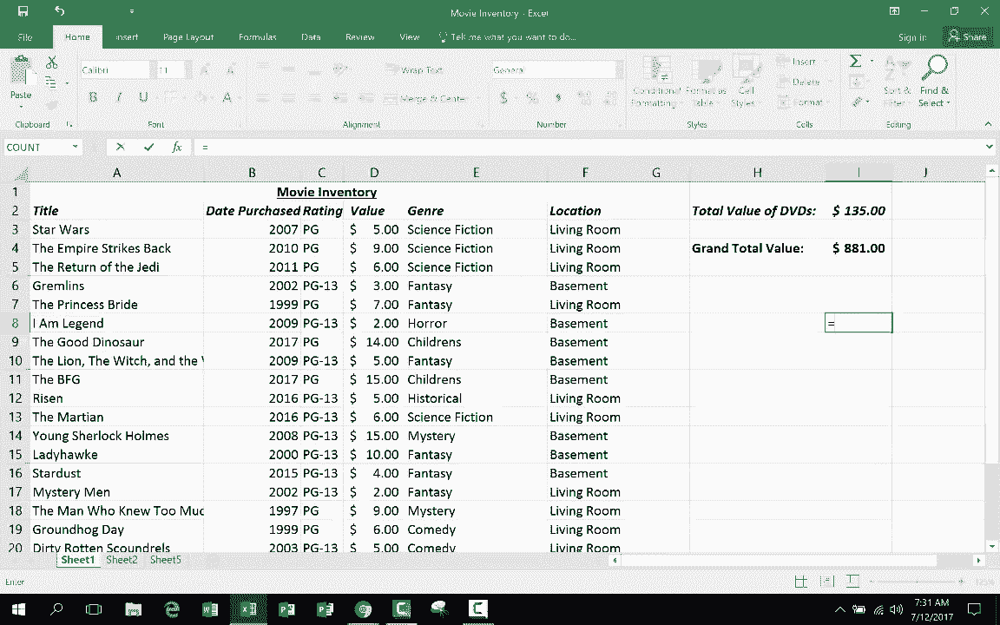

# Excel高级教程（持续更新中） - P13：13）3D公式 📊

在本节课中，我们将学习一个高级Excel技巧：如何创建和使用3D公式。3D公式允许您跨多个工作表的相同单元格位置进行计算，例如求和或求平均值。这对于汇总分布在多个表格中的同类数据非常有用。

在之前的教程中，我们创建了一个电影库存表格。该表格包含了电影标题、购买日期、价值、类型、存放地点和评级等信息。表格的总价值已被计算出来。

为了适应未来可能添加更多DVD记录的需求，我将总价值单元格移动到了表格的右上角。这样，当列表向下扩展时，汇总单元格的位置保持不变。

此外，我还在同一个工作簿中创建了第二个工作表。这个新工作表用于记录我的音乐CD库存。它的结构与电影库存表非常相似，包含了CD名称、购买日期、评分、当前价值和存放位置等信息。我同样计算了CD的总价值。

因为两个工作表的结构一致，关键数据（如总价值）都位于每个工作表的相同单元格（例如I2）中，这为使用3D公式创造了条件。

假设除了电影和音乐，我还想管理书籍等其他媒体的库存。我可以为每种媒体创建一个结构相同的工作表。然后，我希望在一个总表中计算所有媒体库存的总价值。

以下是创建3D求和公式的具体步骤。

首先，在用于显示总价值的空白单元格中，输入公式的起始部分：`=SUM(`。

接着，用鼠标点击第一个工作表（例如“电影库存”）中您想要汇总的单元格（例如I2）。

此时，不要按回车键。按住键盘上的 **Shift** 键。

在按住Shift键的同时，用鼠标点击您希望包含在计算范围内的最后一个工作表的标签（例如“音乐库存”或“书籍库存”）。这样，从第一个点击的工作表到最后一个点击的工作表之间的所有工作表都会被选中。

观察公式栏，您会看到公式变成了类似 `=SUM(‘Sheet1:Sheet3’!I2)` 的形式。这表示将对从Sheet1到Sheet3的所有工作表中的I2单元格进行求和。

最后，释放Shift键，按下键盘上的 **Enter** 键完成公式输入。单元格将显示跨所有选定工作表的指定单元格数值的总和。

这个公式之所以被称为“3D公式”，是因为它引入了第三个维度——工作表。普通的公式在单个工作表的二维平面（行和列）上运算，而3D公式则在三维空间（行、列和工作表）上进行运算。

创建3D公式的核心要点是确保您要计算的数据在不同工作表中位于完全相同的单元格地址。您可以使用的函数不限于`SUM`，还包括`AVERAGE`、`MAX`、`MIN`等。

本节课中我们一起学习了3D公式的概念和创建方法。3D公式通过引用多个工作表中的相同单元格，实现了跨表数据的便捷汇总。关键在于保持各工作表结构一致，并在输入公式时使用Shift键批量选择工作表范围。掌握这个技巧能极大地提升处理多表关联数据的效率。