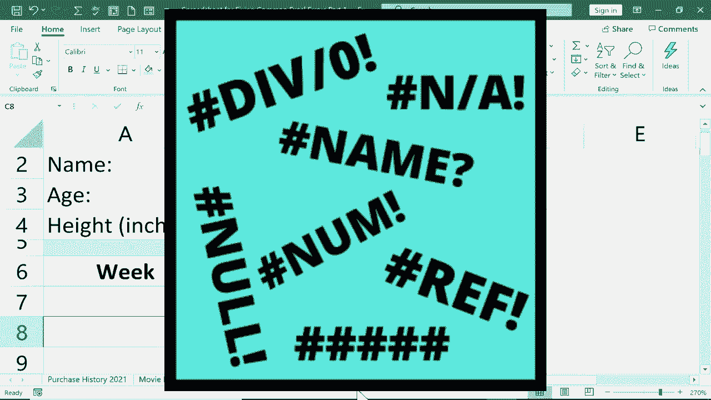

# Excel高级教程（持续更新中） - P14：14）修复常见错误1 - DIV/0、N/A 和 NAME? 🔧

在本节课中，我们将学习如何修复Excel中三种常见的错误信息：`#DIV/0!`、`#N/A` 和 `#NAME?`。这是关于错误处理系列教程的第一部分。我们将通过具体的示例，了解这些错误产生的原因以及如何有效地解决它们，使您的电子表格看起来更专业、更易读。

## 修复 #DIV/0! 错误 ➗

`#DIV/0!` 错误表示公式尝试进行除以零的运算。在数学中，除以零是没有定义的，因此Excel会显示此错误。

上一节我们介绍了本节课的目标，本节中我们来看看第一个常见错误。以下是一个示例：一个记录用品购买历史的表格，其中“单价”由“总成本”除以“数量”计算得出。当“数量”为0时，公式就会产生 `#DIV/0!` 错误。

解决此问题有两种主要方法：

**方法一：避免除数为零**
最直接的方法是确保作为除数的单元格不为零。例如，如果您购买了物品，就输入实际数量。

**方法二：使用 `IFERROR` 函数**
当您无法避免除数为零（例如，某项尚未购买），可以使用 `IFERROR` 函数来优雅地处理错误。该函数会检查公式是否出错，如果出错则返回您指定的值，否则返回公式的正常结果。

其基本语法为：
`=IFERROR(原公式, “出错时显示的值”)`

以下是具体操作步骤：
1.  点击包含错误公式的单元格（例如F2）。
2.  将原公式 `=D2/E2` 修改为 `=IFERROR(D2/E2, “”)`。这里的双引号 `“”` 表示出错时显示为空单元格。
3.  按下回车键，错误信息即被替换为空值。
4.  使用填充柄将公式向下拖动应用到整列。

您也可以将出错时显示的值改为更有意义的提示，例如 `“未购买”`。修改公式为：
`=IFERROR(D2/E2, “未购买”)`

这样，当除数为零时，单元格将显示“未购买”而非错误代码，使表格更清晰。

## 修复 #N/A 错误 🔍

`#N/A` 错误通常在使用 `VLOOKUP`、`HLOOKUP` 等查找函数时出现，表示Excel找不到您要查找的值。

上一节我们处理了除零错误，本节中我们来看看查找数据时常见的 `#N/A` 错误。假设我们有一个电影库存表，使用 `VLOOKUP` 根据电影名称查找其分级。当输入一个不在列表中的电影名（如“狮子王”）时，就会返回 `#N/A`。

此错误可能由以下几个原因导致：

**原因一：查找值在源数据中确实不存在**
这是最直接的原因。解决方法是确保要查找的值存在于您的查找范围内。

**原因二：数据中存在多余空格**
有时，源数据中的文本可能包含肉眼难以察觉的首尾或中间空格。例如，“狮子王”在数据中可能是“狮子王 ”（末尾带空格）。这会导致精确匹配失败。
*   您可以使用 `TRIM` 函数批量清理数据中的空格。例如，在空白列中输入公式 `=TRIM(A2)` 并向下填充，可以去除A2单元格文本中所有多余的空格。
*   然后，复制这些清理后的结果，并使用“粘贴值”功能覆盖原数据列。

**原因三：数字格式不匹配**
如果要查找的值是数字（如电影名“42”），而源数据中对应的列被设置为“文本”格式，或者反之，也可能导致查找失败。
*   确保查找列和查找值的单元格格式一致（同为“文本”或同为“常规/数字”）。

**使用 `IFERROR` 美化错误显示**
与处理 `#DIV/0!` 错误类似，您可以在 `VLOOKUP` 公式外包裹 `IFERROR` 函数，为不存在的项目提供友好提示。
例如，将原公式修改为：
`=IFERROR(VLOOKUP(查找值, 表格范围, 返回列, FALSE), “不在库存中”)`
这样，当查找失败时，单元格会显示“不在库存中”而不是 `#N/A`。

## 修复 #NAME? 错误 📛

`#NAME?` 错误表示Excel无法识别公式中的文本，通常是因为函数名、已定义的名称拼写错误，或引用文本时未使用双引号。

上一节我们解决了查找错误，本节中我们来看看最后一个常见错误：名称错误。这个错误通常是由于拼写问题引起的。例如，在计算BMI的公式中，我们使用了已命名的单元格“height”。如果错误地拼写为“hight”，Excel无法识别这个名称，就会返回 `#NAME?` 错误。

以下是导致 `#NAME?` 错误的常见情况及解决方法：

**情况一：函数名拼写错误**
例如，将 `SUM` 误写为 `SUN`，或将 `AVERAGE` 误写为 `AVG`。
*   **解决方法**：仔细检查并更正函数名的拼写。

**情况二：定义的名称拼写错误**
如果您为单元格或区域定义了名称（如“age”、“height”），在公式中引用时拼写错误会导致此错误。
*   **解决方法**：
    1.  检查名称的拼写。您可以通过点击“公式”选项卡下的“名称管理器”，或点击编辑栏左侧的“名称框”下拉列表，来查看所有已定义的名称。
    2.  在公式中使用正确的名称拼写。

**情况三：文本字符串未加双引号**
在公式中引用纯文本字符串时，必须用双引号括起来。例如，在 `IF` 函数中：`=IF(A1>10, “达标”, “未达标”)`。如果忘记双引号，如 `=IF(A1>10, 达标, 未达标)`，Excel会尝试将“达标”和“未达标”解释为名称，从而引发 `#NAME?` 错误。
*   **解决方法**：确保所有作为文本输出的部分都用双引号 `“”` 括起来。

**情况四：区域引用中漏掉冒号**
引用一个连续区域应使用冒号，如 `A1:A10`。如果写成了 `A1 A10`，也会产生 `#NAME?` 错误。
*   **解决方法**：确保区域引用使用了正确的冒号 `:`。

## 总结 📝

本节课中我们一起学习了如何识别和修复Excel中的三种常见错误：
*   **`#DIV/0!` 错误**：由除以零引起。可通过确保除数非零，或使用 **`IFERROR` 函数** 返回自定义提示来处理。
*   **`#N/A` 错误**：常见于查找函数，表示找不到匹配项。需检查查找值是否存在、数据有无多余空格、数字格式是否一致，同样可以使用 **`IFERROR` 函数** 提供友好提示。
*   **`#NAME?` 错误**：由Excel无法识别的文本引起。请仔细检查函数名、已定义名称的拼写，确保文本字符串加了双引号，以及区域引用格式正确。

掌握这些错误处理方法，能让您的电子表格更加健壮和美观。在接下来的教程中，我们将继续探讨其他类型的Excel错误。

