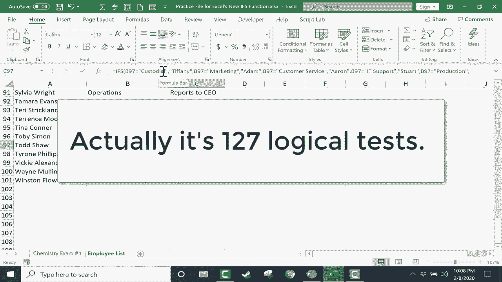

# Excel高级教程（持续更新中） - P16：16）新的 IFS 函数 📊


在本节课中，我们将学习 Excel 中一个令人兴奋的新函数：**IFS**。这个函数是 Excel 2019 和 Office 365 中的新特性。在学习这个新函数之前，我们先回顾一下已经存在多年的传统 **IF** 函数。

## 回顾传统 IF 函数

假设我们有一个电子表格，列出了学生编号、姓名和考试成绩。我们需要根据分数自动给出“通过”或“未通过”的评级。

以下是使用传统 **IF** 函数的步骤：

1.  点击目标单元格，输入公式：`=IF(D2>59, "Pass", "Fail")`
2.  按下 `Enter` 键，Excel 会判断 D2 单元格的值是否大于 59。如果是，则显示“Pass”；否则显示“Fail”。
3.  使用自动填充功能（双击单元格右下角的填充柄），可以将此公式快速应用到整列。

然而，传统 **IF** 函数在处理多个条件时显得力不从心。例如，如果我们想根据分数段给出 A、B、C、D、F 等多个等级，就需要使用嵌套的 **IF** 函数，公式会变得复杂且难以维护。

## 引入新的 IFS 函数 🆕

为了解决多条件判断的复杂性，Excel 2019 和 Office 365 引入了 **IFS** 函数。它允许你在一个公式中按顺序测试多个条件，并返回第一个为真的条件对应的值。

让我们使用 **IFS** 函数来实现上述的分数评级系统。

以下是创建 **IFS** 公式的步骤：

1.  点击目标单元格，输入 `=IFS(` 开始公式。
2.  按顺序添加你的条件和返回值。格式为：`条件1, 返回值1, 条件2, 返回值2, ...`
3.  输入完所有条件后，用右括号 `)` 结束公式。

具体到我们的例子，公式如下：
```excel
=IFS(D2>92, "A", D2>89, "A-", D2>84, "B+", D2>79, "B", D2>74, "B-", D2>69, "C+", D2>64, "C", D2>59, "C-", D2<58, "F")
```
按下 `Enter` 键后，Excel 会从上到下依次检查每个条件。当找到第一个为真的条件时，就返回对应的等级。然后，同样可以使用自动填充功能应用到所有学生。

## IFS 函数的进阶应用 💡

上一节我们介绍了 **IFS** 函数在成绩评级中的基本用法。本节中我们来看看它在处理文本数据时的另一个实用场景。

假设我们有一个员工列表，需要根据其所属部门自动填写主管姓名。

以下是构建此公式的方法：

1.  点击目标单元格，输入 `=IFS(`。
2.  添加部门与主管的对应关系。**注意**：当条件判断文本是否相等时，文本需要用引号括起来。
3.  最后，可以添加一个“万能”条件来处理未列出的部门。

具体公式如下：
```excel
=IFS(B2="保洁", "蒂凡尼", B2="市场营销", "张三", B2="客户服务", "李四", TRUE, "不适用")
```
在这个公式中：
*   `B2="保洁", "蒂凡尼"` 表示：如果 B2 单元格是“保洁”，则返回“蒂凡尼”。
*   最后的 `TRUE, "不适用"` 是一个强制为真的条件。如果前面所有条件都不满足，公式就会执行这一条，返回“不适用”。这可以有效避免出现 `#N/A` 错误，使表格更整洁。

## 课程总结 🎯

本节课中我们一起学习了：
1.  **IFS 函数的优势**：它比传统的嵌套 **IF** 函数更简洁、直观，特别适合处理多个条件判断。
2.  **基本语法**：`=IFS(条件1, 结果1, 条件2, 结果2, ...)`。Excel 会按顺序测试条件，并返回第一个为真条件对应的结果。
3.  **实用技巧**：在公式末尾使用 `TRUE, “默认结果”` 作为最终条件，可以捕获所有未明确指定的情况，避免错误值出现。

通过 **IFS** 函数，你可以轻松构建强大的多条件逻辑判断，让数据自动化处理变得更加高效和清晰。



