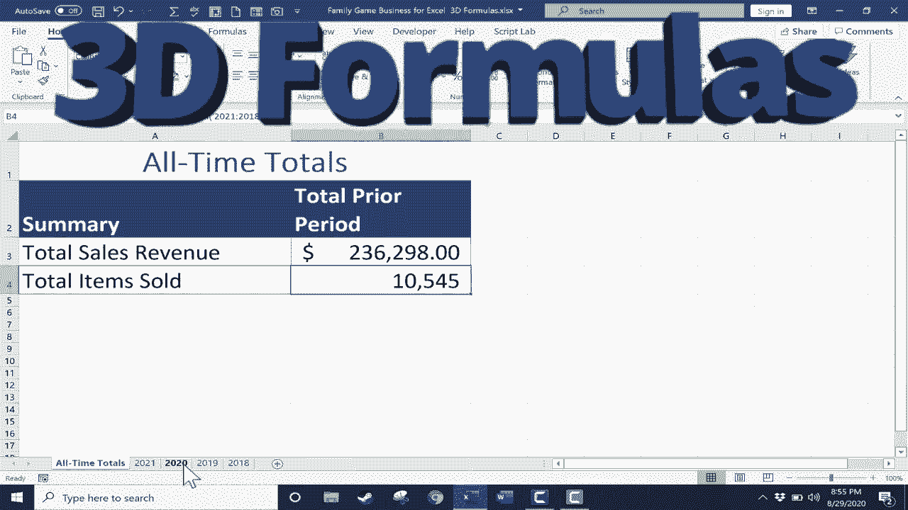

# Excel高级教程（持续更新中） - P17：17）3D 公式 📊

在本节课中，我们将学习如何在Excel中创建和使用3D公式。这种公式之所以被称为“3D”，是因为它能够提取并计算位于不同工作表（即工作簿的“深度”或Z轴方向）上的数据，而不仅仅是当前工作表（X轴和Y轴）上的信息。

## 概述

假设你管理一家桌游和卡牌游戏商店的销售数据，并且每年的数据都记录在一个独立的工作表中。现在，你需要计算自2018年以来的总销售收入和总销售商品数量。本节课将演示两种方法来实现这一目标：一种是传统的单元格链接方法，另一种则是更高效的3D公式方法。

## 数据准备与前提

正如你在示例工作簿中看到的，我们有多个工作表，分别记录了2018年至2021年每年的月度销售数据。每个工作表的布局和结构完全相同，这是成功使用3D公式的关键前提。

*   **工作表结构**：每个工作表都按月份记录销售数据，并在固定位置（例如B16单元格）汇总该年的总销售额。
*   **数据一致性**：虽然每年的具体销售数字不同，但“总销售额”这个信息在每个工作表中的存储位置（单元格地址）是一致的。

## 方法一：传统单元格链接法

上一节我们了解了数据的基本情况，本节中我们来看看第一种汇总多表数据的方法。这种方法通过手动将每个工作表的单元格链接到汇总表来实现。

以下是具体操作步骤：

1.  在汇总表（如“封面”工作表）的目标单元格中点击，输入等号（`=`）和求和函数起始部分：`=sum(`。
2.  不要输入右括号，直接点击第一个源工作表标签（如“2021”）。
3.  在该工作表中，点击包含总销售额的单元格（如B16）。此时公式栏会显示类似 `=sum(‘2021’!B16` 的内容。
4.  在公式栏中手动输入加号（`+`）。
5.  重复步骤2和3，依次点击“2020”、“2019”、“2018”工作表，并选择各自的总销售额单元格，每次选择后都在公式栏输入加号。
6.  在所有年份的单元格地址都添加完毕后，在公式栏输入右括号（`)`）并按回车键。

最终公式可能类似：`=sum(‘2021’!B16+’2020’!B16+’2019’!B16+’2018’!B16)`。此方法可以得到正确结果，但操作繁琐，尤其在需要汇总大量工作表时效率很低。

## 方法二：使用3D公式

传统方法虽然有效但不够简洁。本节我们将学习更强大的3D公式法，它能一次性引用多个连续工作表中的相同单元格区域。

以下是使用3D公式进行跨表求和的操作步骤：

1.  在汇总表的目标单元格中点击，输入 `=sum(`。
2.  点击第一个工作表标签（如“2021”）。
3.  **关键步骤**：按住键盘上的 **`Shift`** 键。
4.  在按住 `Shift` 键的同时，点击最后一个工作表标签（如“2018”）。此时，从“2021”到“2018”的所有工作表标签都会被高亮选中。
5.  松开 `Shift` 键，点击这些工作表中共同的目标单元格（如B16）。公式栏会显示类似 `=sum(‘2021:2018’!B16)` 的格式，这表示对从“2021”到“2018”所有工作表的B16单元格进行求和。
6.  输入右括号（`)`）并按回车键。

**核心概念公式**：
`=SUM(起始工作表名:结束工作表名!单元格地址)`
例如：`=SUM(‘2021:2018’!B16)`

此公式将自动计算指定范围内所有工作表中目标单元格的总和，结果与传统方法一致，但操作更快，公式更简洁。

## 3D公式的扩展应用

3D公式不仅限于 `SUM` 函数。实际上，它可以与许多Excel函数结合使用，对多个工作表中的数据进行统一分析。

以下是其他可以使用3D公式的函数示例：

*   **`AVERAGE`**：计算多个工作表中某个数据的平均值。
    *   示例：`=AVERAGE(‘2021:2018’!B16)`
*   **`MAX` / `MIN`**：找出多个工作表中某个数据的最大值或最小值。
    *   示例：`=MAX(‘2021:2018’!B16)`
*   **`COUNT`**：统计多个工作表中包含数字的单元格数量。
    *   示例：`=COUNT(‘2021:2018’!B2:B13)`

你可以尝试在“总销售单位”的汇总单元格中，使用3D公式的 `SUM` 函数进行计算，体验其便捷性。操作步骤与求和总销售额完全相同，只是选择的目标单元格是存放“总销售单位”的对应位置。

## 总结

本节课中我们一起学习了Excel中的3D公式。我们首先通过一个多年度销售数据汇总的场景，了解了传统跨表链接方法的局限性。接着，我们重点掌握了3D公式的用法，其核心是通过 **`Shift`键配合鼠标点击** 来选中连续的工作表范围，并结合 `SUM` 等函数，快速对多个工作表中相同位置的数据进行统一计算。

记住，成功使用3D公式的前提是**所有源工作表的布局必须完全一致**。掌握这一技巧，将极大提升你处理多表汇总、分析数据的效率。