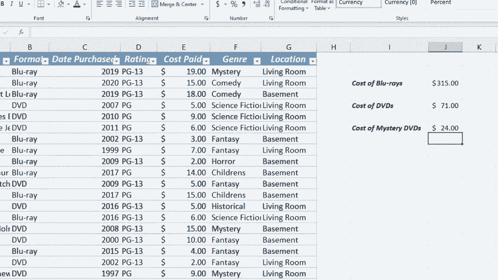

# Excel高级教程（持续更新中） - P18：18）SUMIFS 函数 📊


在本节课中，我们将学习如何使用Excel中的SUMIFS函数。这个函数功能强大且实用，能帮助我们根据多个条件对数据进行求和。

假设我们有一个记录DVD和蓝光收藏的电子表格。我们想计算在不同介质（如DVD或蓝光）或不同类型电影上的总花费。虽然可以使用SUM函数或筛选后求和，但当条件复杂时，这些方法效率较低。SUMIFS函数能高效地解决这类问题。

## 1. SUMIFS函数的基本用法

上一节我们介绍了SUMIFS函数的应用场景，本节中我们来看看它的具体语法和基本用法。

SUMIFS函数的核心语法是一个求和范围，后跟一个或多个“条件范围-条件”对。其基本公式如下：

```
=SUMIFS(求和范围, 条件范围1, 条件1, [条件范围2, 条件2], ...)
```

*   **求和范围**：需要进行求和计算的单元格区域。
*   **条件范围1**：应用第一个条件的单元格区域。
*   **条件1**：定义在`条件范围1`中哪些单元格将被相加的条件。
*   **`[条件范围2, 条件2], ...`**：可选参数，您可以添加更多的条件范围和条件。

以下是使用SUMIFS函数计算“蓝光”总成本的步骤：
1.  在目标单元格输入等号`=`，开始公式。
2.  输入函数名`SUMIFS`和左括号`(`。
3.  选择“支付成本”列作为**求和范围**。对于长列表，可以点击首单元格后，按 `Ctrl + Shift + ↓` 快速选中整列。
4.  输入逗号`,`，然后选择“格式”列作为第一个**条件范围**。
5.  输入逗号`,`，然后输入条件。条件可以是具体的文本（如`"蓝光"`，需加引号），也可以是包含条件的单元格引用（如`B2`）。
6.  输入右括号`)`并按回车，即可得到结果。

## 2. 使用单元格引用作为条件

我们学会了输入固定文本作为条件。接下来，我们看看如何使用单元格引用来动态指定条件，这能使公式更加灵活。

操作方法与之前类似，但在指定条件时，不直接输入带引号的文本，而是点击包含条件值（如“DVD”）的单元格。这样，当该单元格的内容改变时，求和结果会自动更新。

例如，公式 `=SUMIFS(求和范围, 条件范围1, B5)` 会依据B5单元格的内容进行条件求和。如果将B5的内容从“DVD”改为“蓝光”，计算结果会随之变化。

## 3. 应用多个条件进行求和

上一节我们使用了单个条件，本节中我们来看看如何为SUMIFS函数添加多个条件，实现更精确的筛选求和。

SUMIFS函数支持添加多组条件。每组条件都包含一个条件范围和一个对应的条件。只有满足所有指定条件的行，其对应的值才会被求和。

以下是计算“类型”为“神秘”且“格式”为“DVD”的总花费的步骤：
1.  输入公式起始部分：`=SUMIFS(`。
2.  选择“支付成本”列作为**求和范围**。
3.  输入逗号，选择“格式”列作为**条件范围1**。
4.  输入逗号，指定条件1（例如，引用包含“DVD”的单元格）。
5.  输入逗号，选择“类型”列作为**条件范围2**。
6.  输入逗号，指定条件2（例如，引用包含“神秘”的单元格）。
7.  输入右括号并回车，即可得到同时满足两个条件的总和。

通过检查数据可以验证，只有同时满足“格式=DVD”和“类型=神秘”的行（例如花费$15和$9的两行）被计入求和，结果$24是正确的。



## 总结

本节课中我们一起学习了SUMIFS函数。我们掌握了它的基本语法，学会了如何根据单个条件（如介质类型）进行求和，以及如何利用单元格引用使条件动态化。最后，我们探索了如何叠加多个条件（如同时指定介质和电影类型）来实现更复杂、更精确的数据汇总。SUMIFS是处理多条件求和任务的强大工具，能显著提升数据分析的效率。