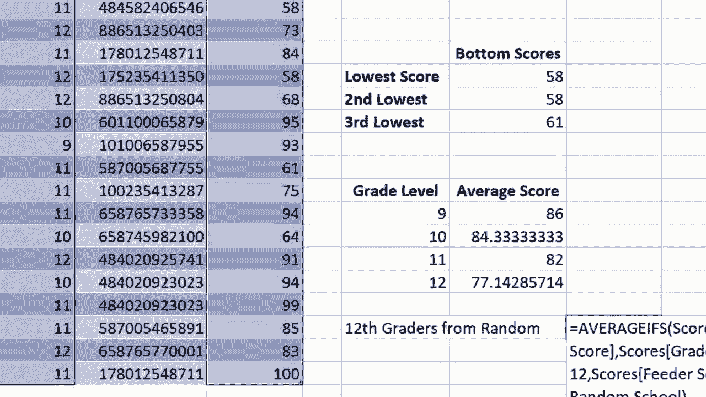

# Excel高级教程（持续更新中） - P19：19）AVERAGEIFS 函数 📊

在本节课中，我们将要学习如何使用Excel中的`AVERAGEIFS`函数。这个函数允许我们根据一个或多个指定的条件，计算满足这些条件的单元格的平均值。这对于从大型数据集中提取特定子集的统计信息非常有用。

---

## 概述

`AVERAGEIFS`函数的核心思想是：**仅对满足所有给定条件的数值进行平均**。其基本语法结构如下：

**公式：**
`=AVERAGEIFS(平均范围, 条件范围1, 条件1, [条件范围2, 条件2], ...)`

*   **平均范围**：包含需要计算平均值的数字的单元格区域。
*   **条件范围**：用于条件判断的单元格区域。
*   **条件**：定义哪些单元格将被平均的标准。

接下来，我们将通过一个具体的例子来逐步掌握这个函数。

---

## 单条件平均值计算

上一节我们介绍了`AVERAGEIFS`函数的基本概念，本节中我们来看看如何用它解决一个简单问题：计算特定年级学生的平均测试分数。

假设我们有一个包含学生姓名、年级和测试分数的数据表。现在，我们想知道9年级学生的平均分是多少。

1.  **选择目标单元格**：点击用于显示结果的单元格（例如`J14`）。
2.  **输入函数**：输入 `=AVERAGEIFS(`。
3.  **定义平均范围**：这是包含测试分数的列（例如`C2:C100`）。你可以用鼠标拖动选择，或者点击首个单元格后按 `Ctrl + Shift + ↓` 快速选择整列数据。
4.  **定义第一个条件范围**：输入逗号后，选择包含年级信息的列（例如`B2:B100`）。
5.  **定义第一个条件**：再次输入逗号，然后指定条件。这里我们想找9年级，所以可以点击包含“9”的单元格（如`I14`），或者直接输入数字`9`。
6.  **完成公式**：输入右括号 `)` 并按回车键。

**代码示例：**
`=AVERAGEIFS(C2:C100, B2:B100, 9)`
或
`=AVERAGEIFS(C2:C100, B2:B100, I14)`

执行后，单元格将显示9年级学生的平均分。

---

## 使用填充柄快速复制公式

计算完一个年级的平均分后，我们通常还需要计算其他年级的。无需重复输入公式，我们可以利用Excel的填充柄功能。

以下是操作步骤：
1.  选中已计算出结果的单元格（例如`J14`）。
2.  将鼠标移至该单元格右下角，直到光标变成黑色十字（即填充柄）。
3.  按住鼠标左键向下拖动，覆盖需要计算的其他年级对应的单元格区域（如`J15:J17`）。
4.  松开鼠标，公式将被自动复制，并且其中的条件引用（如`I14`）会相应地调整为`I15`、`I16`等，从而快速计算出10、11、12年级的平均分。

---

## 多条件平均值计算

`AVERAGEIFS`函数名称中的“S”意味着它支持**多个条件**。现在，我们来看一个更复杂的场景：计算“随机学校”的“12年级”学生的平均分。

假设数据表中新增了一列“学校”。我们需要同时满足“年级为12”和“学校为随机学校”两个条件。

1.  **输入函数**：在目标单元格输入 `=AVERAGEIFS(`。
2.  **定义平均范围**：选择分数列（`C2:C100`），输入逗号。
3.  **定义第一个条件**：
    *   **条件范围1**：选择年级列（`B2:B100`），输入逗号。
    *   **条件1**：指定数字`12`或引用包含12的单元格，输入逗号。
4.  **定义第二个条件**：
    *   **条件范围2**：选择学校列（`E2:E100`），输入逗号。
    *   **条件2**：这是关键。由于“随机学校”是文本，必须用引号括起来，即 `"随机学校"`。也可以引用包含该文本的单元格（如`E2`）。
5.  **完成公式**：输入右括号并按回车。

**代码示例（使用文本条件）：**
`=AVERAGEIFS(C2:C100, B2:B100, 12, E2:E100, "随机学校")`

**代码示例（使用单元格引用）：**
`=AVERAGEIFS(C2:C100, B2:B100, 12, E2:E100, E2)`

> **重要提示**：当条件为文本时，必须在公式中直接使用**英文双引号**将其括起来（如`"随机学校"`）。如果通过引用包含文本的单元格来指定条件，则不需要加引号。

---

## 总结

本节课中我们一起学习了`AVERAGEIFS`函数的强大功能。
*   我们首先了解了其语法：`=AVERAGEIFS(平均范围, 条件范围1, 条件1, ...)`。
*   然后，我们实践了如何根据**单个条件**（如特定年级）计算平均值。
*   接着，我们学会了使用**填充柄**高效地复制公式，以应用不同条件。
*   最后，我们探索了如何设置**多个条件**（如特定年级和特定学校）来进行更精确的数据筛选和平均计算。

掌握`AVERAGEIFS`函数能帮助你从复杂的数据中快速提取有价值的摘要信息。