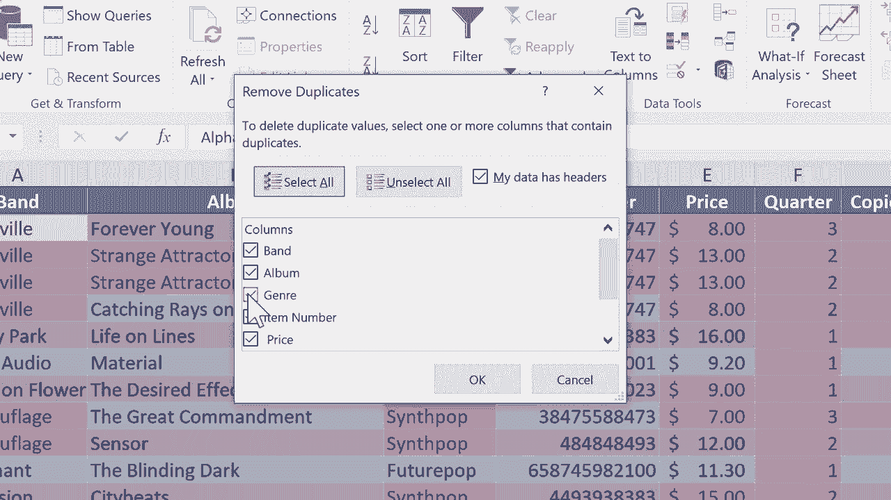

# Excel高级教程（持续更新中） - P2：处理重复项并查找唯一数据 🔍


在本节课中，我们将学习如何在Excel中识别和处理重复数据，以及如何提取唯一值列表。掌握这些技巧能帮助你清理数据，确保分析的准确性。

## 概述：识别重复项

上一节我们介绍了数据的基本操作。本节中，我们来看看如何发现电子表格中的重复记录。假设我们有一个音乐CD商店的库存列表，其中包含乐队和专辑信息。数据中可能无意间混入了一些重复项。

例如，乐队“Alphaville”的专辑“St attractor”出现了两次。乐队“OMD”和“The Killers”的条目也存在重复。虽然某些重复（如音乐流派“合成流行”）可能可以接受，但重复的记录通常需要被清理。

## 使用条件格式高亮重复项

首先，我们可以使用“条件格式”功能来直观地标记出重复的单元格。以下是操作步骤：

1.  选中你想要检查的数据范围。
2.  在【开始】选项卡下，找到【条件格式】。
3.  选择【突出显示单元格规则】->【重复值】。
4.  在弹出的对话框中，保持默认设置（“重复”和“浅红色填充深红色文本”），点击【确定】。

执行后，所有重复出现的单元格都会被高亮显示。这可以帮助你快速定位问题数据。如果只想查看唯一值，可以在步骤4中选择“唯一”。

## 手动删除少量重复项

当重复项数量很少时，可以直接手动删除。方法是选中重复项所在的整行，右键点击并选择【删除】。删除后，条件格式的高亮也会相应消失。

## 使用“删除重复项”功能批量清理

如果数据量很大，手动删除就不现实了。这时可以使用Excel内置的“删除重复项”功能。但请注意，在使用前，只需点击数据区域内的任意一个单元格，而不是选中整个区域，否则该功能可能不可用（呈灰色）。

以下是使用“删除重复项”功能的步骤：



1.  点击数据区域内的任意单元格。
2.  转到【数据】选项卡，在【数据工具】组中点击【删除重复项】。
3.  在弹出的对话框中，选择你要依据哪些列来判断重复。**这是关键步骤**：
    *   如果只勾选“乐队”列，Excel会删除所有乐队名称重复的行，只保留第一个。这可能会误删同一乐队的不同专辑。
    *   如果同时勾选“乐队”和“专辑”列，Excel只会将这两列内容完全相同的行视为重复项，这正是我们通常需要的。
4.  点击【确定】，Excel会报告删除了多少重复值，保留了多少唯一值。

**核心概念公式**：
`删除重复项（依据列 = {“乐队”, “专辑”}）`

这个功能能高效地清理数据，但务必谨慎选择判断依据的列。

## 提取唯一值列表到新位置

有时，我们不需要删除数据，而是想生成一个不重复的列表。例如，客户只需要一份商店拥有的所有乐队名单。

我们可以使用“高级筛选”功能来提取唯一值列表：

1.  点击源数据列（如“乐队”列）中的任意单元格。
2.  转到【数据】选项卡，在【排序和筛选】组中点击【高级】。
3.  在弹出的“高级筛选”对话框中：
    *   选择【将筛选结果复制到其他位置】。
    *   **列表区域**会自动填入选中的数据范围。
    *   **复制到**：点击右侧的折叠按钮，然后点击工作表上一个空白单元格（如 `I2`），作为新列表的起始位置。
    *   **勾选【选择不重复的记录】**。
4.  点击【确定】。

Excel会将唯一的乐队名单复制到指定位置。如果结果带有格式，你可以选中新列表，在【条件格式】中选择【清除规则】->【清除所选单元格的规则】来清理。

**核心概念代码（描述逻辑）**：
```excel
高级筛选(列表区域= A列, 复制到= I2, 条件=唯一记录)
```

## 总结

本节课中我们一起学习了处理Excel重复数据的多种方法。我们首先使用**条件格式**高亮显示重复项以便检查。对于少量重复，可以**手动删除**。面对大量数据，则利用**“删除重复项”** 功能进行批量清理，需注意正确选择判断重复的依据列。最后，我们还学会了使用**“高级筛选”** 功能，将唯一值列表提取到新的位置，而不影响原始数据。灵活运用这些技巧，可以有效管理和净化你的数据集。