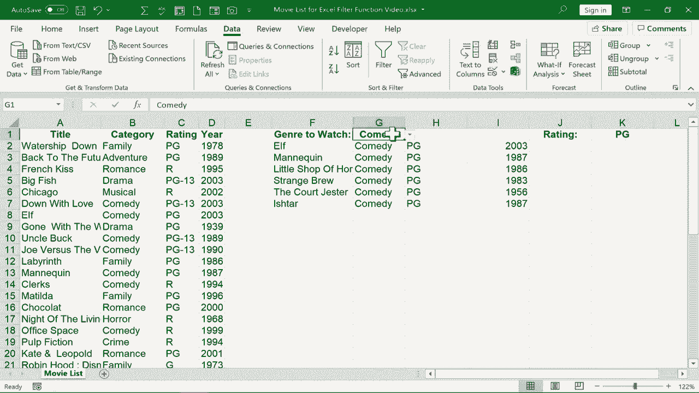

# Excel高级教程（持续更新中） - P20：20）使用FILTER函数创建动态过滤器 🎬

在本节课中，我们将学习如何使用Excel的FILTER函数，在电子表格中创建一个可以根据输入条件自动变化的动态过滤器。我们将以一个电影列表为例，演示如何根据电影类型和评级来筛选数据。

## 概述

我们将从一个包含电影信息的表格开始，目标是创建一个系统：当我们在指定单元格中输入电影类型（如“喜剧”）时，表格能自动列出所有该类型的电影。虽然Excel自带的筛选功能也能实现类似效果，但FILTER函数能提供更动态、更灵活的解决方案。

## 创建基础动态过滤器

首先，我们来看如何根据单一条件（电影类型）来创建动态过滤器。

以下是创建基础动态过滤器的步骤：

1.  **确定数据范围**：首先，我们需要确定要筛选的整个数据区域。在本例中，是电影数据从A2到D43的单元格范围。
2.  **输入FILTER函数**：在希望显示筛选结果的单元格（例如F2）中，输入公式的开始部分：`=FILTER(`。
3.  **指定数组**：在函数中，第一个参数是我们要筛选的“数组”，即整个数据范围 `A2:D43`。
4.  **设置包含条件**：第二个参数是“包含”条件，即根据哪一列进行筛选。这里我们根据电影类型（B列）筛选，所以输入范围 `B2:B43`。
5.  **定义逻辑测试**：接下来，需要设置逻辑测试，即判断B列的值是否等于我们设定的条件。我们可以直接输入条件，例如 `=“家庭”`，也可以引用一个单元格，如 `=$G$1`，这样条件就可以在G1单元格中灵活更改。
6.  **处理空值**：最后一个参数是“如果为空”，用于指定当没有匹配项时显示什么内容。我们可以输入 `“无”`。
7.  **完成公式**：完整的公式看起来像这样：`=FILTER(A2:D43, B2:B43=$G$1, “无”)`。按下回车后，结果区域将动态显示与G1单元格内容匹配的所有行。

当我们在G1单元格中输入“剧情”并回车，结果区域就会列出所有剧情片。将其改为“科幻”，列表也会随之更新，这就是动态过滤器的效果。

## 优化输入方式：使用下拉列表

为了让用户操作更方便，我们可以将手动输入改为下拉菜单选择。

我们可以为条件单元格（如G1）设置数据验证，将其变成一个下拉列表：

1.  选中G1单元格。
2.  点击“数据”选项卡下的“数据验证”按钮。
3.  在“设置”选项卡中，将“允许”项改为“序列”。
4.  在“来源”框中，选择或输入所有电影类型的列表范围（例如 `B2:B43` 或一个去重后的列表）。
5.  点击“确定”。现在G1单元格旁边会出现一个下拉箭头，点击即可从列表中选择电影类型，无需手动输入。

## 添加第二个筛选条件

上一节我们介绍了如何根据单一条件进行筛选。本节中我们来看看如何为动态过滤器添加第二个筛选条件，例如同时根据“类型”和“评级”来筛选电影。

假设我们在K1单元格输入评级条件（如“PG-13”），我们希望筛选出同时满足G1单元格类型和K1单元格评级的电影。

我们需要修改原有的FILTER函数公式。核心思路是使用乘号 `*` 来连接多个条件，这代表逻辑“与”（AND）的关系。

修改后的公式结构如下：
`=FILTER(数组, (条件范围1=条件1) * (条件范围2=条件2), “无”)`

以下是具体操作步骤：

1.  **编辑原有公式**：点击包含FILTER公式的单元格（如F2），进入编辑状态。
2.  **修改包含参数**：将原来的 `B2:B43=$G$1` 用括号括起来，变成 `(B2:B43=$G$1)`。
3.  **添加第二个条件**：在第一个条件后输入乘号 `*`，然后添加第二个条件 `(C2:C43=$K$1)`。这里的C2:C43是评级数据所在列。
4.  **完成公式**：完整的公式变为：`=FILTER(A2:D43, (B2:B43=$G$1)*(C2:C43=$K$1), “无”)`。
5.  按下回车确认公式。

现在，动态过滤器将同时响应G1（类型）和K1（评级）两个单元格的变化。例如，在G1选择“恐怖”，在K1选择“R”，结果区域将只显示评级为R的恐怖电影。同样，我们也可以为K1单元格设置数据验证下拉列表，方便选择评级。

## 总结

本节课中我们一起学习了Excel FILTER函数的核心用法。我们首先创建了一个根据电影类型动态筛选列表的基础过滤器，然后通过数据验证功能将其优化为下拉菜单选择。最后，我们进一步扩展了功能，学会了如何使用 `*` 连接多个条件，实现同时根据类型和评级进行筛选的动态过滤器。

FILTER函数功能强大且灵活，是处理动态数据筛选的利器。掌握它，可以让你在Excel中的数据分析和展示能力大大提升。

