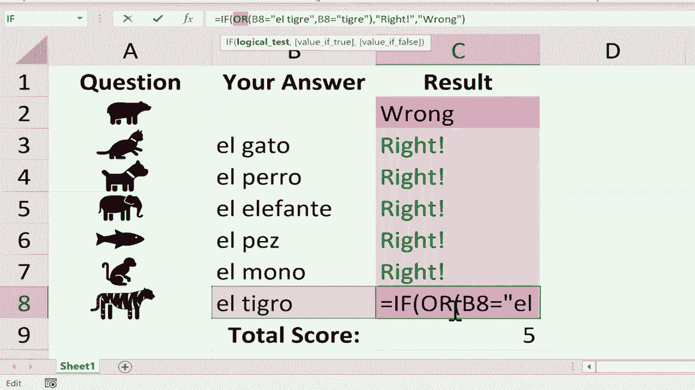

# Excel高级教程（持续更新中） - P21：21）使用 IF 和 COUNTIF 函数创建交互式工作表 📝

在本节课中，我们将学习如何在 Microsoft Excel 中创建一个交互式且能自我评分的工作表。这种工作表非常适合用于制作练习测验，例如让学生练习外语词汇。我们将使用 **IF** 函数来判断答案对错，并使用 **COUNTIF** 函数统计总分。通过结合条件格式，我们还能为答案提供直观的视觉反馈。

## 准备工作：创建测验界面

首先，我们需要准备测验的问题部分。你可以使用文本作为问题，也可以插入图标来增加趣味性。

以下是插入图标作为问题的步骤：

1.  点击“插入”选项卡。
2.  选择“插图”组中的“图标”。
3.  在搜索框中输入关键词（例如“动物”），选择想要的图标。
4.  点击“插入”，将图标调整到合适的大小并放置到单元格中。

假设我们是一名西班牙语老师，制作了一个关于动物词汇的测验。A列放置动物图标，B列留给学生填写答案，C列将用于显示评分结果。

## 使用 IF 函数进行评分

上一节我们设置了测验界面，本节中我们来看看如何为每个问题添加自动评分功能。核心是使用 **IF** 函数。

**IF 函数**的基本逻辑是：**如果满足某个条件，则返回一个值；否则，返回另一个值**。其公式结构如下：
`=IF(逻辑测试, [值为真时的结果], [值为假时的结果])`

现在，让我们为第一个问题（假设是“熊”）设置评分。

1.  选中单元格 C2。
2.  输入公式：`=IF(B2="El Oso", "正确！", "错误")`
3.  按下回车键。

此时，如果在 B2 中输入“El Oso”，C2 会显示“正确！”；如果输入其他内容或留空，C2 则显示“错误”。

## 快速复制公式

我们不需要为每个问题手动重复输入公式。Excel 的“自动填充”功能可以帮我们快速复制公式，并自动调整单元格引用。

以下是使用自动填充柄的步骤：

1.  选中已输入公式的单元格（如 C2）。
2.  将鼠标指针移至单元格右下角，直到它变成黑色的十字加号（即填充柄）。
3.  按住鼠标左键并向下拖动，覆盖需要填充公式的单元格区域（如 C3 到 C8）。

拖动后，C3 中的公式会自动变为 `=IF(B3=…`，C4 中的公式变为 `=IF(B4=…`，以此类推。你只需要逐个修改每个公式中的正确答案即可。

## 修改每个问题的正确答案

自动填充后，每个单元格的公式逻辑相同，但判断条件需要根据具体问题调整。

例如，第二个问题（猫）的正确答案是“El gato”。你需要选中 C3 单元格，在编辑栏中将公式中的 `"El Oso"` 修改为 `"El gato"`。

请依次修改所有问题的公式，确保其判断条件与对应动物的西班牙语名称一致。

## 使用条件格式增强视觉反馈

仅仅显示“正确”或“错误”的文字可能不够直观。我们可以使用条件格式，让单元格根据结果自动改变颜色，提供更清晰的反馈。

以下是设置条件格式的步骤：

首先，为“正确”答案设置绿色背景。

1.  选中 C 列中所有包含评分结果的单元格（例如 C2:C8）。
2.  点击“开始”选项卡中的“条件格式”。
3.  选择“突出显示单元格规则” -> “文本包含”。
4.  在弹出的对话框中输入“正确！”。
5.  在“设置为”下拉菜单中选择一种绿色填充样式（如“绿填充色深绿色文本”），点击“确定”。

接着，用同样的方法为“错误”答案设置红色背景。

1.  保持 C2:C8 的选中状态。
2.  再次点击“条件格式” -> “突出显示单元格规则” -> “文本包含”。
3.  输入“错误”。
4.  选择一种红色填充样式（如“浅红色填充深红色文本”），点击“确定”。

现在，当学生输入答案后，正确的反馈会显示为绿色，错误的反馈会显示为红色，一目了然。

## 使用 COUNTIF 函数统计总分

在提供了每个问题的反馈后，我们还可以为学生计算一个总分。这需要使用 **COUNTIF** 函数。

**COUNTIF 函数**用于统计某个区域内，满足指定条件的单元格数量。其公式结构为：
`=COUNTIF(要检查的区域, 要计数的条件)`

让我们在表格底部（例如 C9 单元格）计算答对题目的总数。

1.  选中单元格 C9。
2.  输入公式：`=COUNTIF(C2:C8, "正确！")`
3.  按下回车键。

这个公式会统计 C2 到 C8 这个范围内，内容为“正确！”的单元格数量，并显示结果。这样，学生就能立刻知道自己的得分。

## 高级技巧：允许多个正确答案

有时，一个问题的答案可能有多种正确表述（例如，“El tigre”和“Tigre”都表示老虎）。标准的 IF 函数无法处理这种情况。我们可以通过结合 **OR** 函数来实现。

**OR 函数**的作用是：**在其参数中，只要有一个逻辑测试为真，即返回真**。

以下是修改公式以接受多个正确答案的步骤：

1.  选中需要修改的评分单元格（例如对应“老虎”的 C8）。
2.  将原有公式 `=IF(B8="El tigre", "正确！", "错误")` 修改为：
    `=IF(OR(B8="El tigre", B8="tigre"), "正确！", "错误")`
3.  按下回车键。

现在，无论在 B8 中输入“El tigre”还是“tigre”，C8 都会显示“正确！”。你可以根据需要对其他问题应用类似的逻辑。

## 课程总结

本节课中我们一起学习了如何利用 Excel 创建交互式自我评分工作表。我们首先使用 **IF** 函数为每个问题构建了基础评分逻辑，然后通过自动填充功能快速应用公式。接着，利用**条件格式**为评分结果添加了颜色提示，使反馈更加直观。最后，我们使用 **COUNTIF** 函数统计了总分，并探索了结合 **OR** 函数来接受多个正确答案的高级技巧。掌握这些方法，你就能轻松制作出各种形式的练习测验和互动学习材料。