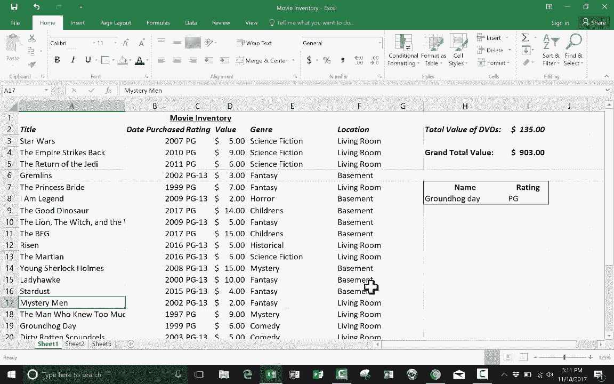

# Excel高级教程（持续更新中） - P3：VLOOKUP 基础 🔍

在本节课中，我们将学习Excel中一个非常强大的工具——**VLOOKUP**函数的基础知识。VLOOKUP可以帮助我们从庞大的数据表中快速查找并提取所需的信息。我们将通过一个简单的例子，一步步学习如何使用它。

---

## 概述

想象你有一个包含数千条电影记录的电子表格，其中有电影名称、时长、主演、评分等多列数据。当你想快速查找某部电影的评分时，手动搜索会非常耗时。VLOOKUP函数可以帮你自动完成这个任务。本节课，我们将学习如何设置和使用VLOOKUP来实现这一目标。

---

## VLOOKUP 的核心概念

VLOOKUP函数可以理解为一种“查找机器”。它的工作方式类似于在电话簿中查找人名以获取电话号码，或者在图书馆目录中查找书名以找到其位置。

其基本语法是一个**公式**：
`=VLOOKUP(查找值, 表格数组, 列索引号, [范围查找])`

这个公式包含四个部分，我们称之为“参数”。接下来，我们将逐一解释每个参数的含义。

---

## 参数详解

上一节我们介绍了VLOOKUP的公式结构，本节中我们来看看每个参数具体代表什么，以及如何填写。

以下是四个参数的具体说明：

1.  **查找值 (Lookup_value)**
    *   这是你已经知道并想要查找的信息。在我们的例子中，就是电影的名称。
    *   为了让查找结果可以变化，我们通常引用一个可以输入内容的单元格。例如，`H8`单元格。

2.  **表格数组 (Table_array)**
    *   这是Excel需要搜索的数据区域。它必须包含你的“查找值”所在的列，以及你想要返回的信息所在的列。
    *   例如，我们可以选择从`A3`到`F22`这个区域，它包含了所有电影数据。

3.  **列索引号 (Col_index_num)**
    *   这个数字指定了，当在表格数组中找到“查找值”后，你想要返回该行中第几列的数据。
    *   **重要**：计数是从你选择的“表格数组”的最左边一列（第一列）开始的，而不是从工作表本身的A列开始。
    *   如果我们想返回“评分”，而“评分”列在我们选择的表格数组（A到F列）中是第3列，那么这里就填`3`。

4.  **范围查找 (Range_lookup)**
    *   这个参数决定查找时是需要“精确匹配”还是“近似匹配”。
    *   通常我们使用`FALSE`（或`0`）来要求精确匹配。这意味着只有当查找值与数据完全一致时，才会返回结果。
    *   如果使用`TRUE`（或`1`），函数会寻找最接近的匹配项，这在处理数值范围（如根据分数查找等级）时很有用。

---

## 实战演练：创建电影评分查询器

理解了各个参数后，让我们动手创建一个可以查询电影评分的工具。

1.  **设置查询区域**
    在工作表的空白区域（例如H7和I7单元格），我们可以创建两个单元格。一个用于输入电影名称（如H8），另一个用于显示查询结果（如I8）。

2.  **输入公式**
    在用于显示结果的单元格（I8）中，输入以下公式：
    `=VLOOKUP(H8, $A$3:$F$22, 3, FALSE)`
    *   `H8`：查找值，即我们输入电影名称的地方。
    *   `$A$3:$F$22`：表格数组，使用绝对引用（`$`）可以防止公式拖动时范围改变。
    *   `3`：列索引号，因为我们想返回“评分”列（在A-F范围内是第3列）。
    *   `FALSE`：要求精确匹配。

3.  **测试公式**
    在H8单元格中输入一部电影的名称，例如“我是传奇”，然后按回车。I8单元格就会自动显示其评分“PG-13”。

4.  **优化布局**
    你可以将H8单元格作为输入框，I8单元格作为结果展示框，并对它们进行加粗、居中等格式化，使其看起来更像一个查询工具。

---

## 使用VLOOKUP必须遵守的规则

为了让VLOOKUP正常工作，你的数据表必须满足两个关键条件。

以下是两条核心规则：

*   **数据必须垂直排列**：VLOOKUP中的“V”代表垂直（Vertical）。你的数据列表（如所有电影名称）必须位于一列中，相关的信息（如评分、时长）水平排列在右侧的各列。
*   **查找值必须在最左列**：你用来查找的信息（如电影名）所在的列，必须位于你选择的“表格数组”区域的最左侧。VLOOKUP只会向右查找，而不会向左查找。

如果你的表格不符合这些规则，你需要先调整列的顺序，或者考虑使用`INDEX`和`MATCH`函数组合等更灵活的方法。

---

## 总结

本节课中，我们一起学习了VLOOKUP函数的基础应用。我们了解到，VLOOKUP就像一个高效的搜索助手，能够根据已知信息（查找值），在指定的数据区域（表格数组）中，精确地找到并返回我们需要的另一条信息。

记住它的核心公式`=VLOOKUP(查找值, 表格数组, 列索引号, [范围查找])`以及两条重要规则（数据垂直、查找值在左），你就能应对许多基础的数据查找场景。这是处理大型电子表格时一项极其有价值的技能。